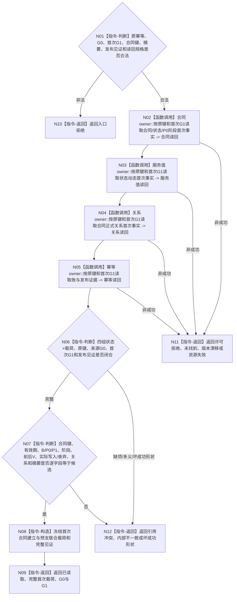

# BIZ-L4-003-04-04-03 联合读回已发布合同建立预支结果目标函数流程图 v0.2

更新时间：2026-08-27

## 依据

```text
0050、4040、4050、6160
父图：BIZ-L3-003-04-04 v0.2；前置：BIZ-L4-003-04-04-02 v0.2
```

## 身份与边界

正式目标函数设计图。按原幂等身份、来源G0和首次G1从各owner历史入口独立读回合同/P0、服务值状态动态、正式关系及幂等发布证据，并逐字段互证为首次完整结果；禁止拼接当前最新值。

## 函数合同

```text
根函数：服务合同数据操作::联合读回已发布合同建立预支结果
归属模块 / 文件 / 目标分解深度：服务合同数据操作 / 海中鱼巣/领域/数据操作.服务合同.ixx / BIZ-L4
现有或待新增：待新增组合读取
完整签名：合同建立联合读回结果 服务合同数据操作::联合读回已发布合同建立预支结果(const 合同建立联合读回请求& 请求) const noexcept
参数：请求含原幂等身份、来源G0、首次G1、合同唯一键、冻结候选摘要、发布见证和各owner首次历史读取键/规格
返回结果：已读取时携带合同完整记录、P0/P1及阶段、服务值前后状态动态、正式关系、原幂等账、G0/G1和完整联合见证；其它状态空载荷截止0
被调函数流程图：各owner首次历史读取属于后续更细分解
```

## 流程图



## 节点合同

| 节点 | 类型 | 输入绑定 | 输出绑定 | 事实读写 | 后继条件 | 验证 |
| --- | --- | --- | --- | --- | --- | --- |
| N02—N05 | 调用 | 原键与首次G1历史键 | 四组首次事实 | 只读历史已发布事实 | 全部完整才互证 | 漏项、错G1、许可/资源/版本 |
| N06—N07 | 判断 | 四组读回、G0/G1和候选摘要 | 同代次/全字段等值 | 无 | 不以当前净值掩盖动态 | P0只一次、舍弃不补领、错关系/账 |
| N08—N09 | 构造 / 返回 | 已互证材料 | 首次联合载荷 | 无 | 成功同时回显G0/G1 | 精确重复与首次发布同载荷 |
| N10—N12 | 返回 | 非成功 | 空载荷截止0 | 无 | 返回父图 | 未找到不能补写，矛盾进入审计/恢复 |

## 关键边界

- 本函数读取的是原发布事实，不是当前合同快照；合同后来进入终态或服务值后来变化，都不得改变首次P0结果。
- 精确重复、新提交后的读回和已可能发布收敛都复用本入口，以同一原键得到同一首次完整载荷。
- 任一owner未找到、错G1或异义都不允许调用方重建成功，也不允许用SQL、日志、缓存或当前最新值补齐。
