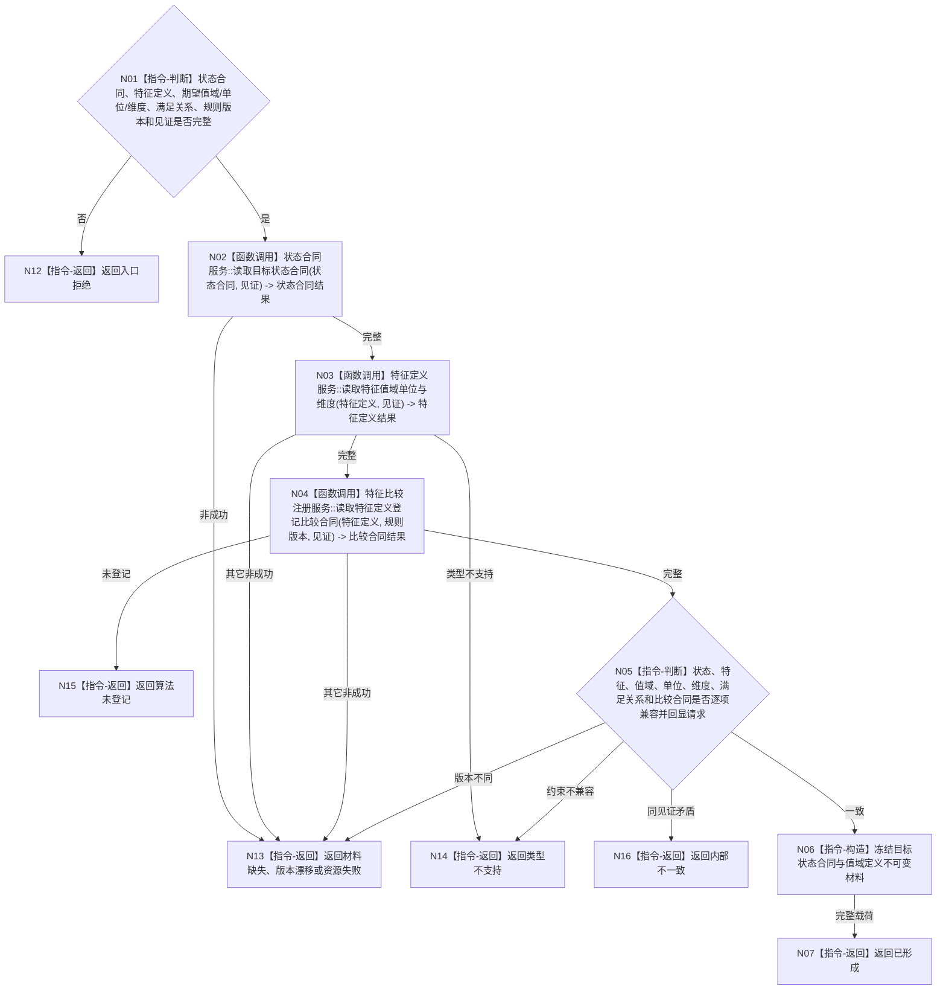

# BIZ-L4-004-01-01-01 读取目标状态合同与值域定义目标函数流程图 v0.1

更新时间：2026-08-03

## 依据

```text
4110、4130、4160、5100、6210；BIZ-L3-004-01-01、BIZ-L3-004-01-02
```

## 身份与边界

正式目标函数设计图。读取目标状态合同、特征定义、值域/单位/维度、满足关系和比较资格，为目标当前事实与后续注册比较提供同一份定义材料；不读取宿主当前值、不执行比较。

## 函数合同

```text
根函数：需求目标事实提供者::读取目标状态合同与值域定义
归属模块 / 文件 / 层级：需求目标事实提供者 / 海中鱼巣/领域/提供者.需求目标事实.ixx / L4
现有或待新增：待新增组合读取；复用状态合同、特征定义和比较注册具名只读服务
完整签名：目标状态合同读取结果 需求目标事实提供者::读取目标状态合同与值域定义(const 目标状态合同读取请求& 请求) const
参数：请求为只读借用；含目标状态合同身份、目标特征定义、期望类型合同/值域/单位/维度、满足关系、比较规则版本和各定义提供者见证
返回结果：不可变值式结果；含已形成、材料缺失、类型不支持、算法未登记、版本漂移、资源失败或内部不一致，以及状态合同、特征定义、值域、单位、维度、误差资格、满足关系、比较算法身份/版本和实际消费见证
被调函数流程图：状态合同、特征定义和值域/比较注册服务属于后续L5展开对象；具体比较算法按BIZ-L3-004-01-02条件展开
父图：BIZ-L3-004-01-01
```

## 流程图



## 节点合同

| 节点 | 类型 | 参数 / 输入绑定 | 结果 / 输出绑定 | 事实读写 | 后继条件 | 验证 |
| --- | --- | --- | --- | --- | --- | --- |
| N02 | 函数调用 | 目标状态合同和见证 | 目标值与满足关系合同 | 只读状态定义 | 完整才读特征 | 合同身份、版本和范围 |
| N03 | 函数调用 | 特征定义和见证 | 值域、单位、维度和误差资格 | 只读特征定义 | 类型受支持 | I64/向量原始材料与业务解释分离 |
| N04 | 函数调用 | 特征定义、规则版本和见证 | 具名比较算法合同 | 只读注册事实 | 已登记才返回完整 | 未登记不得默认减法 |
| N05—N07/N12—N16 | 指令-判断 / 构造 / 返回 | 三组定义 | 完整合同或具名非成功 | 无 | 返回父图 | 坐标/位姿、角度、集合和空间约束 |

## 关键边界

同为 `VecI64` 不代表可用同一算法。坐标、角度、旋转、集合、轮廓和点云必须由登记合同解释；未登记或单位/维度不兼容时拒绝，不得退化为普通减法。

