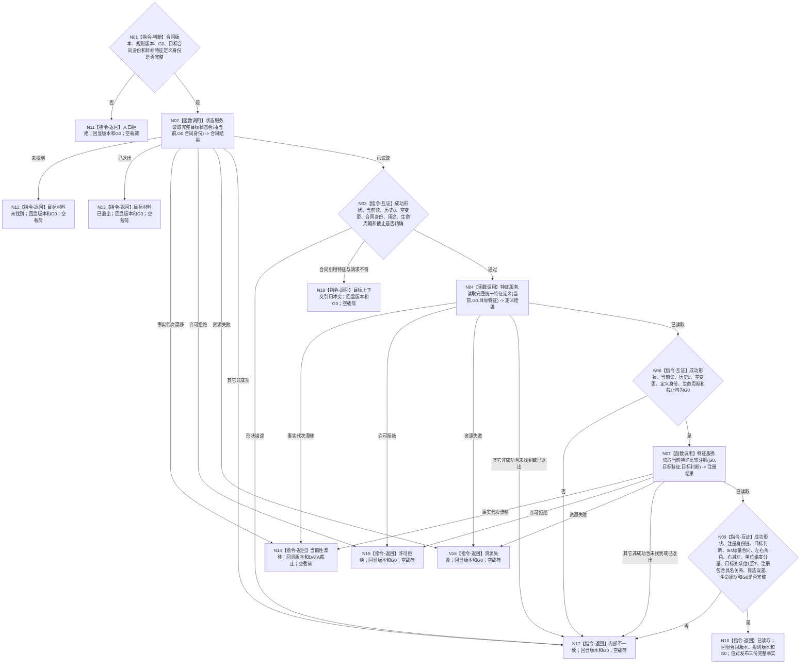

# BIZ-L4-004-01-01-01 读取目标状态合同与值域定义目标函数流程图 v0.2

更新时间：2026-08-16

## 依据

```text
0050、3100、4030、4180、4230、5100；BIZ-L3-004-01-01
```

## 身份与边界

正式目标函数设计图。函数只经普通应用同一 `L2结构聚合服务` 中的状态、特征服务，在调用方给出的同一非零事实截止 `G0` 下读取目标状态合同、完整特征定义和目标判断比较注册，逐字段互证后发布不可变值式材料；不读取宿主当前值、不执行比较、不写 DATA 或业务事实。

v0.2 替代 v0.1 中由调用方重复提供值域、单位、维度、满足关系和“提供者见证”的旧请求。上述语义均由正式目标合同与比较注册读回，调用方不得复制成第二权威。

## 函数合同

```text
根函数：需求目标事实提供者::读取目标状态合同与值域定义
归属模块 / 文件 / 层级：需求目标事实提供者 / 海中鱼巣/领域/提供者.需求目标事实.ixx / BIZ-L4
现有或待新增：待新增 BIZ 只读组合提供者；复用当前已发布 DATA ABI
完整签名：目标状态合同定义读取结果 需求目标事实提供者::读取目标状态合同与值域定义(const 目标状态合同定义读取请求& 请求) const noexcept
参数：合同版本、规则版本、非零事实截止 G0、L2目标状态合同身份、目标L2特征定义身份
返回：已读取、入口拒绝、目标材料未找到、目标材料已退出、当前性漂移、许可拒绝、资源失败、目标上下文引用冲突或内部不一致；结果回显合同版本、规则版本和最终 G0，只有已读取携带目标合同、完整特征定义与目标判断比较注册
被调公开函数：
  L2状态结构服务::读取完整目标状态合同(...)
  L2特征结构服务::读取完整统一特征定义(...)
  L2特征结构服务::读取当前特征比较注册(...)
父图：BIZ-L3-004-01-01
```

## 流程图



## 状态与映射合同

| DATA 结果 | BIZ 结果 | 载荷 |
| --- | --- | --- |
| 第一笔目标合同读取为 `未找到` | 目标材料未找到 | 空 |
| 第一笔目标合同读取为 `已退出` | 目标材料已退出 | 空 |
| 第一笔成功后，第二或第三笔为 `未找到`、`已退出`、`属性未设置`或其它不适用状态 | 内部不一致 | 空 |
| `事实代次漂移` | 当前性漂移 | 空 |
| `许可拒绝` | 许可拒绝 | 空 |
| `资源失败` | 资源失败 | 空 |
| 第一笔合同引用的特征定义与请求目标特征不一致 | 目标上下文引用冲突 | 空 |
| 三次均 `已读取`、`成功()`且逐字段互证通过 | 已读取 | 三份完整事实 + `合同版本` + `规则版本` + `G0` |
| 合法请求触发 `入口拒绝`、成功形状错误、错身份、错用途、非空变更代次、非当前读取、历史截止非零、混合截止或其它不适用状态 | 内部不一致 | 空 |

## 关键边界

- `G0` 由父级当前事实截止选择者提供，本函数不直达 L1，也不用零守卫选择新截止。
- 目标满足关系由 `L2目标状态合同事实::允许关系位`承载；值域、单位、维度、角色、算法版本和误差合同由 `L2特征比较注册事实::合同`承载。
- 本图冻结的是三次 BIZ 显式 DATA 调用；状态服务可在自己的公开合同内部再次读取特征定义和比较注册，本图不声称底层恰有三次读取。
- 当前闭合范围仅为 `I64` 原始类型和“标量有序比较与安全差异”算法族；向量、角度、空间、集合和时间序列值域均不在本叶。
- `L2目标状态合同事实::operator==` 包含审计字段，不能用作跨合同目标语义等价算法；本叶不裁决多个需求目标是否等价。
- 正常成功预期零事实写入；失败不得保留部分已读材料或回退到缓存、字符串、裸 I64、默认单位或默认比较算法。
