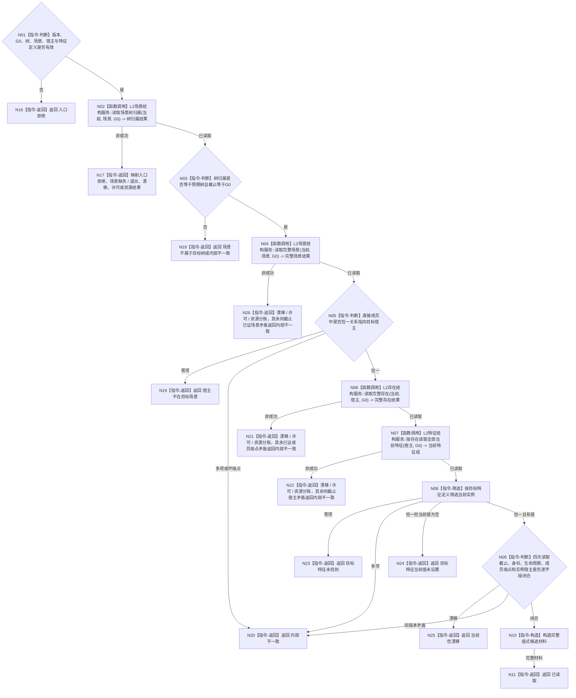

# BIZ-L4-004-01-01-02 读取目标宿主同截止当前特征事实目标函数流程图 v0.1

更新时间：2026-08-16

## 依据

```text
4110 v0.8、4160 v0.4、4190 v0.6、4200 v1.4、4230 v0.10、5100 v0.2
BIZ-L3-004-01-01 v0.2；当前 L2 场景 / 存在 / 特征公开 ABI
```

## 身份与边界

正式目标函数设计图。函数只经消费者取得的同一 `L2结构聚合服务`，在同一非零 `G0` 下证明：目标场景属于预期具名树、目标宿主是该场景直接成员、目标宿主存在当前、同宿主同定义的唯一当前特征实例存在且具有当前值。

函数不判断现实世界或自我资格，不要求目标宿主只属于一个场景，不读取状态 / 动态 / 因果，不从当前值补造其它事实。

## 函数合同

```text
根函数：需求目标事实提供者::读取目标宿主同截止当前特征事实
归属模块 / 文件 / 层级：需求目标事实 provider / 海中鱼巣/领域/提供者.需求目标事实.ixx / BIZ-L4
现有或待新增：待新增；串行扩展 TARGET-STATE-CONTRACT-DEFINITION-CONSUME 建立的同一 provider
完整签名：目标宿主当前特征事实读取结果 需求目标事实提供者::读取目标宿主同截止当前特征事实(const 目标宿主当前特征事实读取请求& 请求) const noexcept
参数：请求为只读借用；含 BIZ 合同版本、规则版本、非零 G0、预期 L2场景树身份、目标 L2场景身份、目标 L2存在身份和目标 L2特征定义身份
返回结果：值式结果；成功携带树归属、完整场景、目标成员关系、完整存在、唯一特征实例及当前值；非成功不携带部分事实
被调函数流程图：DATA 已发布公开叶；不在 BIZ 目录复制 DATA 内部实现图
```

## 流程图



## 节点合同

| 节点 | 类型 | 参数 / 输入绑定 | 结果 / 输出绑定 | 事实读写 | 后继条件 | 验证 |
| --- | --- | --- | --- | --- | --- | --- |
| N02 | 函数调用 | 场景、当前类别、G0 | 树归属 | 只读场景结构 | 已读取才继续 | 归属树=预期树 |
| N04 | 函数调用 | 同场景、G0 | 完整场景及直接成员 | 只读场景结构 | 已读取才继续 | 直接成员端点完整 |
| N05 | 本函数内指令 | 直接成员组、目标宿主 | 恰一成员关系 | 无 | 0/1/多分账 | 不宣称宿主场景全局唯一 |
| N06 | 函数调用 | 目标宿主、G0 | 完整存在 | 只读存在结构 | 已读取才继续 | 身份和生命周期当前 |
| N07 | 函数调用 | 目标宿主、G0 | 完整当前特征实例组 | 只读特征结构 | 已读取才继续 | 每项定义 / 宿主 / 值同截止 |
| N08 | 本函数内指令 | 特征组、目标定义 | 0/1/多实例 | 无 | 恰一才继续 | 4110 同宿主同定义唯一防御 |
| N09/N10 | 本函数内指令 | 四次读回 | 完整值式结果 | 无 | 全闭合 | 非成功零部分材料 |

## 关键边界

```text
同一宿主与同一抽象定义当前只能形成一个实例槽；多项表示内部不一致，不按顺序择一。
当前值允许独立退出；恰一实例但当前值为空是“当前值未设置”，不是坏结构。
场景成员关系只证明请求指定场景中包含目标宿主，不证明该存在不属于其它场景。
函数零写入、零缓存、零内部重试；任何调用只执行一次。
```
