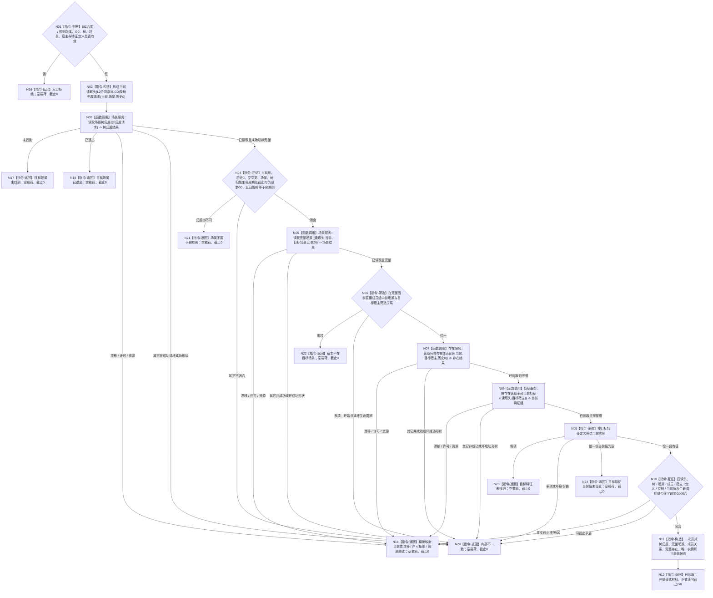

# BIZ-L4-004-01-01-02 读取目标宿主同截止当前特征事实目标函数流程图 v0.2

更新时间：2026-08-27

## 依据

```text
0050、4110、4160、4190 v0.7、4200、4230 v0.14、5100 v0.3
BIZ-L3-004-01-01 v0.3；当前已发布 L2 场景 / 存在 / 特征公开 ABI
```

## 身份与边界

正式目标函数设计图。函数只经消费者取得的同一 `L2结构聚合服务`，在调用方给定的同一非零 `G0` 下证明：目标场景属于预期具名树、目标宿主是该场景的当前直接成员、目标宿主在 `G0` 当前存在、同宿主同定义的唯一当前特征实例存在且具有当前值。

函数不判断现实世界、自我资格或“所在场景”，不要求目标宿主只属于一个场景，不读取状态 / 动态 / 因果，不从当前值补造其它事实。完整场景的直接成员关系只证明请求指定场景内的结构包含；它不证明现实作用范围、成员资格或全局唯一场景。

v0.2 正式替代 v0.1：同步当前父图与 DATA 规范版本，冻结四次公开读取的精确请求 / 成功形状、首读缺失与已证明引用后缺失的分账，并把合法 BIZ 请求触发的 DATA 入口拒绝、未实现、坏成功形状和同截止矛盾统一收束为内部不一致。

## 函数合同

```text
根函数：需求目标事实提供者::读取目标宿主同截止当前特征事实
归属模块 / 文件 / 目标分解深度：需求目标事实提供者 / 海中鱼巣/领域/提供者.需求目标事实.ixx / BIZ-L4
现有或待新增：待新增；串行扩展 TARGET-STATE-CONTRACT-DEFINITION-CONSUME 建立的同一 provider
完整签名：目标宿主当前特征事实读取结果 需求目标事实提供者::读取目标宿主同截止当前特征事实(const 目标宿主当前特征事实读取请求& 请求) const noexcept
参数：请求为只读借用；含 BIZ 合同版本、规则版本、非零 G0、预期 L2场景树身份、目标 L2场景身份、目标 L2存在身份和目标 L2特征定义身份
返回结果：已读取、入口拒绝、目标场景未找到、目标场景已退出、场景不属于预期树、宿主不在目标场景、目标特征未找到、目标特征当前值未设置、当前性漂移、许可拒绝、资源失败或内部不一致；只有已读取携带完整六段值式材料和 G0
被调公开函数：
  L2场景结构服务::读取场景树归属(const L2场景树归属读取请求&) const
  L2场景结构服务::读取完整场景(const L2场景完整读取请求&) const
  L2存在结构服务::读取完整存在(const L2存在完整读取请求&) const
  L2特征结构服务::按存在读取全部当前特征(const L2按存在当前特征读取请求&) const
父图：BIZ-L3-004-01-01 v0.3；BIZ-L4-004-02-02-11 v0.1 通过父组合复用
```

## 流程图



## 节点合同

| 节点 | 类型 | 参数 / 输入绑定 | 结果 / 输出绑定 | 事实读写 | 后继条件 | 验证 |
| --- | --- | --- | --- | --- | --- | --- |
| N02/N03 | 构造 / 函数调用 | `L2结构请求头{L2结构合同版本,G0}`、当前类别、场景、历史0 | `L2场景树归属读取结果` | 只读场景结构 | 已读取完整形状才继续 | 归属树必须等于预期树；不以根编码或父链猜树 |
| N05 | 函数调用 | 同一头、当前类别、场景、历史0 | `L2场景完整读取结果` | 只读场景结构 | 已读取、空变更、完整场景才继续 | `L2场景事实完整(场景,G0)`；直接成员组完整有序 |
| N06 | 本函数内指令 | 完整直接成员组、目标场景、目标宿主 | 恰一 `L2场景成员关系事实` | 无 | 0 / 1 / 多分账 | 不宣称宿主场景全局唯一，不把场景宿主关系当成员关系 |
| N07 | 函数调用 | 同一头、当前类别、目标宿主、历史0 | `L2存在完整读取结果` | 只读存在结构 | 已读取、空变更、完整当前存在才继续 | 已有成员端点后同截止缺存在属于内部不一致 |
| N08/N09 | 函数调用 / 筛选 | 同一头、目标宿主、目标定义 | 完整当前特征组与唯一目标实例 | 只读特征结构 | 完整组中目标定义恰一才继续 | 组允许0项；同宿主同定义多项属于内部不一致 |
| N10—N12 | 互证 / 构造 / 返回 | 四份公开读回与筛选关系 | 完整值式结果 | 无写入 | 全闭合 | 请求回显、身份链、生命周期、G0和当前值逐字段可追溯 |
| N16—N24 | 返回 | 入口、DATA状态或业务筛选结果 | 结构化非成功 | 无 | 终止 | 所有非成功空业务载荷、正式读回截止0 |

## 状态与映射合同

| 触发 | BIZ 状态 | 归因 |
| --- | --- | --- |
| BIZ 版本、G0或任一身份无效 | 入口拒绝 | 外部请求不完整；零 DATA 调用 |
| 第一笔树归属读取为 `未找到` / `已退出` | 目标场景未找到 / 目标场景已退出 | 请求指定场景没有当前树归属材料 |
| 树归属完整但树身份不等预期树 | 场景不属于预期树 | 请求目标上下文不匹配，不是 DATA 内部错误 |
| 完整场景中目标宿主成员关系0项 | 宿主不在目标场景 | 合法完整空筛选结果 |
| 当前特征完整组中目标定义实例0项 / 恰一实例但无当前值 | 目标特征未找到 / 目标特征当前值未设置 | 合法业务材料缺口 |
| 任一 DATA 读取为 `事实代次漂移` / `许可拒绝` / `资源失败` | 当前性漂移 / 许可拒绝 / 资源失败 | 精确分账；不得重选截止或重试 |
| 第一笔成功后同截止的场景、存在或宿主端点缺失；合法构造的 DATA 请求返回入口拒绝、未实现、引用冲突；任一成功形状、数量、身份、生命周期或截止矛盾 | 内部不一致 | 已证明引用后的缺失或 provider 合同破损，不降级为普通未找到 |
| 四次均为完整当前读取，指定成员恰一，目标定义实例恰一且当前值完整，全部截止等于G0 | 已读取 | 完整六段材料 + 正式读回截止G0 |

## 关键边界

```text
同一宿主与同一抽象定义当前只能形成一个实例槽；多项表示内部不一致，不按顺序择一。
当前值允许独立退出；恰一实例但当前值为空是“目标特征当前值未设置”，不是坏结构。
场景成员关系只证明请求指定场景中包含目标宿主，不证明该存在不属于其它场景，也不证明现实资格。
完整场景读取自身可再次读取树归属；“四次公开调用”不等于底层只有四次 DATA / L1 读取。
函数零写入、零缓存、零内部重试、零截止重选；四个公开调用各执行一次。
所有非成功结果空业务载荷、正式读回截止0；不得保留前三读部分事实形成半成功。
```
