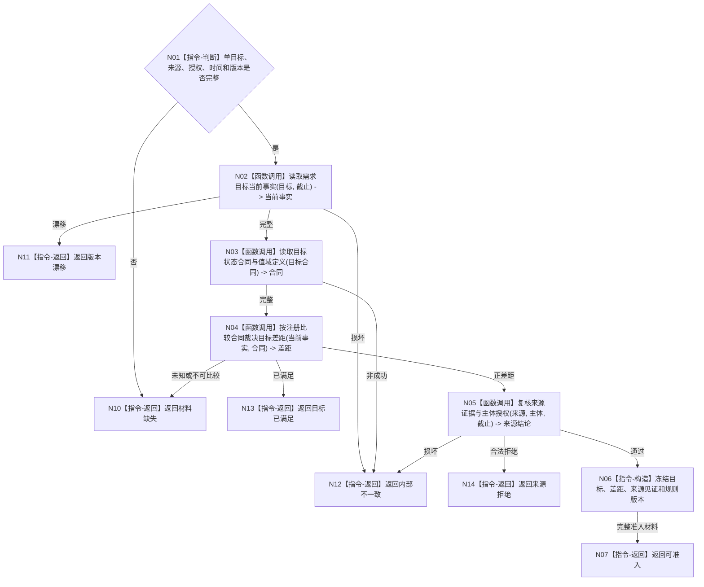

# BIZ-L4-004-02-01-01 复核需求候选准入目标函数流程图 v0.1

更新时间：2026-08-03

## 依据

```text
3100、5100、5110、5130、5150；BIZ-L3-004-02-01
```

## 身份与边界

正式目标函数设计图。只读复核单目标候选、来源证据、当前目标差距和任务化前的需求准入资格；不创建需求，不写拒绝回执。

## 函数合同

```text
根函数：需求业务服务::复核需求候选准入
归属模块 / 文件 / 层级：需求领域 / 海中鱼巣/领域/服务.需求.ixx / L4
现有或待新增：待新增；组合目标事实、来源证据和目标比较服务
完整签名：需求候选准入结果 需求业务服务::复核需求候选准入(const 需求候选准入请求& 请求) const
参数：请求为只读借用；含主体、目标宿主/场景/特征/状态合同、正差距、来源证据、授权、时间、事实截止和规则版本
返回结果：不可变值式结果；含可准入、目标已满足、来源拒绝、材料缺失、版本漂移或内部不一致，并回显完整目标身份和来源见证
被调函数流程图：读取目标状态合同复用BIZ-L4-004-01-01-01；读取当前目标事实复用BIZ-L3-004-01-01；比较复用BIZ-L3-004-01-02；来源互证按来源主题进入L5
父图：BIZ-L3-004-02-01
```

## 流程图



## 节点合同

| 节点 | 类型 | 参数 / 输入绑定 | 结果 / 输出绑定 | 事实读写 | 后继条件 | 验证 |
| --- | --- | --- | --- | --- | --- | --- |
| N02—N05 | 函数调用 | 目标、合同、来源和截止 | 当前事实、差距、来源结论 | 只读正式事实 | 全部当前且正差距 | 不由需求域直接比较原始值 |
| N06/N07 | 指令-构造 / 返回 | 已通过材料 | 准入结果 | 无写入 | 材料闭合 | 来源差异不改变目标身份 |
| N10—N14 | 指令-返回 | 具名非成功 | 结构化结果 | 无写入 | 返回父图 | 内部损坏不伪装普通拒绝 |

## 关键边界

准入通过不等于需求已经建立。逻辑上应存在却损坏的目标、来源或状态进入开发诊断语义，不能包装成新需求。
