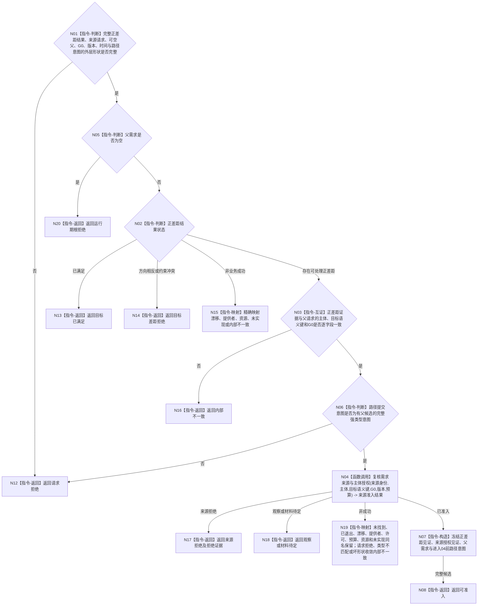

# BIZ-L4-004-02-01-01 复核需求候选准入目标函数流程图 v0.2

更新时间：2026-08-16

## 依据

```text
3100、5100、5110、5130、5150；BIZ-L3-004-01；BIZ-L3-004-02-01；BIZ-L5-004-02-01-01-01
```

## 身份与边界

正式目标函数替代图。函数只消费调用方已经形成的完整 `需求正差距结果`，再经统一 `需求来源准入服务`取得来源与主体授权见证；不重新读取目标合同、当前事实或执行比较，不读取需求结构，不建立新根，不写需求或拒绝回执。

普通 `提交或复用单目标需求`禁止建立新根。父需求为空固定返回运行期根拒绝；冷启动根只能由独立具名初始化入口建立，不经过本函数绕行。

## 函数合同

```text
根函数：需求业务服务::复核需求候选准入
归属模块 / 文件 / 层级：需求领域 / 海中鱼巣/领域/服务.需求.ixx / BIZ-L4
现有或待新增：待新增；消费完整正差距结果和统一来源准入 provider
完整签名：需求候选准入结果 需求业务服务::复核需求候选准入(const 需求候选准入请求& 请求) const noexcept
参数：请求为只读借用；含完整需求正差距结果、来源准入请求、可空父需求、路径提交意图、同一非零 G0、规则版本和发生时间
返回结果：不可变值式结果；来源消费分支精确分账可准入、来源拒绝、观察或材料待定、来源未找到、来源已退出、当前性漂移、版本漂移、提供者拒绝、许可拒绝、数量预算不足、资源失败、未实现和内部不一致；另保留请求拒绝、运行期根拒绝、目标已满足和目标差距拒绝
被调函数流程图：BIZ-L5-004-02-01-01-01
父图：BIZ-L3-004-02-01
```

## 流程图



## 节点合同

| 节点 | 类型 | 参数 / 输入绑定 | 结果 / 输出绑定 | 事实读写 | 后继条件 | 验证 |
| --- | --- | --- | --- | --- | --- | --- |
| N01/N05 | 判断 | 外层请求、可空父需求 | 请求拒绝、运行期根拒绝或非根候选 | 无读写 | 外层形状合法后父空优先于全部业务裁决 | 结构合法的父空请求固定零provider调用；不因目标状态或来源材料改变结果 |
| N02/N03 | 判断 / 互证 | 完整 `需求正差距结果`、父请求 | 正差距见证或具名非成功 | 无读写 | 仅非根且 `存在可处理正差距`继续 | 零目标重读、零再次比较、G0不重选 |
| N04 | 函数调用 | 来源种类、强类型来源身份、主体、完整目标语义键、G0、版本、预算 | `需求来源准入结果` | 只经统一 BIZ provider 只读 | 只有完整已准入见证继续 | 不直达 DATA/L1，不从消息或名称授权 |
| N06 | 判断 | 非空父需求、路径提交意图 | 非根前置意图 | 无读写 | 完整意图才允许来源调用 | 不建立根、不提前裁决最终路径角色 |
| N07/N08 | 构造 / 返回 | 三份完整见证和父身份 | 可准入结果 | 无写入 | 完整值式交付 | 04仍须读当前父链和路径组完成防环 |
| N12—N20 | 返回 / 映射 | 具名非成功与拒绝证据 | 结构化结果 | 无写入 | 返回父提交入口 | 父入口按5150写正式拒绝回执；01零写 |

来源公共结果到01结果的映射固定如下：

| `需求来源准入状态` | `需求候选准入结果` |
| --- | --- |
| 已准入 | 继续构造可准入候选 |
| 来源拒绝 | 来源拒绝并保留完整拒绝证据 |
| 观察或材料待定 | 观察或材料待定并保留完整拒绝证据 |
| 来源未找到 / 来源已退出 | 同名状态 |
| 当前性漂移 / 版本漂移 | 同名状态 |
| 提供者拒绝 / 许可拒绝 / 数量预算不足 / 资源失败 / 未实现 | 同名状态 |
| 请求拒绝 / 来源类型不匹配 / 内部不一致 / 未知值 / 坏 optional或错 G0 | 内部不一致 |

01在调用前已经使用同一公共 helper 验证来源请求，因此统一服务若仍返回入口请求拒绝或来源类型不匹配，表示父子合同不一致，不得降级为普通用户请求拒绝。

## 关键边界

- 01 与后继 04 都是只读函数；任何普通业务拒绝均由父 `提交或复用单目标需求`按 5150 写正式拒绝回执。父空优先于来源读取，固定零provider调用并返回运行期根拒绝。
- 01 只冻结“进入04前路径提交意图”，不宣布路径角色可发布，不读取父链，不做防环。
- 来源已准入不等于允许建立根、可任务化、已入树或已经发布需求。
- v0.1 的目标事实重读、合同重读、再次比较和泛化“按来源主题进入 L5”全部退出。
- 本版冻结父空优先、正差距复用和来源公共15态消费映射；精确 `需求候选准入请求 / 结果`字段布局及 `需求正差距结果`22态到01结果的逐项映射由01自己的后继详细设计与计划冻结。该门禁闭合前，本图不单独授权01代码施工。
