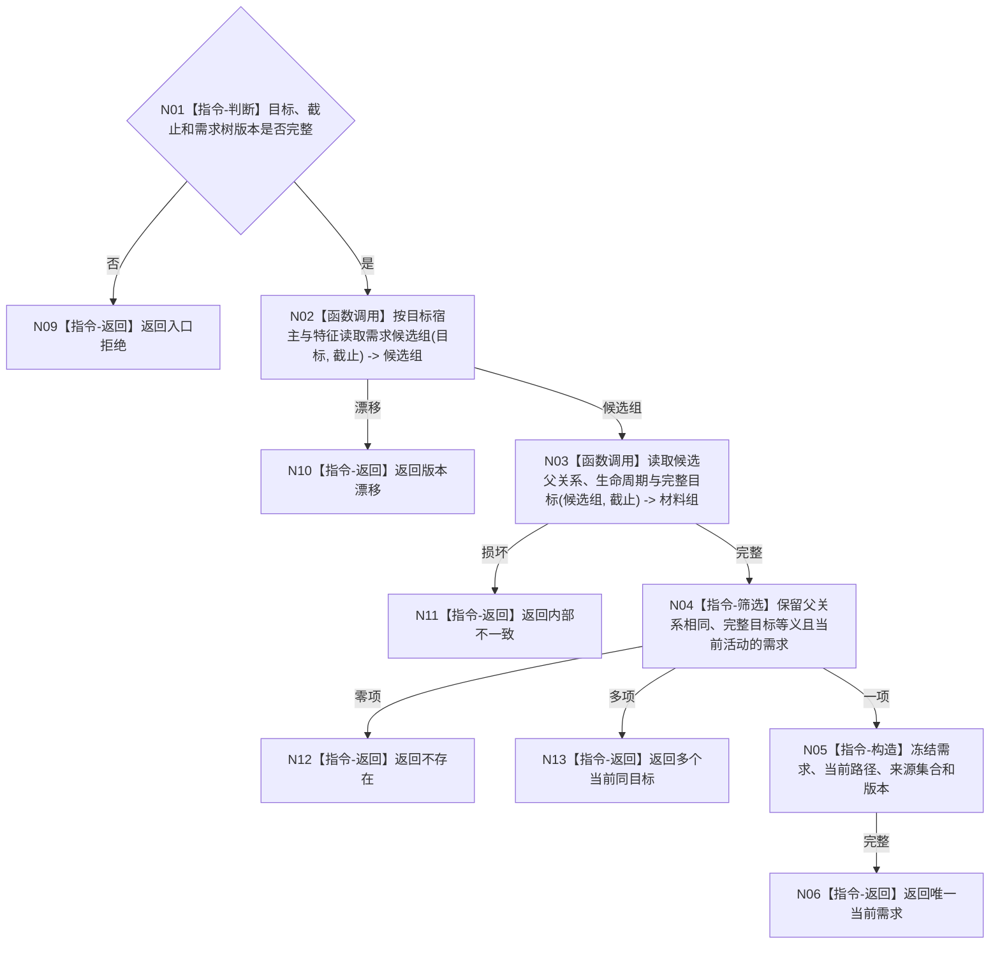

# BIZ-L4-004-02-01-02 读取同父同目标当前需求目标函数流程图 v0.1

更新时间：2026-08-03

## 依据

```text
3100、5100、5110；BIZ-L3-004-02-01
```

## 身份与边界

正式目标函数设计图。按可选父需求和完整目标语义只读定位当前活动需求；不按文本、来源、时间或列表位置去重。

## 函数合同

```text
根函数：需求业务服务::读取同父同目标当前需求
归属模块 / 文件 / 层级：需求领域 / 海中鱼巣/领域/服务.需求.ixx / L4
现有或待新增：待新增；组合父关系、目标和生命周期读取
完整签名：同父同目标需求读取结果 需求业务服务::读取同父同目标当前需求(const 同父同目标需求读取请求& 请求) const
参数：请求为只读借用；含可选父需求、目标宿主/场景/特征/状态合同、满足关系、事实截止和需求树版本
返回结果：不可变值式结果；含不存在、唯一当前需求、多个当前同目标、版本漂移或内部不一致，并回显完整需求和当前路径身份
被调函数流程图：父关系和生命周期复用BIZ-L4-002-04-02-01；目标/状态批量读取在L5展开
父图：BIZ-L3-004-02-01
```

## 流程图



## 节点合同

| 节点 | 类型 | 参数 / 输入绑定 | 结果 / 输出绑定 | 事实读写 | 后继条件 | 验证 |
| --- | --- | --- | --- | --- | --- | --- |
| N02/N03 | 函数调用 | 目标、父需求和截止 | 候选及完整材料 | 只读需求事实 | 材料完整 | 当前关系与历史关系分离 |
| N04—N06 | 指令 | 材料组 | 零/一/多裁决 | 无写入 | 唯一才成功 | 同父完整目标等义 |
| N09—N13 | 指令-返回 | 非成功分类 | 结构化结果 | 无写入 | 返回父图 | 多当前项是内部不一致输入 |

## 关键边界

来源证据差异不能制造第二个需求身份；目标更具体化必须作为明确合并裁决，不能被本读取函数静默等同。
