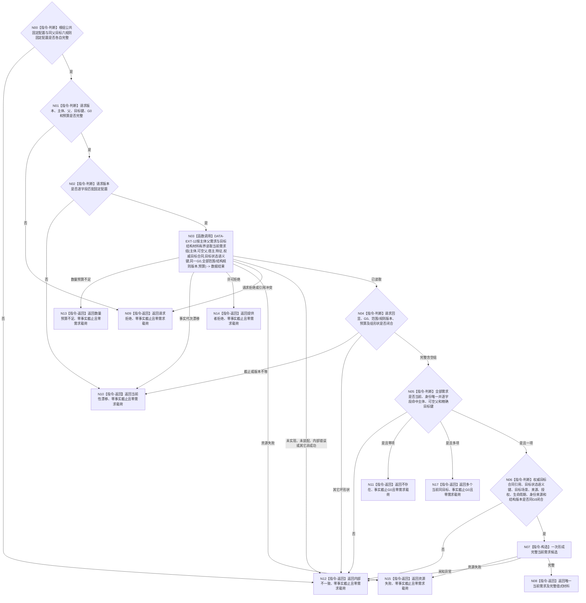

# BIZ-L4-004-02-01-02 读取同父同目标当前需求目标函数流程图 v0.2

更新时间：2026-08-16

## 依据

```text
0050、3100、5100、5110；BIZ-L3-004-02-01；数据服务最终需求清单 DATA-EXT-12
```

## 身份与边界

正式目标函数替代图。函数只经同一 `需求业务服务` 持有的 DATA-EXT-12 `需求结构服务`，按需求主体、可空父需求和精确单目标键，在调用方给定的同一非零共享事实截止 `G0` 一次有界读取全部当前匹配需求，再由 BIZ 裁决零项、一项或多项。

精确单目标键固定为“目标宿主 + 目标特征定义 + 目标状态语义键”。目标状态语义键由完整 `L2特征比较I64合同材料`、目标 I64、允许关系位和目标状态合同规则版本组成；目标合同身份与比较注册身份都只作为权威引用与读回见证，不单独决定目标等价。待登记的 DATA-EXT-12 中性组读必须把引用不同合同 / 注册身份但语义键逐字段相同的需求纳入同一结果组。来源、提出者、到达时间、显示名称和目标场景均不参与去重键。目标场景仍是完整需求事实的一部分，由唯一结果正式读回；本函数不更新场景、来源或路径。

## 函数合同

```text
根函数：需求业务服务::读取同父同目标当前需求
归属模块 / 文件 / 层级：需求业务服务 / 海中鱼巣/领域/服务.需求.ixx / BIZ-L4
现有或待新增：待新增；要求 DATA-EXT-12 新登记中性能力“按主体父需求与目标结构材料有界读取当前需求组”
完整签名：同父同目标需求读取结果 需求业务服务::读取同父同目标当前需求(const 同父同目标需求读取请求& 请求) const noexcept
参数：合同版本、运行代次、全部范围 / 结构规则版本、需求主体、可空父需求、目标宿主、目标特征定义、权威目标状态合同身份、目标状态语义键、非零 G0 和非零数量预算；版本必须匹配服务两份固定配置
返回结果：不存在、唯一当前需求、多个当前同目标、请求拒绝、当前性漂移、数量预算不足、提供者拒绝、资源失败或内部不一致；只有唯一当前需求携带完整值式需求材料
被调能力：DATA-EXT-12 `需求结构服务`待登记“按主体父需求与目标结构材料有界读取当前需求组”，在指定 G0 返回全部逐字段匹配的当前完整需求；不同合同 / 注册身份但语义键相同仍须同组返回；当前最终需求清单与 C++ ABI 均未登记该操作
父图：BIZ-L3-004-02-01
```

## 流程图



## 节点合同

| 节点 | 类型 | 参数 / 输入绑定 | 结果 / 输出绑定 | 事实读写 | 后继条件 | 验证 |
| --- | --- | --- | --- | --- | --- | --- |
| N00—N02 | 判断 | 根组公共固定配置、同父目标六规则固定配置与请求 | 零载荷拒绝或有效请求 | 无写入 | 公共字段只由根组配置拥有；两配置各自完整且请求版本匹配 | 坏配置、坏请求、版本不等均零 DATA 调用 |
| N03 | 函数调用 | 主体、可空父、宿主、特征、权威目标合同、目标状态语义键、G0、全部范围 / 结构规则版本和预算 | 全部当前完整需求组 | 只读 DATA-EXT-12 | 已读取或具名非成功 | 恰一次组读；运行代次不进入 DATA 请求；首笔 wrong-family / 引用冲突返回请求拒绝 |
| N04—N06 | 判断 | DATA 完整结果 | 零 / 一 / 多裁决前材料 | 无写入 | 每项完整且精确命中 | 来源、时间和场景不参与去重；场景仍须在完整事实内 |
| N07—N17 | 构造 / 返回 | 唯一完整候选或失败分类 | 完整当前需求或零载荷非成功 | 无写入 | 唯一映射 | 只有完整已读取零 / 一 / 多分支回显G0；其它状态事实截止为0；空组合法不存在；多项不任选第一项；异常守恒 |

## 关键边界

- DATA 只按强类型参数返回指定 G0 下的完整当前结构，不判断需求是否合理、目标是否满足或哪个需求是主需求；零 / 一 / 多解释属于 BIZ。
- 同父同目标按目标状态语义键逐字段相等裁决，不按目标合同身份或比较注册身份相等裁决。不同引用身份若完整 `L2特征比较I64合同材料`、目标 I64、允许关系位和目标状态合同规则版本相同，必须进入同一候选组；语义键只是本次不可变查询快照，不是第二权威，也不能独立修改目标合同。本叶不处理 5110 的明确值 / 区间 / 宽泛方向细化优先与合并；任何广义包含、裸值近似或显示文本相似仍不得在本函数推导等价。
- 目标场景不进入 5110 的同目标身份键，避免同一长期目标因宿主移动场景而产生第二需求；场景差异是否形成后继路径更新由父级合并逻辑另行裁决。
- 无匹配项必须是 `已读取 + optional 有值 + 空 vector + G0`。`多个当前同目标`是具名内部矛盾状态，不是可继续的普通业务结果；父级必须收敛为内部不一致，禁止按排序、创建时间或来源任选一项。
- 本函数零 L1 / owner / 仓库直达，零写、零缓存、零重试、零历史拼装、零截止重选。旧 v0.1 的目标场景入键、宽泛“目标等义 / 更具体化”和未冻结批量读取语义全部退出。
