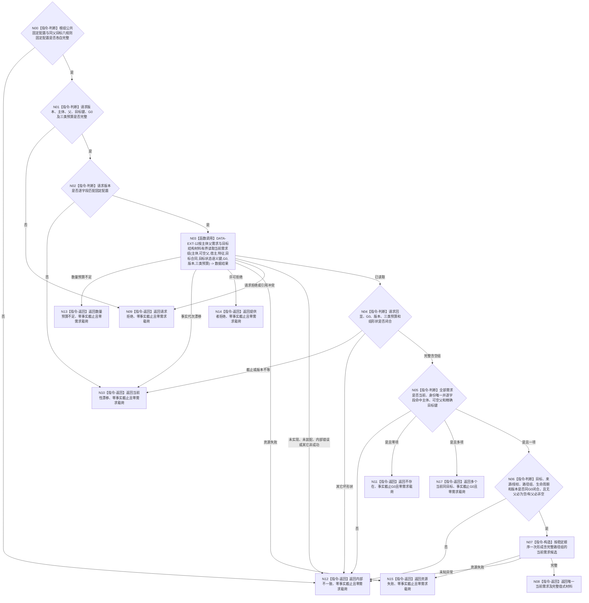

# BIZ-L4-004-02-01-02 读取同父同目标当前需求目标函数流程图 v0.3

更新时间：2026-08-16

## 依据

```text
0050、3100、5100、5110；BIZ-L3-004-02-01；数据服务最终需求清单 DATA-EXT-12
```

## 身份与边界

正式目标函数替代图。函数只经同一 `需求业务服务` 持有的 DATA-EXT-12 `需求结构服务`，按需求主体、可空父需求和精确单目标键，在调用方给定的同一非零共享事实截止 `G0` 一次有界读取全部当前匹配需求，再由 BIZ 裁决零项、一项或多项。

精确单目标键为“目标宿主 + 目标特征定义 + 目标状态语义键”。目标合同身份与比较注册身份只作权威引用；来源、时间、显示名称、目标场景和路径不进入键。一个需求可以在同一父需求下通过多条互异当前路径关系参与不同 OR / AND 路径；DATA 必须完整返回当前路径关系组，BIZ 不因路径不同建立第二需求身份，也不在本函数选择结算路径。

## 函数合同

```text
根函数：需求业务服务::读取同父同目标当前需求
归属模块 / 文件 / 层级：需求业务服务 / 海中鱼巣/领域/服务.需求.ixx / BIZ-L4
现有或待新增：待新增；要求 DATA-EXT-12 登记中性能力“按主体父需求与目标结构材料有界读取当前需求组”并完整返回当前路径关系组
完整签名：同父同目标需求读取结果 需求业务服务::读取同父同目标当前需求(const 同父同目标需求读取请求& 请求) const noexcept
参数：合同版本、运行代次、全部范围 / 结构规则版本、需求主体、可空父需求、目标宿主、目标特征定义、权威目标状态合同身份、目标状态语义键、非零 G0 和非零需求 / 来源 / 路径总预算；版本必须匹配服务两份固定配置
返回结果：不存在、唯一当前需求、多个当前同目标、请求拒绝、当前性漂移、数量预算不足、提供者拒绝、资源失败或内部不一致；只有唯一当前需求携带含完整当前路径关系组的值式需求材料
被调能力：DATA-EXT-12 `需求结构服务`待登记“按主体父需求与目标结构材料有界读取当前需求组”，在指定 G0 返回全部匹配需求、全部来源 / 授权和全部当前路径关系；当前最终需求清单与 C++ ABI 均未登记该精确操作
父图：BIZ-L3-004-02-01
```

## 流程图



## 节点合同

| 节点 | 类型 | 参数 / 输入绑定 | 结果 / 输出绑定 | 事实读写 | 后继条件 | 验证 |
| --- | --- | --- | --- | --- | --- | --- |
| N00—N02 | 指令-判断 | 两份固定配置与请求 | 零载荷拒绝或有效请求 | 无写入 | 共同字段唯一且版本匹配 | 坏配置、坏请求和版本不等零 DATA 调用 |
| N03 | 函数调用 | 主体、父、精确目标键、G0、版本和三类预算 | 全部当前完整需求组 | 只读 DATA-EXT-12 | 已读取或具名非成功 | 恰一次组读；运行代次不进入 DATA 请求 |
| N04—N06 | 指令-判断 | DATA 完整结果 | 零 / 一 / 多及唯一项完整性 | 无写入 | 来源组、授权组和路径组零截断、零重复 | 路径不入去重键；同父同目标不同路径仍只允许一个需求身份 |
| N07—N17 | 构造 / 返回 | 稳定排序的完整候选或失败分类 | 完整当前需求或零载荷非成功 | 无写入 | 唯一映射 | 只有完整已读取零 / 一 / 多回显G0；多项不任选；异常守恒 |

## 关键边界

- 同一父需求下，同一目标需求可由多条互异当前路径关系承载；每条关系独立保留路径组 / 角色 / 顺序 / 当前性和版本。父需求为空时路径关系组必须为空，父需求非空时必须至少一项；违反任一条件均为内部不一致、零业务载荷和零事实截止。路径不同不建立第二需求身份，也不使旧路径自动退出。
- 实际结算仍只允许一条合法活动 OR 路径领取一次；本函数只返回结构，不选择路径、不结算、不重判角色。
- DATA 只返回强类型结构；BIZ 只裁决零 / 一 / 多及完整性。路径组按显式路径身份、角色、顺序和关系身份稳定排序，不得截断、任选或折叠为单项。
- 无匹配项必须是已读取空组；多个当前同目标是内部矛盾状态。本函数零 L1 / owner / 写入 / 缓存 / 历史拼装 / 重试 / 截止重选。
