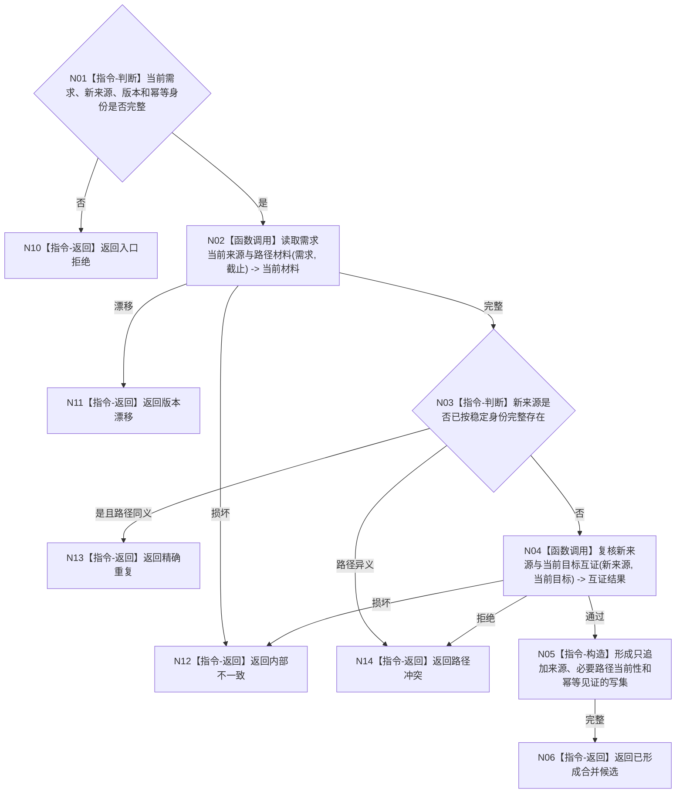

# BIZ-L4-004-02-01-03 合并来源与当前路径材料目标函数流程图 v0.1

更新时间：2026-08-03

## 依据

```text
3100、5110、5130；BIZ-L3-004-02-01
```

## 身份与边界

正式目标函数设计图。为唯一当前同目标需求形成来源与当前路径的幂等补充候选；不改变目标语义，不直接发布。

## 函数合同

```text
根函数：需求业务服务::合并来源与当前路径材料
归属模块 / 文件 / 层级：需求领域 / 海中鱼巣/领域/服务.需求.ixx / L4
现有或待新增：待新增；复用需求来源和路径专用参与者
完整签名：需求来源路径合并结果 需求业务服务::合并来源与当前路径材料(const 需求来源路径合并请求& 请求) const
参数：请求为只读借用；含当前需求完整投影、新来源证据、可选父路径材料、事实截止、期望版本和幂等身份
返回结果：不可变值式结果；含精确重复、已形成合并候选、路径冲突、版本漂移或内部不一致；候选含只追加来源/路径当前性的冻结写集
被调函数流程图：来源互证和路径当前性专用读取在L5展开；发布复用BIZ-L4-004-02-01-05
父图：BIZ-L3-004-02-01
```

## 流程图



## 节点合同

| 节点 | 类型 | 参数 / 输入绑定 | 结果 / 输出绑定 | 事实读写 | 后继条件 | 验证 |
| --- | --- | --- | --- | --- | --- | --- |
| N02/N04 | 函数调用 | 当前需求和新来源 | 当前材料与互证 | 只读需求/来源事实 | 来源与目标互证 | 不以文本或获取途径去重 |
| N03/N05/N06 | 指令 | 当前材料 | 重复或冻结写集 | 无已发布写入 | 只追加且目标不变 | 历史来源不删除 |
| N10—N14 | 指令-返回 | 非成功分类 | 结构化结果 | 无写入 | 返回父图 | 冲突与损坏分离 |

## 关键边界

合并只能补充来源证据和当前路径材料；不得覆盖需求目标、父权重、历史路径或结算事实。

