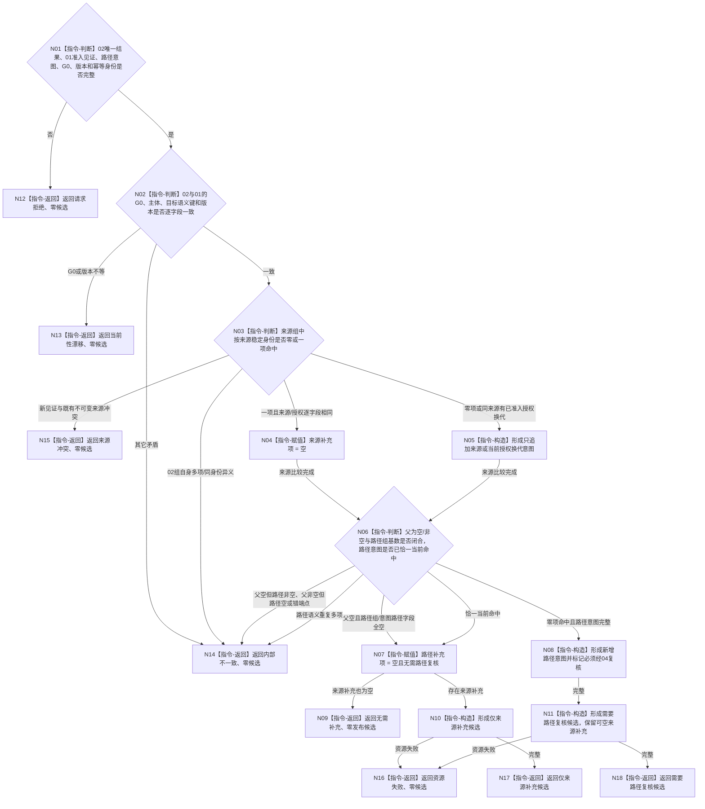

# BIZ-L4-004-02-01-03 合并来源与当前路径材料目标函数流程图 v0.2

更新时间：2026-08-16

## 依据

```text
0050、3100、5100、5110、5130；BIZ-L3-004-02-01 v0.2；BIZ-L4-004-02-01-02 v0.3
```

## 身份与边界

正式目标函数替代图。函数只消费 02 已正式读取的完整当前需求值、01 后继冻结的已准入来源授权见证和父请求的路径提交意图，纯值形成无需补充、仅来源补充或需要路径复核的不可变候选。零 DATA 调用、零事实写入，不生成 DATA 内部写集。

## 函数合同

```text
根函数：需求业务服务::合并来源与当前路径材料
归属模块 / 文件 / 层级：需求业务服务 / 海中鱼巣/领域/服务.需求.ixx / BIZ-L4
现有或待新增：待新增；纯值组合，复用02完整结果并等待01最终来源授权见证DTO
完整签名：需求来源路径合并结果 需求业务服务::合并来源与当前路径材料(const 需求来源路径合并请求& 请求) const noexcept
参数：02唯一当前需求结果、01可准入来源授权见证、路径提交意图、同一非零G0、来源 / 路径规则版本和非零后继发布幂等身份
返回结果：无需补充、仅来源补充候选、需要路径复核候选、请求拒绝、当前性漂移、来源冲突、资源失败或内部不一致；候选只携带值式补充意图
被调函数流程图：无；本函数只执行具体纯值指令
父图：BIZ-L3-004-02-01 v0.2
```

## 流程图



## 节点合同

| 节点 | 类型 | 输入 | 输出 | 事实读写 | 验证 |
| --- | --- | --- | --- | --- | --- |
| N01/N02 | 指令-判断 | 两个上游值、G0、版本和幂等身份 | 有效同截止输入或零候选非成功 | 无 | 不选择新截止、不重读DATA |
| N03—N05 | 指令-判断 / 构造 | 全部当前来源 / 授权组与新见证 | 空或一个来源补充意图 | 纯值 | 02组自身重复/异义为内部不一致；有效新见证与既有不可变来源冲突为来源冲突 |
| N06—N08 | 指令-判断 / 构造 | 全部当前路径关系组与路径意图 | 空或一个待04复核路径意图 | 纯值 | 根需求全空直接无需路径补充；非根组非空并按组/角色/顺序比较 |
| N09—N18 | 指令-构造 / 返回 | 两类可空补充项 | 无需补充或完整候选 | 无 | 同输入产生值相等结果；不宣称DATA幂等 |

## 关键边界

- 当前需求、来源、授权和路径只来自02完整值；03不得再次调用 DATA 或历史补缺。
- 来源追加不改变需求目标、父权重、既有来源或历史；授权换代只形成意图，正式当前/历史切换由05经DATA完成。
- 路径意图语义键为父子端点、路径组、角色和顺序；关系身份不参与意图等价。未命中不等于冲突，只表示必须经04复核；多项同义当前路径是内部不一致。
- 后继发布幂等身份只原样进入候选；本函数不查询幂等账，也不把 `无需补充`伪装成DATA精确重复。
