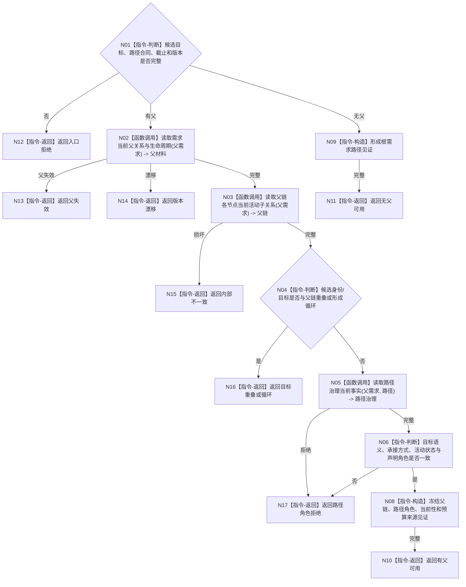

# BIZ-L4-004-02-01-04 复核父需求路径角色与防环目标函数流程图 v0.1

更新时间：2026-08-03

## 依据

```text
3100、5100、5110；BIZ-L3-004-02-01；BIZ-L4-002-04-02-01—02
```

## 身份与边界

正式目标函数设计图。只读复核候选父关系、路径角色、活动当前性、目标重叠和循环；拓扑数量不能单独决定业务角色。

## 函数合同

```text
根函数：需求业务服务::复核父需求路径角色与防环
归属模块 / 文件 / 层级：需求领域 / 海中鱼巣/领域/服务.需求.ixx / L4
现有或待新增：待新增；组合父链、活动子关系与路径治理读取
完整签名：需求父路径复核结果 需求业务服务::复核父需求路径角色与防环(const 需求父路径复核请求& 请求) const
参数：请求为只读借用；含候选目标、可选父需求、路径角色/组、当前性、权重预算来源、事实截止和需求树版本
返回结果：不可变值式结果；含无父可用、有父可用、父失效、目标重叠、循环、路径角色拒绝、版本漂移或内部不一致，并回显冻结父链见证
被调函数流程图：读取父关系与生命周期复用BIZ-L4-002-04-02-01；读取活动子关系复用BIZ-L4-002-04-02-02；路径治理读取复用BIZ-L4-002-06-02-03
父图：BIZ-L3-004-02-01
```

## 流程图



## 节点合同

| 节点 | 类型 | 参数 / 输入绑定 | 结果 / 输出绑定 | 事实读写 | 后继条件 | 验证 |
| --- | --- | --- | --- | --- | --- | --- |
| N02/N03/N05 | 函数调用 | 父需求、路径和截止 | 父链与治理材料 | 只读需求事实 | 同截止完整 | 历史子项不冒充活动项 |
| N04/N06 | 指令-判断 | 候选与父链 | 防环和角色裁决 | 无写入 | 无环且语义一致 | 不按子节点数量判断角色 |
| N08—N17 | 构造 / 返回 | 裁决材料 | 结构化结果 | 无写入 | 返回父图 | 根需求与有父需求分离 |

## 关键边界

父子拓扑只表达展开；AND、OR、管理、执行或因果支撑角色必须由正式路径关系和目标语义共同成立。

