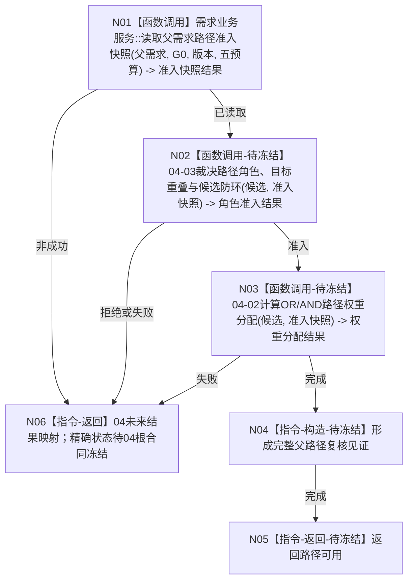

# BIZ-L4-004-02-01-04 复核父需求路径角色与防环目标函数流程图 v0.2

更新时间：2026-08-16

## 依据

```text
0050、3100、5100、5110、5150
BIZ-L3-004-02-01 v0.4
BIZ-L5-004-02-01-04-01 v0.1
```

## 身份与边界

正式目标函数部分重基线图。当前只把04拆成三个职责互斥的 BIZ-L5 叶，并冻结 04-01 中性快照读取；04-02 权重分配和04-03角色 / 重叠 / 候选防环仍是设计缺口，所以本图不构成04根函数的可施工合同。

旧 v0.1 的“无父根见证”、分次父链读取和虚构“路径治理当前事实”退出。普通提交父需求必须非零；冷启动根由具名入口处理。

## 函数合同

```text
根函数：需求业务服务::复核父需求路径角色与防环
归属模块 / 文件 / 层级：需求领域 / 海中鱼巣/领域/服务.需求.ixx / BIZ-L4
现有或待新增：待新增；当前只有子叶04-01合同冻结
完整签名：未冻结；必须等待04-02/04-03的角色、目标重叠、权重和余量机器语义裁决
参数：未来至少消费03新增路径候选、非零父需求、同一G0、版本与预算；精确DTO未冻结
返回结果：未来必须分账结构读取失败、角色拒绝、目标重叠、候选成环、权重分配和内部不一致；精确状态未冻结
被调函数流程图：BIZ-L5-004-02-01-04-01 v0.1；04-02/04-03尚无有效函数图
父图：BIZ-L3-004-02-01 v0.4
```

## 流程图



## 节点合同

| 节点 | 当前状态 | 已冻结输入 / 输出 | 未决语义 | 完成边界 |
| --- | --- | --- | --- | --- |
| N01 | 已冻结子叶 | 非零父需求、G0、版本、五预算 -> 完整中性准入快照 | DATA最终ABI待实现 | 只证明结构读取 |
| N02 | 设计缺口 | 候选与快照 | 正式路径角色全集、角色匹配、目标重叠算法、候选循环裁决 | 不得由拓扑数量推断 |
| N03 | 设计缺口 | 已准入候选与权威权重事实 | W类型/范围、W/n、余量、新成员重分配 | 不得写死旧算法 |
| N04/N05/N06 | 设计缺口 | 三叶结果 | 04根DTO、优先级和状态映射 | 未冻结前不得施工04根 |

## 关键边界

04-01 的发布和实现不会自动闭合04。只有04-02与04-03的机器语义经正式规范裁决、形成独立叶设计并由04根重新冻结后，04才可能进入可施工状态；05仍不得越过04。
