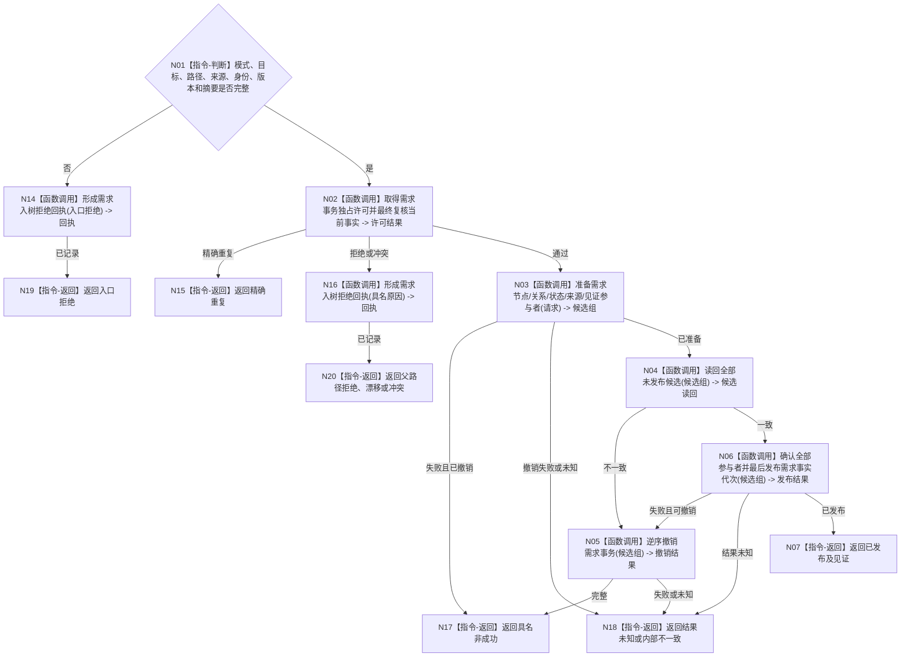

# BIZ-L4-004-02-01-05 发布单目标需求事务目标函数流程图 v0.1

更新时间：2026-08-03

## 依据

```text
0050、3100、4010—4050、5110、5150；BIZ-L3-004-02-01
```

## 身份与边界

正式目标函数设计图。原子发布新需求或既有需求来源/路径合并写集，并在拒绝时形成结构化回执；不创建任务。

## 函数合同

```text
根函数：需求数据操作::发布单目标需求事务
归属模块 / 文件 / 层级：需求数据操作 / 海中鱼巣/领域/数据操作.需求.ixx / L4
现有或待新增：待新增；复用节点、关系、类型化状态、来源证据和发布见证参与者
完整签名：单目标需求发布结果 需求数据操作::发布单目标需求事务(const 单目标需求发布请求& 请求)
参数：请求为只读借用；含创建或合并模式、完整目标、父路径、来源、授权/当前性、节点/关系/状态幂等身份、预期代次、需求树版本和语义摘要
返回结果：不可变值式结果；含已发布、精确重复、入口拒绝、父路径拒绝、版本漂移、幂等冲突、资源失败、结果未知或内部不一致，以及发布身份和见证
被调函数流程图：事务参与者准备、读回、逆序撤销、确认和发布见证属于L5展开对象
父图：BIZ-L3-004-02-01
```

## 流程图



## 节点合同

| 节点 | 类型 | 参数 / 输入绑定 | 结果 / 输出绑定 | 事实读写 | 后继条件 | 验证 |
| --- | --- | --- | --- | --- | --- | --- |
| N02—N04 | 函数调用 | 完整写集 | 许可与未发布候选 | 仅不可见候选 | 全部读回一致 | 第一笔写入前最终复核 |
| N05/N06 | 函数调用 | 完整候选 | 撤销或发布 | 原子切换一个需求事实代次 | 全确认后发布 | 故障注入覆盖每个参与者 |
| N14/N16 | 函数调用 | 拒绝材料 | 5150结构化回执 | 写治理回执，不写需求 | 回执形成后返回 | 日志不替代回执 |
| N07/N15/N17—N20 | 指令-返回 | 发布状态 | 结构化结果 | 无额外写入 | 返回父图 | 结果未知不得重试造第二需求 |

## 关键边界

需求节点、目标/父路径/来源关系、当前状态和发布见证必须同代次可读；SQL或材料写入成功不构成运行期需求发布。
