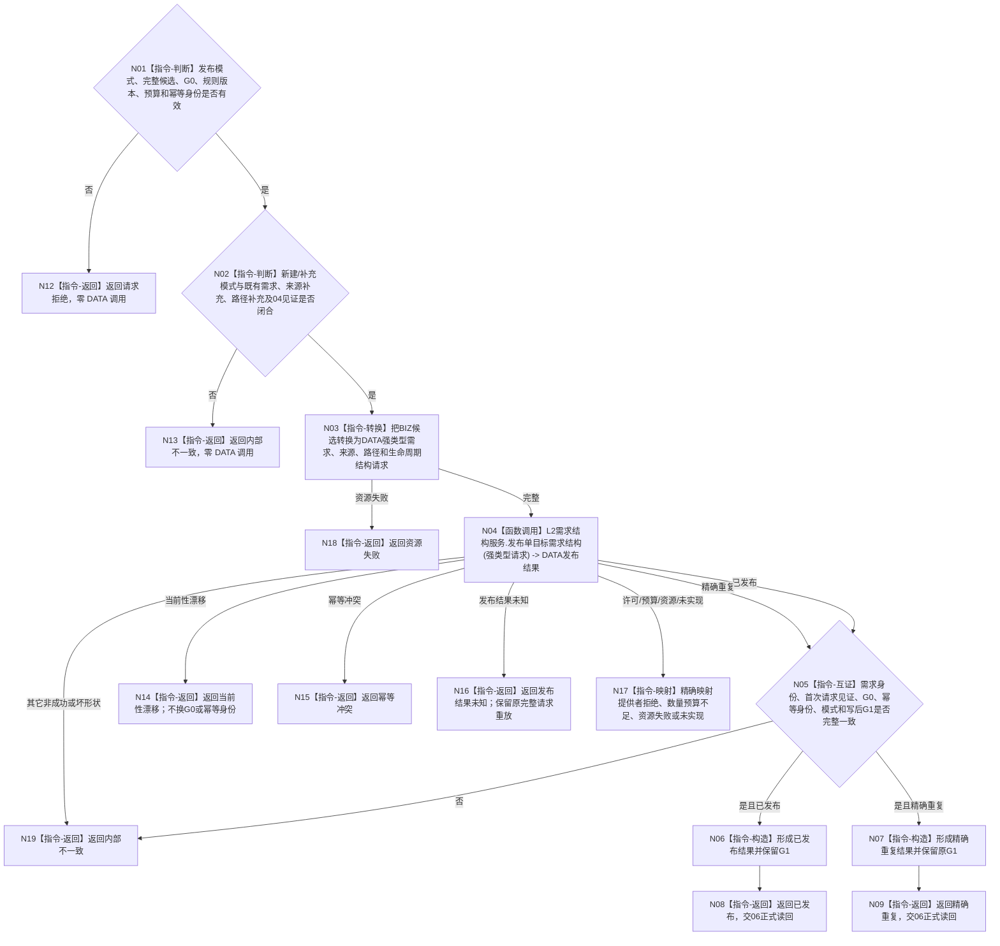

# BIZ-L4-004-02-01-05 发布单目标需求结构目标函数流程图 v0.2

更新时间：2026-08-16

## 依据

```text
0050、3100、5100、5110、5150；BIZ-L3-004-02-01 v0.3；BIZ-L4-004-02-01-03 v0.2
```

## 身份与边界

正式目标函数替代图。函数只把上游已经完成业务准入、同父同目标复用和必要路径复核的完整候选，转换为唯一 DATA-EXT-12 `需求结构服务`公开强类型请求并恰一次提交。DATA 内部负责结构校验、幂等、原子发布和首次结果见证；BIZ 不取得 owner、L1、事务、候选确认、撤销或内部写集。

本函数不写 5150 拒绝回执；所有业务拒绝仍由父 `提交或复用单目标需求`入口统一写入治理结构。本函数成功或精确重复后也不宣称需求完整成立，必须把 DATA 发布身份和 `G1`交给 06 正式读回。

## 函数合同

```text
根函数：需求业务服务::发布单目标需求结构
归属模块 / 文件 / 层级：需求业务服务 / 海中鱼巣/领域/服务.需求.ixx / BIZ-L4
现有或待新增：待新增；只消费 DATA-EXT-12 唯一公开写入口
完整签名：单目标需求结构发布结果 需求业务服务::发布单目标需求结构(const 单目标需求结构发布请求& 请求) const noexcept
参数：请求为只读借用；含建立新需求或补充既有需求的完整候选、可空路径复核见证、同一非零 G0、原发布幂等身份、规则版本和数量预算
返回结果：不可变值式结果；已发布或精确重复时携带需求身份、原首次请求见证和写后非零 G1；发布未知及其它非成功零发布材料
被调函数流程图：DATA-EXT-12 公开结构写入属于基础数据提供者内部，不在 BIZ 图中展开
父图：BIZ-L3-004-02-01 v0.3
```

## 流程图



## 节点合同

| 节点 | 类型 | 输入 | 输出 | 事实读写 | 验证 |
| --- | --- | --- | --- | --- | --- |
| N01/N02 | 判断 | 完整BIZ候选、可空04见证、G0、版本、预算、幂等身份 | 合法模式或零调用非成功 | 无 | 新建必须有经04复核路径；补充只能新增来源或路径；新增路径必须有04见证；无需补充不得调用本函数 |
| N03 | 转换 | BIZ业务见证 | DATA中性强类型结构请求 | 无 | 不把“已准入”“路径允许”等业务布尔或BIZ见证对象传入DATA；只传结构身份、关系、生命周期、来源事实与版本 |
| N04 | 函数调用 | 一个完整DATA请求 | 一个结构化DATA结果 | 只经唯一DATA-EXT-12写入口 | 原请求恰一次调用；零L1/owner/事务/撤销/缓存 |
| N05—N09 | 互证 / 构造 / 返回 | 成功或精确重复材料 | 需求身份、首次请求见证、G1 | 无额外写入 | G1非零；精确重复返回原结果且不推进代次；两态都必须进入06 |
| N12—N19 | 返回 / 映射 | 具名非成功 | 零发布材料 | 无额外写入 | 发布未知不换身份重试；DATA在同一G0拒绝已由BIZ证明的引用或路径形状时按内部不一致处理 |

## 基础数据公开接口需求

DATA-EXT-12 必须提供一个唯一公开 `发布单目标需求结构`操作：接收建立或补充模式、可空既有需求、完整单目标结构、来源结构组、可空路径结构、生命周期、非零期望事实代次、单一幂等身份及预算；返回已发布、精确重复、漂移、幂等冲突、许可拒绝、预算、资源、结果未知、未实现或内部不一致。已发布与精确重复必须回显完整首次请求见证、需求身份和原写后事实代次。精确 C++ ABI 由 DATA 提供者发布后机械匹配，本图不冻结 DATA 内部写集。

## 关键边界

- v0.1 的 BIZ `需求数据操作`、事务参与者、逆序撤销和私有发布见证全部退出，不得施工。
- 05只负责公开结构提交及结果互证；5150回执由父入口负责，06负责正式读回。
- DATA入口拒绝、引用缺失、路径成环或半结构若发生在同一G0且BIZ输入已经通过上游合同，属于内部不一致，不降级为普通业务拒绝。
- 发布结果未知只允许原完整请求、原G0和原幂等身份重放；本函数不自动重试。
