# BIZ-L4-004-02-01-06 完整读回需求目标来源与路径目标函数流程图 v0.1

更新时间：2026-08-03

## 依据

```text
3100、5100、5110、5150；BIZ-L3-004-02-01
```

## 身份与边界

正式目标函数设计图。按需求稳定身份和精确发布见证联合读回目标、来源、父路径、当前性与版本；不根据提交返回值补齐缺项。

## 函数合同

```text
根函数：需求业务服务::完整读回需求目标来源与路径
归属模块 / 文件 / 层级：需求领域 / 海中鱼巣/领域/服务.需求.ixx / L4
现有或待新增：待新增；组合需求结构与发布见证读取
完整签名：单目标需求完整读回结果 需求业务服务::完整读回需求目标来源与路径(const 单目标需求完整读回请求& 请求) const
参数：请求为只读借用；含需求稳定身份、原幂等身份、发布见证、事实截止、期望需求树版本和规则版本
返回结果：不可变值式结果；含已读取、不存在、材料缺失、目标异义、版本漂移或内部不一致，以及完整单目标、全部来源、父路径和当前性
被调函数流程图：父关系/生命周期复用BIZ-L4-002-04-02-01；路径治理复用BIZ-L4-002-06-02-03；目标与来源批量读取在L5展开
父图：BIZ-L3-004-02-01
```

## 流程图

```mermaid
flowchart TD
    N01{"N01【指令-判断】需求、幂等身份、发布见证和版本是否完整"} -->|否| N11["N11【指令-返回】返回入口拒绝"]
    N01 -->|是| N02["N02【函数调用】读取需求节点、主体、目标宿主/场景/特征/状态(需求, 截止) -> 目标材料"]
    N02 -->|不存在| N12["N12【指令-返回】返回不存在"]
    N02 -->|缺失| N13["N13【指令-返回】返回材料缺失"]
    N02 -->|完整| N03["N03【函数调用】读取需求当前父关系与生命周期(需求, 截止) -> 父生命材料"]
    N03 -->|非成功| N13
    N03 -->|完整| N04["N04【函数调用】读取需求全部来源和路径治理当前事实(需求, 截止) -> 来源路径材料"]
    N04 -->|非成功| N13
    N04 -->|完整| N05["N05【函数调用】读取原幂等发布见证(幂等身份, 发布见证) -> 见证材料"]
    N05 -->|漂移| N14["N14【指令-返回】返回版本漂移"]
    N05 -->|完整| N06{"N06【指令-判断】单目标、来源、路径、当前性和见证是否逐项互证"}
    N06 -->|目标异义| N15["N15【指令-返回】返回目标异义"]
    N06 -->|其它矛盾| N16["N16【指令-返回】返回内部不一致"]
    N06 -->|一致| N07["N07【指令-构造】按稳定身份冻结完整需求投影"]
    N07 -->|完整| N08["N08【指令-返回】返回已读取"]
```



## 节点合同

| 节点 | 类型 | 参数 / 输入绑定 | 结果 / 输出绑定 | 事实读写 | 后继条件 | 验证 |
| --- | --- | --- | --- | --- | --- | --- |
| N02—N05 | 函数调用 | 需求、截止和见证 | 目标、父链、来源路径和见证 | 只读已发布事实 | 同一发布版本 | 不读SQL、缓存或提交方临时对象 |
| N06—N08 | 指令 | 全量材料 | 完整投影 | 无写入 | 逐项互证 | 单目标、全来源、当前路径齐全 |
| N11—N16 | 指令-返回 | 非成功分类 | 结构化结果 | 无写入 | 返回父图 | 缺失、异义、漂移分账 |

## 关键边界

发布返回成功不能替代独立读回。读回发现半结构或同一发布见证下的异义属于内部不一致，不得补默认字段后宣称创建成功。
