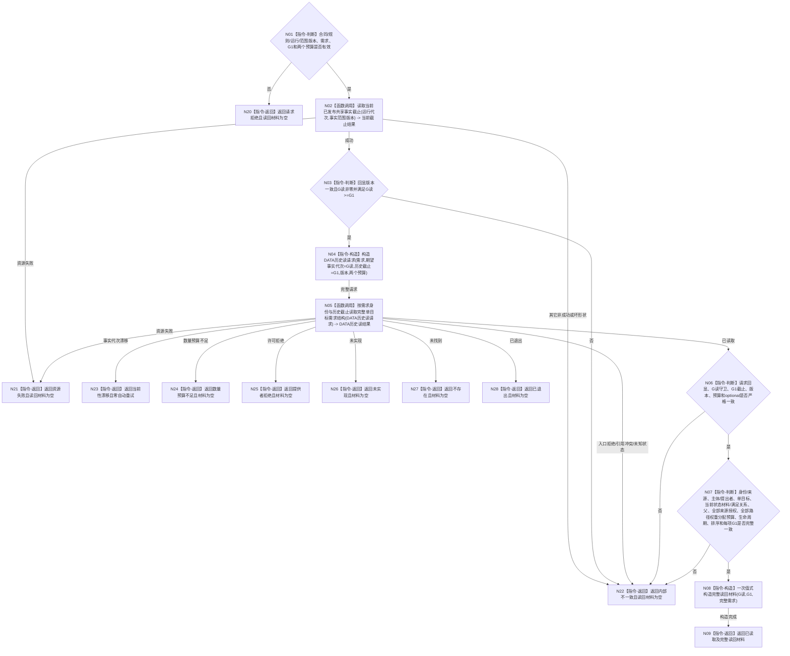

# BIZ-L4-004-02-01-06 完整读回需求目标来源与路径目标函数流程图 v0.2

更新时间：2026-08-16

## 依据

```text
0050、3100、4015、4030、4050、4230、5100、5110、5150；
BIZ-L3-004-02-01 v0.4；
DEMAND-SINGLE-TARGET-STRUCTURE-READBACK-CONSUME v0.1详细设计
```

## 身份与边界

正式目标函数替代图。06只消费一个非零需求身份和05返回的原G1，以既有运行期事实版本服务重新取得本次当前守卫G读，再经 DATA-EXT-12 唯一需求结构服务按`G读`守卫、`G1`历史截止一次读取完整需求投影。06不接收05首次请求见证或幂等账材料，不直达L1 / owner / 仓库 / SQL，不分次拼装目标、父、来源或路径，不写5150回执。

DATA-EXT-12完整历史读ABI仍待实现；图中只冻结具名公开能力、请求 / 结果语义和调用顺序，精确C++类型名与字段顺序必须在DATA最终发布后机械匹配。本图不能证明真实DATA读回已经可用。

## 函数合同

```text
根函数：需求业务服务::完整读回需求目标来源与路径
归属模块 / 文件 / 层级：需求领域 / 海中鱼巣/领域/服务.需求.ixx / BIZ-L4
现有或待新增：待新增；目标合同已冻结，真实DATA ABI待实现
完整签名：单目标需求完整读回结果 需求业务服务::完整读回需求目标来源与路径(const 单目标需求完整读回请求& 请求) const noexcept
参数：请求为只读借用；含合同/规则版本、运行代次、事实范围版本、一个非零L2需求身份、原非零发布事实代次G1、非零来源授权总预算和非零当前路径关系总预算
返回结果：不可变值式结果；已读取时携带G读、G1及一个G1下完整单目标需求投影；请求拒绝、不存在、已退出、当前性漂移、数量预算不足、提供者拒绝、资源失败、未实现或内部不一致时载荷为空
被调函数流程图：运行期事实版本服务::读取当前已发布共享事实截止；DATA-EXT-12待实现“按需求身份与历史截止读取完整单目标需求结构”公开能力
父图：BIZ-L3-004-02-01 v0.4
```

## 流程图



## 节点合同

| 节点 | 类型 | 参数 / 输入绑定 | 结果 / 输出绑定 | 事实读写 | 后继条件 | 验证 |
| --- | --- | --- | --- | --- | --- | --- |
| N01 | 指令-判断 | 完整BIZ请求 | 有效 / 请求拒绝 | 无事实读写 | 所有身份、代次、版本和预算非零有效 | 坏请求零下层调用 |
| N02 | 函数调用 | 运行代次、事实范围版本 | 当前截止结果、G读 | 只读既有provider | 成功回显同版本、G读非零 | 不新增第二当前截止入口 |
| N03/N04 | 判断 / 构造 | G读、原G1、需求、预算 | 一份DATA历史读请求 | 无事实写入 | `0<G1<=G读` | G读与G1字段分账 |
| N05 | 函数调用 | DATA历史读请求 | DATA历史读结果 | 恰一次只读DATA-EXT-12 | DATA前后守卫同一G读；历史重建截止G1 | 零自动重试、零分次拼装 |
| N06/N07 | 指令-判断 | DATA完整结果 | 完整 / 内部不一致 | 无事实写入 | 全字段、全组、全代次和稳定排序一致 | 空父 / 非空父、零 / 一 / 多来源路径矩阵 |
| N08/N09 | 构造 / 返回 | 已验证DATA投影 | BIZ值式完整投影 | 无事实写入 | 只在全部互证后构造 | 非成功绝不携带部分载荷 |
| N20—N28 | 指令-返回 | 具名非成功 | 空载荷结果 | 无事实写入 | 精确状态映射 | 05成功后的不存在 / 已退出由父级升级内部不一致 |

## 关键边界

- `G1`是05原发布结构的历史截止，`G读`是06本次读取的当前守卫；精确重复时允许`G读>G1`，不得把G1冒充当前守卫。
- DATA成功投影必须完整包含3100要求的当前状态材料和满足关系，以及5110要求的路径当前性、权重、AND份额 / 余量版本和预算来源；缺项不得由BIZ默认补齐。
- 05首次请求见证只由父函数持有并与本函数成功投影比较；它不进入DATA读请求，也不要求DATA公开L1幂等账。
- DATA漂移返回后，本函数零自动重试、零换G1；后继可用同一需求身份和原G1重新发起完整06。
- v0.1保留为不可施工历史图。DATA最终ABI、04 / 05跨叶字段和上游BIZ代码结果未闭合前，本图对应计划只能待激活。
