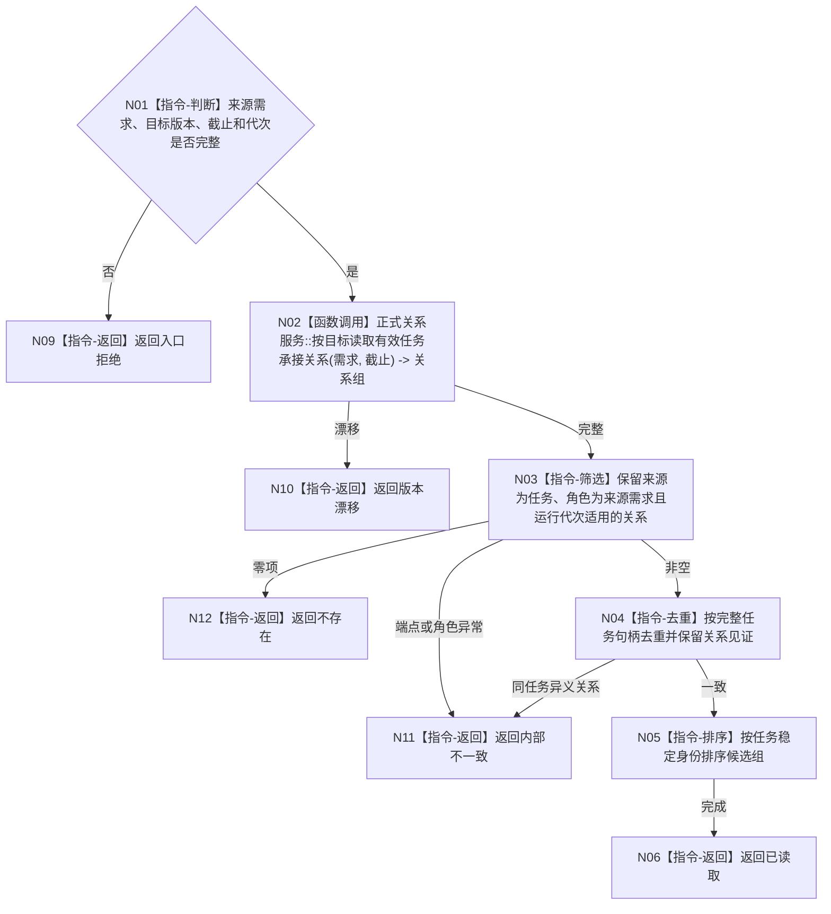

# BIZ-L4-004-02-02-01 按来源需求读取当前承接任务组目标函数流程图 v0.1

更新时间：2026-08-03

## 依据

```text
3200、5090、5200；BIZ-L3-004-02-02
```

## 身份与边界

正式目标函数设计图。从任务到来源需求的正式反向关系读取当前承接候选；不按任务缓存、列表或创建时间推断当前任务树。

## 函数合同

```text
根函数：任务业务服务::按来源需求读取当前承接任务组
归属模块 / 文件 / 层级：任务领域 / 海中鱼巣/领域/服务.任务.ixx / L4
现有或待新增：待新增；扩展任务—需求正式关系反向读取
完整签名：当前承接任务组读取结果 任务业务服务::按来源需求读取当前承接任务组(const 当前承接任务组读取请求& 请求) const
参数：请求为只读借用；含来源需求稳定身份、目标合同版本、事实截止、运行代次和任务关系规则版本
返回结果：不可变值式结果；含不存在、已读取、版本漂移或内部不一致，以及按任务稳定身份排序的当前承接任务候选组和关系见证
被调函数流程图：正式关系反向值式读取属于已冻结通用能力；任务关系角色筛选为本函数内指令
父图：BIZ-L3-004-02-02
```

## 流程图



## 节点合同

| 节点 | 类型 | 参数 / 输入绑定 | 结果 / 输出绑定 | 事实读写 | 后继条件 | 验证 |
| --- | --- | --- | --- | --- | --- | --- |
| N02 | 函数调用 | 来源需求和截止 | 关系组 | 只读已发布关系 | 读取完成 | 无SQL/缓存反查 |
| N03—N05 | 指令 | 关系组 | 稳定候选组 | 无写入 | 端点、角色、代次一致 | 多来源任务仍只出现一次 |
| N06/N09—N12 | 指令-返回 | 读取裁决 | 结构化结果 | 无写入 | 返回父图 | 空与损坏分离 |

## 关键边界

该函数只给出候选任务组；任务是否属于当前唯一树还必须联合生命周期、目标等价和运行态治理存在复核。

