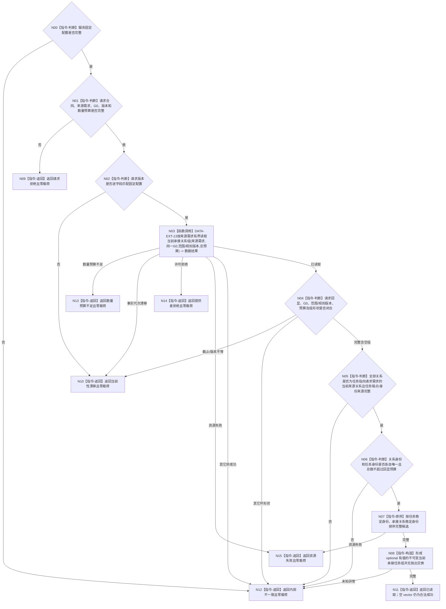

# BIZ-L4-004-02-02-01 按来源需求读取当前承接任务组目标函数流程图 v0.2

更新时间：2026-08-16

## 依据

```text
0050、3200、5090、5200、4015；BIZ-L3-004-02-02；数据服务最终需求清单 DATA-EXT-13
```

## 身份与边界

正式目标函数替代图。函数只经同一 `任务业务服务` 持有的 DATA-EXT-13 `任务结构服务`，按一个来源需求、同一非零共享事实截止 `G0` 和单一数量预算一次读取全部当前任务—来源需求承接关系；空组是合法成功。函数不直达 L1 / 仓库，不读取目标、生命周期阶段、任务树或历史，不判断哪个任务是当前根，也不以运行代次、列表位置或创建时间筛选关系。

## 函数合同

```text
根函数：任务业务服务::按来源需求读取当前承接任务组
归属模块 / 文件 / 层级：任务业务服务 / 海中鱼巣/领域/服务.任务.ixx / BIZ-L4
现有或待新增：待新增；消费 DATA-EXT-13 按来源需求当前承接关系组读
完整签名：当前承接任务组读取结果 任务业务服务::按来源需求读取当前承接任务组(const 当前承接任务组读取请求& 请求) const noexcept
参数：合同版本、运行代次、事实范围版本、需求范围版本、任务范围版本、任务来源关系规则版本、读取规则版本、来源需求、非零 G0 和非零当前承接关系数量预算；版本必须匹配服务固定配置
返回结果：已读取时 optional 有值并携带按任务稳定身份排序的零或多项完整当前承接关系、请求回显、G0和预算；预算不足、漂移或其它非成功均零业务载荷
被调能力：DATA-EXT-13 `任务结构服务` 按来源需求与指定截止有界读取全部当前承接关系组；最终 C++ ABI 待 DATA 发布后机械匹配
父图：BIZ-L3-004-02-02；父图 v0.1 的含糊截止、空组不存在状态和运行代次关系筛选待后继重基线
```

## 流程图



## 节点合同

| 节点 | 类型 | 参数 / 输入绑定 | 结果 / 输出绑定 | 事实读写 | 后继条件 | 验证 |
| --- | --- | --- | --- | --- | --- | --- |
| N00—N02 | 判断 | 固定配置与请求 | 零载荷拒绝或有效请求 | 无写入 | 请求完整且版本匹配 | 坏配置、坏请求、版本不等均零 DATA 调用 |
| N03 | 函数调用 | 来源需求、G0、范围 / 规则版本、单一总预算 | 全部当前承接关系组 | 只读 DATA-EXT-13 | 已读取或具名非成功 | 恰一次组读；运行代次不进入 DATA 请求 |
| N04—N07 | 判断 / 排序 | DATA 完整结果 | 唯一、完整、稳定排序候选 | 无写入 | 全部端点、角色、生命周期、版本和 G0 闭合 | 空组成功；多来源任务在本需求下只出现一次；不筛目标或任务阶段 |
| N08—N15 | 构造 / 返回 | 完整候选或失败分类 | 不可变成功值或零载荷非成功 | 无写入 | 唯一映射 | 全部非成功零组；分配异常收敛资源失败 |

## 关键边界

- DATA 返回指定 G0 下全部当前任务—来源需求承接关系及完整任务端点；BIZ 只互证和稳定排序，不判断目标等价、任务当前根、任务阶段、任务完成或调度资格。
- 无当前承接关系是 `已读取 + optional 有值 + 空 vector + 事实截止=G0`。只有父级当前任务树函数可以把该空组解释为当前任务树不存在。
- 数量预算覆盖 DATA 返回的全部当前关系；不得先去重、筛选或截断后再计数。同任务同需求多条当前关系、重复任务身份或重复关系身份属于内部不一致。
- 运行代次只用于 BIZ 请求与固定配置匹配和回显，不进入 DATA 请求，也不参与关系当前性筛选；关系是否当前只由 G0 下正式结构事实决定。
- 旧 v0.1 的“正式关系服务”直达、含糊事实截止、零项不存在、运行代次适用筛选及缺少预算 / DTO / 异常收口的语义全部退出。
