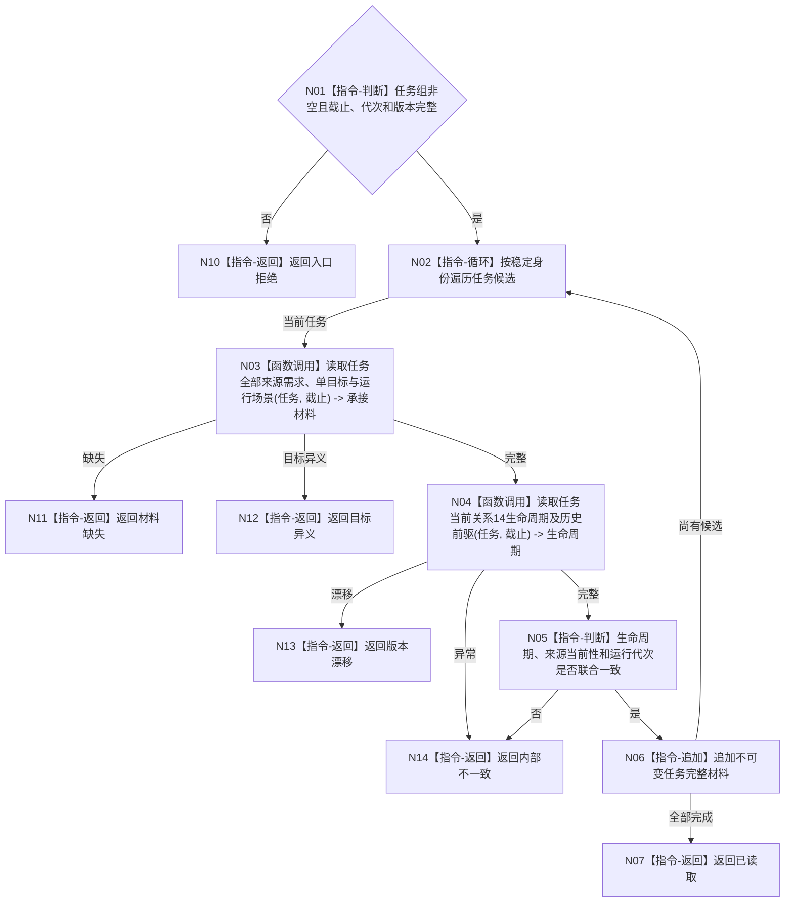

# BIZ-L4-004-02-02-02 读取各任务完整承接与生命周期事实目标函数流程图 v0.1

更新时间：2026-08-03

## 依据

```text
3200、5090、5200、5210；BIZ-L3-004-02-02
```

## 身份与边界

正式目标函数设计图。批量读回每个候选任务的完整来源需求集合、单目标、运行场景、生命周期和当前性；不读取方法或执行细节。

## 函数合同

```text
根函数：任务业务服务::读取各任务完整承接与生命周期事实
归属模块 / 文件 / 层级：任务领域 / 海中鱼巣/领域/服务.任务.ixx / L4
现有或待新增：待新增；组合任务结构和关系14生命周期读取
完整签名：任务完整承接生命周期读取结果 任务业务服务::读取各任务完整承接与生命周期事实(const 任务完整承接生命周期读取请求& 请求) const
参数：请求为只读借用；含非空任务候选组、目标合同版本、事实截止、运行代次和任务规则版本
返回结果：不可变值式结果；含已读取、材料缺失、目标异义、版本漂移或内部不一致，以及逐任务完整承接、目标、场景、生命周期和当前性
被调函数流程图：单任务来源/目标/场景和关系14历史读取在L5展开
父图：BIZ-L3-004-02-02
```

## 流程图



## 节点合同

| 节点 | 类型 | 参数 / 输入绑定 | 结果 / 输出绑定 | 事实读写 | 后继条件 | 验证 |
| --- | --- | --- | --- | --- | --- | --- |
| N02 | 指令-循环 | 稳定任务组 | 当前任务 | 无写入 | 每项一次 | 不持锁跨领域调用 |
| N03/N04 | 函数调用 | 任务和截止 | 承接与生命周期 | 只读任务事实 | 同一截止完整 | 全来源保留、关系14唯一当前 |
| N05—N07 | 指令 | 两类材料 | 批量完整投影 | 无写入 | 全部一致 | 历史任务可保留但标明非当前 |
| N10—N14 | 指令-返回 | 非成功分类 | 结构化结果 | 无写入 | 返回父图 | 异义、漂移和损坏分账 |

## 关键边界

一个任务可以承接多个目标等价需求；任何来源目标异义都使该任务材料不可作为当前任务树事实。

