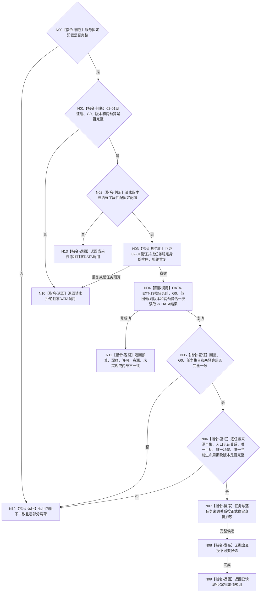

# BIZ-L4-004-02-02-02 读取各任务完整承接与生命周期事实目标函数流程图 v0.2

更新时间：2026-08-16

## 依据

```text
0050、3200、5090、5200、5210；BIZ-L3-004-02-02；DATA-EXT-13
```

## 身份与边界

正式目标函数设计图。以 `BIZ-L4-004-02-02-01 v0.2` 在同一非零 `G0` 返回的来源需求和当前承接任务组为输入，只经唯一 DATA-EXT-13 `任务结构服务`恰一次批量读取每个任务的完整当前来源关系、唯一目标引用、唯一运行场景和唯一当前生命周期结构，再形成稳定值式组。

本叶不读取历史生命周期前驱，不读取子任务拓扑或运行态治理存在，不判断各来源目标是否等价、哪个任务是当前根、任务是否完成或可调度。旧 v0.1 的逐任务分次读取和“关系14历史前驱”路线退出。

## 函数合同

```text
根函数：任务业务服务::读取各任务完整承接与生命周期事实
归属模块 / 文件 / 业务分解层级：任务领域 / 海中鱼巣/领域/服务.任务.ixx / BIZ-L4
现有或待新增：待新增；扩展同一任务业务服务，消费 DATA-EXT-13 批量完整读取
完整签名：任务完整承接生命周期读取结果 任务业务服务::读取各任务完整承接与生命周期事实(const 任务完整承接生命周期读取请求& 请求) const noexcept
参数：请求为只读借用；含02-01同一G0完整承接任务见证组、同一非零G0、运行代次、范围/规则版本、任务数量预算和全部当前来源关系总预算
返回结果：不可变值式结果；含已读取、请求拒绝、数量预算不足、当前性漂移、提供者拒绝、资源失败、未实现或内部不一致，以及与任务稳定顺序一致的完整承接生命周期组
被调能力：DATA-EXT-13唯一任务结构服务::按任务组与指定截止有界读取完整承接生命周期结构
父图：BIZ-L3-004-02-02
```

## 流程图



## 节点合同

| 节点 | 类型 | 输入 | 输出 | 事实读写 | 验证 |
| --- | --- | --- | --- | --- | --- |
| N00—N03 | 校验 / 规范化 | 固定配置、02-01见证组、G0、版本、两预算 | 唯一稳定任务组 | 无 | 配置坏、请求坏和版本漂移分账且零DATA调用；重复不去重修复 |
| N04 | 函数调用 | 含范围/规则版本和两预算的一份DATA请求 | 一份结构化DATA结果 | 只读DATA-EXT-13 | 恰一次调用；零逐任务/逐关系查询 |
| N05—N06 | 互证 | DATA结果、原请求与02-01见证 | 完整候选 | 无 | 输入任务全集相等；每任务全部来源且含入口见证关系；目标、场景、当前生命周期均恰一 |
| N07—N09 | 排序 / 发布 / 返回 | 完整候选 | 不可变值式组 | 无 | 稳定排序；成功前零部分载荷 |
| N10—N13 | 返回 | 具名非成功 | 空载荷结果 | 无 | 同G0未找到/退出、未知或坏成功形状统一内部不一致 |

## 关键边界

- DATA 只校验并返回任务强类型结构，不判断来源目标等价、当前任务根、任务阶段业务含义、完成、调度或权限。
- BIZ 只验证结构完整和跨叶入口来源绑定，不读取需求目标内容；目标等价由父级后继业务函数在同一 `G0` 裁决。
- 当前生命周期是指定截止上的唯一当前结构，不等于全历史审计；关系14历史前驱和迁移证据不属于本叶。
- BIZ-L4-004-02-02-03 v0.1 中“逐任务来源集合”读取职责由本图正式替代并退出；该身份后继 v0.2 只能读取子任务拓扑和唯一运行态治理存在，禁止重复读取来源关系。
- DATA-EXT-13 最终 DTO / 状态 / ABI 尚未发布；本图冻结消费语义，不证明接口或 BIZ 代码已经实现。
