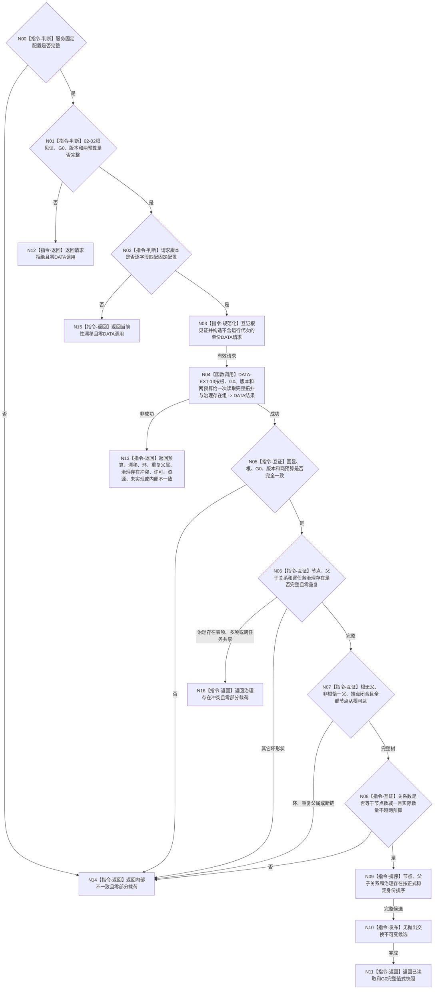

# BIZ-L4-004-02-02-03 读取当前子任务拓扑和运行态治理存在目标函数流程图 v0.2

更新时间：2026-08-16

## 依据

```text
0050、1140、3200、5090、5200、5210；BIZ-L3-004-02-02；BIZ-L4-004-02-02-02 v0.2；DATA-EXT-13
```

## 身份与边界

正式目标函数设计图。以父级已经依据 `BIZ-L4-004-02-02-02 v0.2` 同一非零 `G0` 材料裁决出的唯一当前根完整见证为输入，只经唯一 DATA-EXT-13 `任务结构服务`恰一次有界读取从该根可达的完整当前子任务拓扑和每任务恰一运行态治理存在，完成树结构、任务治理资格和共同截止互证后形成稳定值式快照。

本叶不读取任务来源关系、目标、场景或任务生命周期；不判断目标等价、当前根资格、任务阶段、完成、调度、方法或权限。任务运行态治理存在复用统一 `L2存在身份`载体，但必须由任务—治理存在强类型关系和资格材料证明其由该任务独占且未进入任何世界/场景成员投影；裸 `L2存在身份`或普通存在事实不能代替该资格。旧 v0.1 的 BIZ 逐任务遍历和来源集合读取路线退出。

## 函数合同

```text
根函数：任务业务服务::读取当前子任务拓扑和运行态治理存在
归属模块 / 文件 / 业务分解层级：任务领域 / 海中鱼巣/领域/服务.任务.ixx / BIZ-L4
现有或待新增：待新增；扩展02-01/02-02同一任务业务服务，消费DATA-EXT-13一次整树组读
完整签名：当前子任务拓扑治理存在读取结果 任务业务服务::读取当前子任务拓扑和运行态治理存在(const 当前子任务拓扑治理存在读取请求& 请求) const noexcept
参数：请求为只读借用；含02-02同一G0下已裁决根任务完整见证、同一非零G0、运行代次、事实/任务/存在/场景范围与父子/治理资格/读取规则版本、任务节点总预算和当前父子关系总预算
返回结果：不可变值式结果；含已读取、请求拒绝、数量预算不足、当前性漂移、任务环、重复父属、治理存在冲突、提供者拒绝、资源失败、未实现或内部不一致，以及完整节点组、父子关系组、逐任务唯一治理存在组和共同G0
被调能力：DATA-EXT-13唯一任务结构服务::按任务根与指定截止有界读取当前子任务拓扑和治理存在组
父图：BIZ-L3-004-02-02
```

## 流程图



## 节点合同

| 节点 | 类型 | 输入 | 输出 | 事实读写 | 验证 |
| --- | --- | --- | --- | --- | --- |
| N00—N03 | 校验 / 规范化 | 固定配置、02-02根见证、G0、版本、两预算 | 唯一DATA请求 | 无 | 配置坏、请求坏和版本漂移分账且零DATA调用；运行代次不下传 |
| N04 | 函数调用 | 根、G0、版本、节点/关系两总预算 | 一份结构化DATA结果 | 只读DATA-EXT-13 | 恰一次调用；零BIZ逐节点查询、分页或补读 |
| N05—N08 | 互证 | DATA结果和原请求 | 完整有根树候选 | 无 | 根恰一、非根恰一父、全可达、无环/多父/重复/外部端点；每任务恰一且不共享治理存在 |
| N09—N11 | 排序 / 发布 / 返回 | 完整候选 | 不可变值式快照 | 无 | 稳定排序；成功前零部分载荷 |
| N12—N16 | 返回 | 具名非成功 | 空载荷结果 | 无 | 同G0根未找到/退出和坏成功形状归内部不一致；DATA明确结构冲突可保留具名状态 |

## 关键边界

- 单节点树是合法成功：返回根节点和其唯一治理存在，父子关系组为空；成功载荷仍不得为空。
- DATA 可以校验任务强类型身份、父子端点、当前性、单父基数和治理存在绑定完整性，但不解释当前根的业务资格或任务阶段。
- BIZ 对成功形状执行防御性互证；DATA 明确报告环或重复父属时保留同名状态，DATA 的治理存在基数/共享冲突与治理资格冲突统一映射 BIZ `治理存在冲突`；DATA 声称成功但同样坏形状时固定为 `内部不一致`。
- `L2存在身份`只是统一中性身份载体；成功必须同时回显存在身份来源、任务—治理存在关系以及未进入世界根、现实场景、内部世界场景或普通场景成员投影的资格证据。
- 节点或关系预算不足必须整体失败，不得分页、截断或返回成功前缀。
- DATA-EXT-13 最终 DTO / 状态 / ABI 尚未发布；本图冻结消费语义，不证明接口或 BIZ 代码已经实现。
