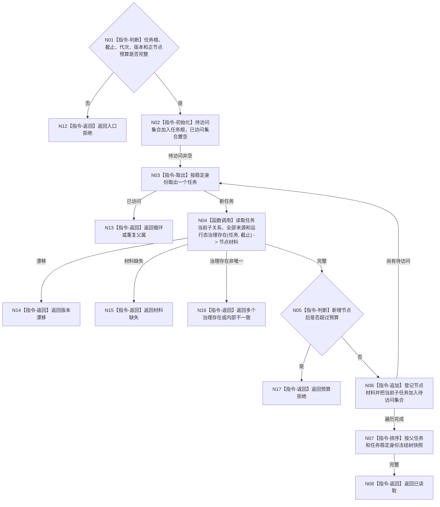

# BIZ-L4-004-02-02-03 读取当前子任务来源集合和运行态治理存在目标函数流程图 v0.1

更新时间：2026-08-03

## 依据

```text
3200、5090、5200、5210；BIZ-L3-004-02-02
```

## 身份与边界

正式目标函数设计图。以已确定任务根为入口读取当前子任务拓扑、每项来源需求集合和每任务唯一运行态治理存在；不把UI树或历史关系当作当前结构。

## 函数合同

```text
根函数：任务业务服务::读取当前子任务来源集合和运行态治理存在
归属模块 / 文件 / 层级：任务领域 / 海中鱼巣/领域/服务.任务.ixx / L4
现有或待新增：待新增；组合任务父子关系、来源关系和运行态治理存在读取
完整签名：任务树材料读取结果 任务业务服务::读取当前子任务来源集合和运行态治理存在(const 任务树材料读取请求& 请求) const
参数：请求为只读借用；含任务根、目标合同版本、事实截止、运行代次、最大节点预算和任务树规则版本
返回结果：不可变值式结果；含已读取、预算拒绝、材料缺失、循环、多个治理存在、版本漂移或内部不一致，以及稳定任务树、逐任务全部来源和唯一治理存在
被调函数流程图：任务当前子关系、来源关系和治理存在关系专用读取在L5展开
父图：BIZ-L3-004-02-02
```

## 流程图



## 节点合同

| 节点 | 类型 | 参数 / 输入绑定 | 结果 / 输出绑定 | 事实读写 | 后继条件 | 验证 |
| --- | --- | --- | --- | --- | --- | --- |
| N02/N03/N05—N07 | 指令 | 根和节点预算 | 稳定有界树 | 无写入 | 无环且预算内 | 不递归爆栈、不按UI顺序 |
| N04 | 函数调用 | 当前任务和截止 | 子关系、来源、治理存在 | 只读任务事实 | 每任务完整 | 每任务恰一治理存在 |
| N08/N12—N17 | 指令-返回 | 遍历裁决 | 结构化结果 | 无写入 | 返回父图 | 预算拒绝不截断成成功 |

## 关键边界

任务树读取是有界、不可变、同截止快照；节点预算只防止无界读取，不能通过静默截断伪造“完整任务树”。

