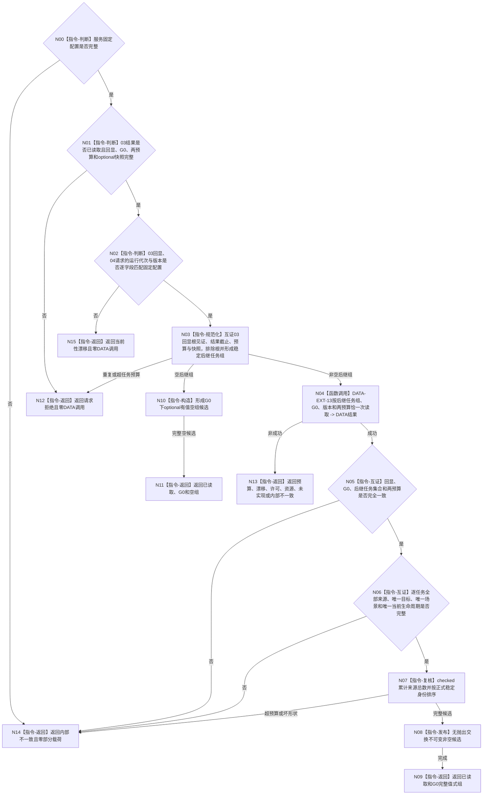

# BIZ-L4-004-02-02-04 读取全部后继任务完整承接与生命周期事实目标函数流程图 v0.1

更新时间：2026-08-16

## 依据

```text
0050、3200、5090、5200、5210；BIZ-L3-004-02-02；BIZ-L4-004-02-02-02 v0.2；BIZ-L4-004-02-02-03 v0.2；DATA-EXT-13
```

## 身份与边界

正式目标函数设计图。以 `BIZ-L4-004-02-02-03 v0.2` 在同一非零 `G0` 返回的完整成功读取结果为输入；先互证其状态、请求回显、固定版本、两项预算、事实截止与 optional 快照，再从任务节点组排除根，只经唯一 DATA-EXT-13 `任务结构服务`最多一次批量读取全部非根后继任务的完整当前来源关系、唯一目标引用、唯一运行场景和唯一当前生命周期结构，最后形成稳定值式组。

单节点树没有后继任务时，本叶零 DATA 调用并返回 `已读取 + optional有值空组 + G0`。本叶不重复读取根材料、父子关系或治理存在，不判断各任务目标是否等价、当前根资格、阶段业务含义、完成、调度、方法或权限。

## 函数合同

```text
根函数：任务业务服务::读取全部后继任务完整承接与生命周期事实
归属模块 / 文件 / 业务分解层级：任务领域 / 海中鱼巣/领域/服务.任务.ixx / BIZ-L4
现有或待新增：待新增；扩展01—03同一任务业务服务，复用02要求的DATA-EXT-13批量完整读取操作
完整签名：后继任务完整承接生命周期读取结果 任务业务服务::读取全部后继任务完整承接与生命周期事实(const 后继任务完整承接生命周期读取请求& 请求) const noexcept
参数：请求为只读借用；含03同一G0完整成功读取结果、同一非零G0、运行代次、03与04各自范围/规则版本、03节点/关系预算、最大后继任务数量和全部后继当前来源关系总预算
返回结果：不可变值式结果；含已读取、请求拒绝、数量预算不足、当前性漂移、提供者拒绝、资源失败、未实现或内部不一致，以及与全部非根任务稳定顺序一致的完整承接生命周期组
被调能力：DATA-EXT-13唯一任务结构服务::按任务组与指定截止有界读取完整承接生命周期结构
父图：BIZ-L3-004-02-02
```

## 流程图



## 节点合同

| 节点 | 类型 | 输入 | 输出 | 事实读写 | 验证 |
| --- | --- | --- | --- | --- | --- |
| N00—N03 | 校验 / 规范化 | 固定配置、03完整读取结果、G0、运行代次、版本、03与04两组预算 | 稳定非根任务组 | 无 | 03状态已读取、请求回显/结果截止/optional快照完整；`03回显运行代次 = 04请求运行代次 = 固定配置运行代次`，范围与规则版本也逐字段匹配；回显根见证、节点/关系预算和快照逐字段互证；根恰好排除一次；重复不去重修复 |
| N04 | 函数调用 | 非空后继任务组、G0、版本、两总预算 | 一份结构化DATA结果 | 只读DATA-EXT-13 | 非空时恰一次；空组时零调用；零逐任务读取 |
| N05—N07 | 互证 / 排序 | DATA结果、03完整成功见证和原请求 | 完整候选 | 无 | 后继任务全集相等；每任务来源、目标、场景和生命周期完整；根不得混入 |
| N08—N11 | 发布 / 返回 | 完整非空或合法空候选 | 不可变值式组 | 无 | optional有值；事实截止=G0；成功前零部分载荷 |
| N12—N15 | 返回 | 具名非成功 | 空载荷结果 | 无 | 同G0后继未找到/退出和坏成功形状归内部不一致 |

## 关键边界

- 04 复用 02 已冻结的 DATA 批量完整读取操作，不新增第二 DATA 服务或“完整任务树大投影”。
- 根完整材料只来自 02，全部非根材料只来自 04；父级必须互证 `02选中根 ∪ 04非根任务 = 03全部任务节点`。
- 04 不读取或返回父子关系、治理存在和根材料；它也不以任务阶段过滤后继任务。
- DATA-EXT-13 最终 DTO / 状态 / ABI 尚未发布；本图冻结消费语义，不证明接口或 BIZ 代码已经实现。
