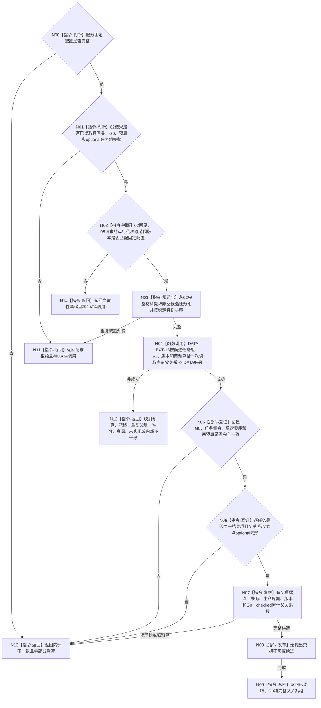

# BIZ-L4-004-02-02-05 读取候选任务当前父关系组目标函数流程图 v0.1

更新时间：2026-08-16

## 依据

```text
0050、3200、5090、5200；BIZ-L3-004-02-02；BIZ-L4-004-02-02-02 v0.2；BIZ-L4-004-02-02-03 v0.2；DATA-EXT-13
```

## 身份与边界

正式目标函数设计图。函数接收 02 在同一非零 `G0` 返回的候选任务完整成功读取结果，先互证其状态、请求回显、运行代次、范围版本、预算、事实截止和完整任务组，再只经唯一 DATA-EXT-13 `任务结构服务`恰一次批量读取每个候选任务的可空唯一当前父关系和有父时的完整父任务端点。

本叶只解除“父级必须先选根才能调用 03、但 01/02 又没有父关系”的循环。零父只是根候选材料，不是根资格结论；父级后续才裁决零个、一个或多个零父候选并调用 03 证明完整有根树。本叶不读取完整拓扑、治理存在、目标内容、来源需求内容、阶段、完成、调度、方法或权限。

## 函数合同

```text
根函数：任务业务服务::读取候选任务当前父关系组
归属模块 / 文件 / 业务分解层级：任务领域 / 海中鱼巣/领域/服务.任务.ixx / BIZ-L4
现有或待新增：待新增；扩展01—04同一任务业务服务，要求DATA-EXT-13增加按任务组与G0批量读取当前父关系的const操作
完整签名：候选任务当前父关系读取结果 任务业务服务::读取候选任务当前父关系组(const 候选任务当前父关系读取请求& 请求) const noexcept
参数：请求为只读借用；含02完整成功读取结果、同一非零G0、运行代次、事实/任务范围与父子关系/任务树/读取规则版本、候选任务和当前父关系两项总预算
返回结果：不可变值式结果；含已读取、请求拒绝、数量预算不足、当前性漂移、重复父属、提供者拒绝、资源失败、未实现或内部不一致，以及与候选任务稳定顺序一致的逐任务可空当前父关系组
被调能力：DATA-EXT-13唯一任务结构服务::按任务组与指定截止有界读取当前父关系组
父图：BIZ-L3-004-02-02
```

## 流程图



## 节点合同

| 节点 | 类型 | 输入 | 输出 | 事实读写 | 验证 |
| --- | --- | --- | --- | --- | --- |
| N00—N03 | 校验 / 规范化 | 固定配置、02完整结果、G0、版本、两预算 | 稳定候选任务组 | 无 | `02回显运行代次 = 05请求运行代次 = 固定配置运行代次`；02状态/截止/optional完整；任务非空无重复 |
| N04 | 函数调用 | 非空候选任务组、G0、版本、两预算 | 一份结构化DATA结果 | 只读DATA-EXT-13 | 恰一次组读；零逐任务、分页或补读 |
| N05—N07 | 互证 | DATA结果、02完整见证和原请求 | 完整候选 | 无 | 每任务恰一项；零父合法；有父时关系与完整父端点同形且子端点命中候选任务 |
| N08—N09 | 发布 / 返回 | 完整候选 | 不可变值式组 | 无 | optional有值、组非空、事实截止=G0；成功前零部分载荷 |
| N11—N14 | 返回 | 具名非成功 | 空载荷结果 | 无 | 同G0任务未找到/退出和坏成功形状归内部不一致 |

## 关键边界

- DATA 返回每个候选任务的结构化当前父关系事实；BIZ 不用“列表第一项、创建时间、生命周期阶段、来源数量或没有子节点”推断根。
- 当前父任务可以不在候选任务组中；本叶只证明候选自身零父或单父，不证明候选们属于同一树，也不扩张为完整拓扑读取。
- 一个候选出现多条当前父关系是 `重复父属`；不同候选共享同一父任务是合法兄弟关系，关系身份仍须全组唯一；多个候选均为零父仍是完整读取成功，由父级升级为当前树内部不一致。
- 05 复用 DATA-EXT-13 唯一任务结构服务，不新增第二服务、“根候选查询”业务快捷入口、L1/owner/仓库直达或缓存。
- DATA-EXT-13 最终 DTO / 状态 / ABI 尚未发布；本图冻结消费语义，不证明接口或 BIZ 代码已经实现。
