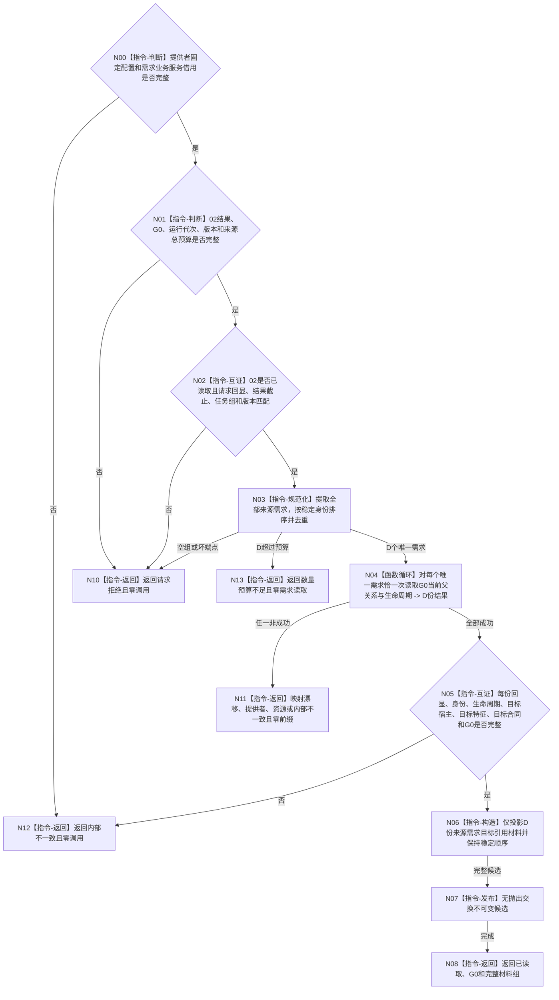

# BIZ-L4-004-02-02-06 读取候选任务全部来源需求目标材料组目标函数流程图 v0.1

更新时间：2026-08-16

## 依据

```text
0050、3100、3200、5100、5200；BIZ-L3-004-02-02；BIZ-L4-004-02-02-02 v0.2；BIZ-L4-002-04-02-01 v0.2；DATA-EXT-12
```

## 身份与边界

正式目标函数设计图。函数接收 02 在同一非零 `G0` 返回的候选任务完整成功结果，从逐任务全部当前来源关系中提取、稳定排序并去重全部来源需求身份，再经同一个 `需求业务服务`对每个唯一来源需求恰一次读取 `G0` 下完整当前需求，值式投影目标宿主、目标特征和目标状态合同引用。

本叶只补齐后继 I64 精确目标等价裁决所需的来源目标引用材料。它不读取目标状态合同正文、不比较目标、不选择稳定首来源为权威、不调用 DATA-EXT-13、不选择任务根，也不读取当前世界特征值。

## 函数合同

```text
根函数：任务来源目标事实提供者::读取候选任务全部来源需求目标材料组
归属模块 / 文件 / 业务分解层级：任务领域只读组合 / 海中鱼巣/领域/提供者.任务来源目标事实.ixx / BIZ-L4
现有或待新增：待新增；只借入同一需求业务服务，不直接持有DATA服务
完整签名：候选任务来源需求目标读取结果 任务来源目标事实提供者::读取候选任务全部来源需求目标材料组(const 候选任务来源需求目标读取请求& 请求) const noexcept
参数：请求为只读借用；含02完整成功结果、同一非零G0、运行代次和来源需求总数量预算；事实/需求范围与需求树/父关系/读取规则版本来自provider不可变固定配置
返回结果：不可变值式结果；含已读取、请求拒绝、数量预算不足、当前性漂移、提供者拒绝、资源失败或内部不一致，以及按需求稳定身份排序的唯一来源需求目标引用材料组
被调函数：BIZ-L4-002-04-02-01 v0.2 `需求业务服务::读取需求当前父关系与生命周期`；每个唯一来源需求恰一次
间接DATA能力：DATA-EXT-12 按需求身份和指定非零G0读取完整当前需求、生命周期与可空父关系；不新增批量或任务专用DATA入口
父图：BIZ-L3-004-02-02
```

## 流程图



## 节点合同

| 节点 | 类型 | 输入 | 输出 | 事实读写 | 验证 |
| --- | --- | --- | --- | --- | --- |
| N00—N03 | 校验 / 规范化 | 固定配置、02完整结果、G0、版本、预算 | D个唯一来源需求 | 无 | 02已读取且optional完整；全部任务来源非空；任务—需求端点正确；D不超过总预算 |
| N04 | 函数调用 | D个需求身份、同一G0和固定版本 | D份完整当前需求结果 | 间接只读DATA-EXT-12 | 每个唯一需求恰一次；共享需求跨任务只读一次；零截止重选 |
| N05—N07 | 互证 / 发布 | D份结果 | 完整值式候选 | 无 | 身份、来源、生命周期、目标三引用和G0完整；成功前零部分载荷 |
| N10—N13 | 返回 | 具名非成功 | 空载荷结果 | 无 | 零预算归请求拒绝；D超预算归数量预算不足；同G0需求未找到/退出与02当前来源关系矛盾，归内部不一致 |

## 关键边界

- `D` 是 02 全部任务来源关系中的唯一需求身份数；同一需求可以授权多个任务，只读取一次并由身份回连，不形成跨调用缓存。
- 目标材料只含来源需求的目标宿主、目标特征定义和目标状态合同引用及其结构见证；目标合同 / 比较注册正文由后继复用 `需求目标事实提供者`正式读取。
- 本叶不按第一来源、名称、关系顺序或合同身份相等判断目标等价。第一来源最多可由后继作为局部候选初始化，最终必须逐任务、逐来源全量互证。
- 本叶复用既有单需求读取语义。相同 `G0` 已提供快照一致性，因此不要求 DATA-EXT-12 新增批量目标读取或让 DATA-EXT-13 复制需求目标宿主 / 特征。
- 最终需求服务和 BIZ ABI 尚未发布；本图冻结消费语义，不证明 DATA-EXT-12、上游需求业务服务或本叶代码已实现。
