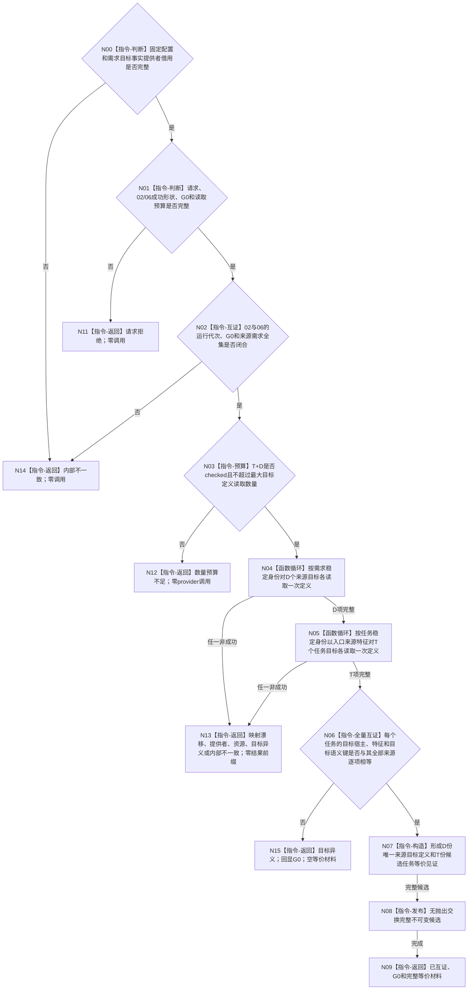

# BIZ-L4-004-02-02-07 复核候选任务与全部来源需求目标I64精确等价目标函数流程图 v0.1

更新时间：2026-08-16

## 依据

```text
0050、3100、3200、4180、5100、5200；BIZ-L3-004-02-02；BIZ-L4-004-02-02-02 v0.2；BIZ-L4-004-02-02-06 v0.1；BIZ-L4-004-01-01-01 v0.2
```

## 身份与边界

正式目标函数设计图。函数消费 02 和 06 在同一非零 `G0` 下形成的完整成功材料，对 `D` 个唯一来源需求目标和 `T` 个候选任务目标分别正式读取目标状态合同定义，再以目标宿主、目标特征定义身份和完整 I64 目标状态语义键逐项精确相等，证明每个任务的单目标与其全部当前来源需求目标等价。

本叶不调用 `L2特征结构服务::比较特征`，不把目标合同身份或比较注册身份相同当作内容等价，不读取目标宿主当前值，不选择当前根，也不复核活动路径、授权或任务化资格。

## 函数合同

```text
根函数：任务目标等价裁决服务::复核候选任务与全部来源需求目标等价
归属模块 / 文件 / 业务分解层级：任务目标只读裁决 / 海中鱼巣/领域/服务.任务目标等价.ixx / BIZ-L4
现有或待新增：待新增；只借入需求目标事实提供者，不直接持有DATA服务
完整签名：候选任务目标等价裁决结果 任务目标等价裁决服务::复核候选任务与全部来源需求目标等价(const 候选任务目标等价裁决请求& 请求) const noexcept
参数：合同/规则版本、运行代次、02完整成功结果、06完整成功结果、同一非零G0和最大目标定义读取数量
返回结果：不可变值式结果；含已互证、请求拒绝、数量预算不足、目标异义、当前性漂移、提供者拒绝、资源失败或内部不一致；只有已互证携带D份来源目标定义和T份任务等价见证
被调函数：需求目标事实提供者::读取目标状态合同与值域定义；完整无失败路径中来源D次、任务T次
直接DATA能力：无；不新增DATA接口，不调用比较特征
父图：BIZ-L3-004-02-02
```

## 流程图



## 节点合同

| 节点 | 类型 | 输入 | 输出 | 事实读写 | 验证 |
| --- | --- | --- | --- | --- | --- |
| N00—N03 | 校验 / 互证 / 预算 | 固定配置、02、06、G0、预算 | T、D和入口来源需求 | 无 | 02/06同代次同G0；02来源并集恰等于06唯一需求组；T+D checked |
| N04 | 函数调用 | D个来源的特征和目标合同 | D份完整目标定义 | 间接只读DATA-EXT-03/04 | 每个唯一需求恰一次；来源上下文冲突归内部不一致 |
| N05 | 函数调用 | T个任务目标合同和入口来源特征 | T份完整任务目标定义 | 间接只读DATA-EXT-03/04 | 每个任务恰一次；入口来源只作局部候选；上下文冲突归目标异义 |
| N06—N08 | 纯值互证 / 发布 | D+T份定义及02/06关系 | 完整等价见证 | 无 | 全量来源逐项比较；合同/注册身份不入等价键；成功前零前缀 |
| N11—N15 | 返回 | 具名非成功 | 空等价材料 | 无 | 只有完整目标异义回显G0；其它失败不冒充完整读取 |

## 关键边界

- 精确等价键固定为：`目标宿主 + 目标特征定义身份 + 目标状态语义键{完整L2特征比较I64合同材料, 目标I64, 允许关系位, 目标状态合同规则版本}`。
- `L2目标状态合同身份`和`L2特征比较注册身份`只证明本次权威读回来源，不进入等价键；不同身份但完整键相同仍等价。
- 入口来源需求从 02 的上游承接见证中确定，只用于为每个任务目标读取提供候选宿主 / 特征。最终结论必须逐任务、逐来源全量互证，入口来源不得升级为第二目标权威。
- 完整无失败路径的 BIZ provider 调用数恰为 `D + T`；共享来源跨任务仍只读一次。任一调用失败立即丢弃全部局部候选，不缓存、不重试、不重选截止。
- 02-07 与 BIZ-L4-004-02-03-01 不重复：本叶只负责读取既有任务树时的纯值目标等价；03-01 仍负责写侧活动路径、授权和任务化闸门，并须复用同一 `目标状态语义键`，不得复制第二套等价算法。
- 02、06、目标定义provider及共享 `目标状态语义键`的最终 ABI 尚未全部实现；本图只冻结消费与裁决合同，不证明代码可调用。
