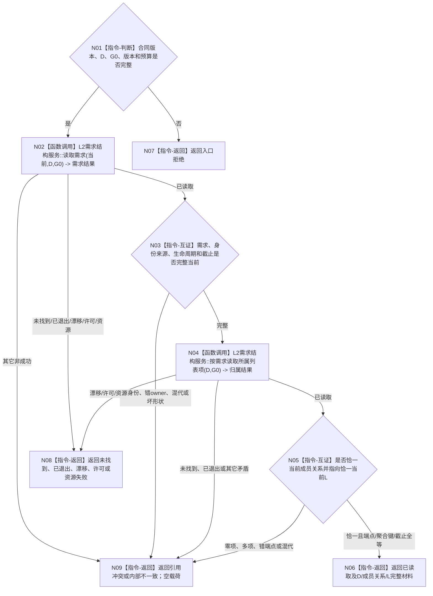

# BIZ-L4-004-02-02-08 读取具体需求及唯一当前列表项目标函数流程图 v0.1

更新时间：2026-08-27

## 依据

```text
0050、3100、4250 v0.6、5090、5200 v0.9
BIZ-L3-004-02-02 v0.2
```

## 身份与边界

正式目标函数设计图。函数只在一个非零 `G0` 下读取调用方已经选定的具体需求 `D`、需求身份来源、完整需求核心和唯一当前列表成员关系，并读取该关系端点的列表项 `L`。它不枚举 `L` 的其它成员，不读取任务，不判断目标满足，也不创建或修改需求结构。

## 函数合同

```text
根函数：任务承接组合器::读取具体需求及唯一当前列表项
归属模块 / 文件 / 层级：任务承接组合 / 海中鱼巣/领域/组合.任务承接.ixx / BIZ-L4
现有或待新增：待新增 module-private 只读组合；发布源码已有部分需求DTO与旧读取实现，但没有本同截止组合
完整签名：具体需求列表归属读取结果 任务承接组合器::读取具体需求及唯一当前列表项(const 具体需求列表归属读取请求& 请求) const noexcept
参数：请求只读借用；含合同版本、具体需求D、非零G0及需求结构版本/预算；不得携带调用方声明的L或成员关系
返回结果：已读取、入口拒绝、未找到、已退出、当前性/版本漂移、许可拒绝、资源失败、引用冲突或内部不一致；只有已读取携带D完整事实、身份来源、唯一当前成员关系、L完整事实和共同截止G0
被调公开函数：L2需求结构服务::读取需求；L2需求结构服务::按需求读取所属列表项
父图：BIZ-L3-004-02-02 v0.2
```

## 流程图



## 节点合同

| 节点 | 类型 | 输入 | 输出 | 事实读写 | 验证 |
| --- | --- | --- | --- | --- | --- |
| N02/N03 | 函数调用 / 互证 | D、G0 | D核心与身份来源 | 只读需求事实 | 当前类别、历史截止0、变更截止空、生命周期当前 |
| N04/N05 | 函数调用 / 互证 | 同一D、同一G0 | 唯一成员关系与L | 只读需求列表结构 | 0/1/N严格分账；D、L、聚合键和G0逐字段互证 |
| N06—N09 | 返回 | 结构化读取结果 | 完整载荷或空载荷非成功 | 无写入 | 不保留半份D/L材料 |

## 关键边界

- `L`只能由正式成员关系读回；调用方、消息、缓存和列表首项均不能提供或修正它。
- 当前需求零个或多个当前列表成员关系都属于内部不一致，不得选择最小身份或回退历史。
- 本叶不读取 `L` 的成员组，因此不会把列表成员自动提升为任务来源。
- 发布源码尚无本组合入口；目标图不证明代码、装配或运行闭合。
