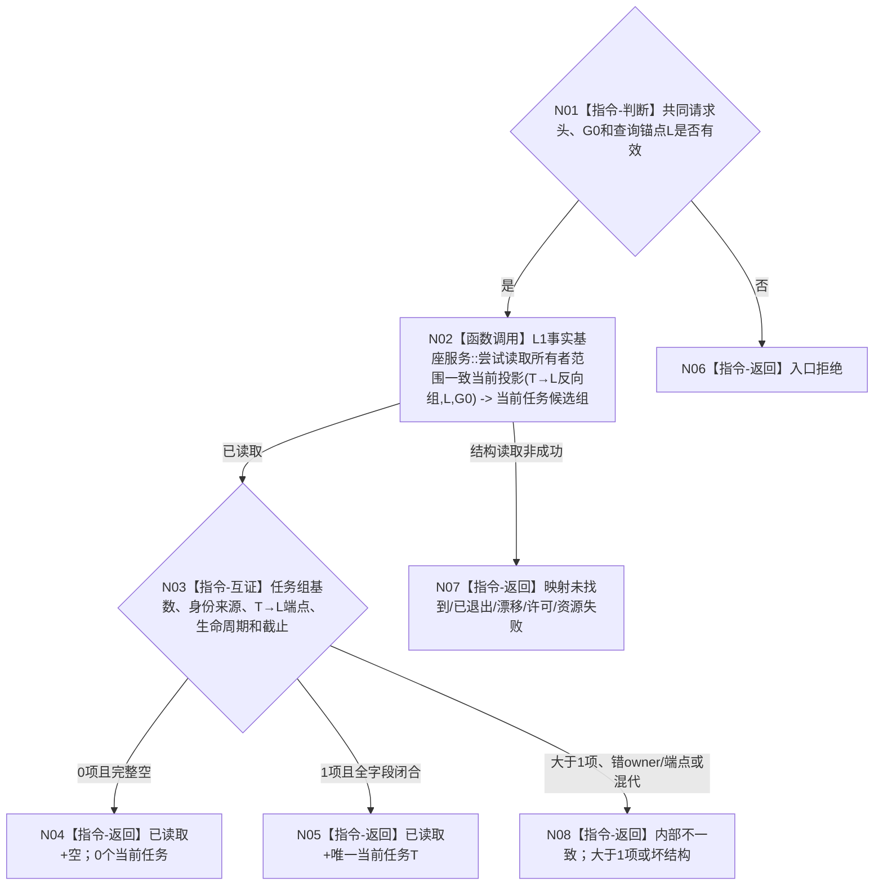

# BIZ-L4-004-02-02-09 按同类任务查询锚点读取当前任务目标函数流程图 v0.1

更新时间：2026-08-27

## 依据

```text
0050、3200、4260 v0.9、5090、5200 v0.9
BIZ-L3-004-02-02 v0.2
```

## 身份与边界

正式目标函数设计图。函数是 task owner 的窄结构读取：只按一个正式 `L2需求列表项身份 L` 在同一非零 `G0` 下读取 `0..1` 个当前任务。`L`只是同类任务查询 / 防重锚点，不是任务目标、任务来源集合或授权。

## 函数合同

```text
根函数：L2任务结构服务::按同类任务查询锚点读取当前任务
归属模块 / 文件 / 层级：L2任务结构服务 / 海中鱼巣/领域/服务.L2任务结构.ixx / BIZ-L4
现有或待新增：待实现正式新名与G0合同；发布源码只有旧按需求列表项读取当前任务入口
完整签名：L2按同类任务查询锚点读取当前任务结果 L2任务结构服务::按同类任务查询锚点读取当前任务(L2按同类任务查询锚点读取当前任务请求 请求) const noexcept
参数：L2结构请求头(G0)和L2需求列表项身份同类任务查询锚点
返回结果：共同L2结构状态；已读取允许空载荷或恰一当前任务，截止必须为G0；其它状态无任务载荷
父图：BIZ-L3-004-02-02 v0.2
```

## 流程图



## 0 / 1 / N 合同

| 当前任务数 | 结果 | 后继 |
| --- | --- | --- |
| 0 | 已读取 + 空任务载荷 + 截止G0 | 父级进入新任务分支 |
| 1 | 已读取 + 唯一当前T + 截止G0 | 父级继续读取T→D组 |
| >1 | 内部不一致 + 空载荷 | 停止依赖路径，不挑选 |

## 节点合同

| 节点 | 类型 | 输入 | 输出 | 事实读写 | 验证 |
| --- | --- | --- | --- | --- | --- |
| N02 | 函数调用 | L、G0 | 0..N候选任务结构 | 只读task owner的T→L当前关系、任务与身份来源 | 单一owner-aware一致投影 |
| N03 | 本函数内互证 | 候选任务组 | 0/1/N裁决 | 无新增读写 | 任务当前、T→L端点=L、身份来源和G0完整 |
| N04—N08 | 返回 | 结构化裁决 | 空、唯一T或具名非成功 | 无写入 | 非成功不携带候选前缀 |

## 关键边界

- 不扫描列表成员、不按目标近似、不读取任务父子拓扑或治理存在。
- 空结果是完整结构读取，不表示D不存在或目标已满足。
- 发布源码旧入口名字和实现不证明本正式目标ABI已发布。
