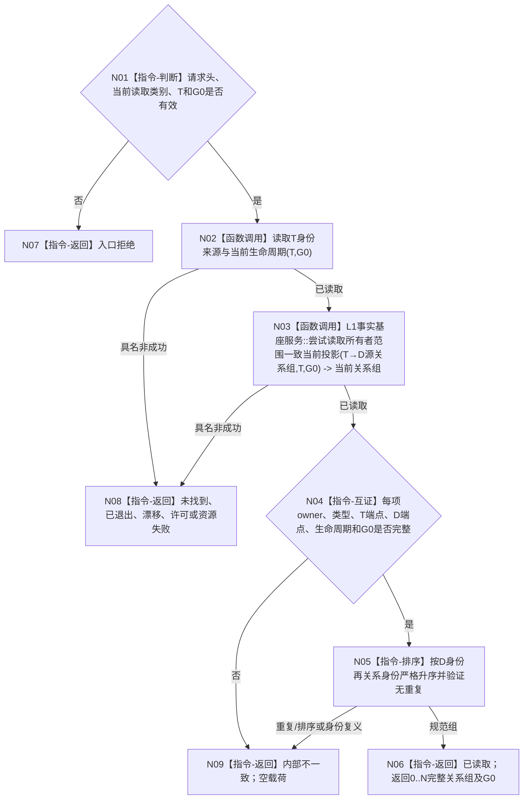

# BIZ-L4-004-02-02-10 按任务读取来源需求关系组目标函数流程图 v0.1

更新时间：2026-08-27

## 依据

```text
0050、3200、4260 v0.9、5090、5200 v0.9
BIZ-L3-004-02-02 v0.2
```

## 身份与边界

正式目标函数设计图。函数只从 task owner 在同一非零 `G0` 下完整读取任务 `T` 的当前正式 `T→D` 关系组，并按来源需求身份、关系身份稳定升序返回。空组是结构读取成功，但不能形成当前任务目标。

## 函数合同

```text
根函数：L2任务结构服务::按任务读取来源需求关系组
归属模块 / 文件 / 层级：L2任务结构服务 / 海中鱼巣/领域/服务.L2任务结构.ixx / BIZ-L4
现有或待新增：待新增；HEAD尚无公开请求、结果和生产实现
完整签名：L2按任务读取来源需求关系组结果 L2任务结构服务::按任务读取来源需求关系组(L2按任务读取来源需求关系组请求 请求) const noexcept
参数：共同L2结构请求头(G0)、读取类别、任务T；历史读取另带非零历史截止，当前父图只使用当前G0
返回结果：共同L2结构状态、规范有序的0..N条L2任务来源需求关系事实和事实截止；非成功空关系组
父图：BIZ-L3-004-02-02 v0.2
```

## 流程图



## 节点合同

| 节点 | 类型 | 输入 | 输出 | 事实读写 | 验证 |
| --- | --- | --- | --- | --- | --- |
| N02 | 函数调用 | T、G0 | 正式任务身份来源 | 只读任务事实 | wrong-family和owner私有锚点不得冒充T |
| N03/N04 | 函数调用 / 互证 | 正式T、G0 | 0..N当前T→D | 只读任务来源关系 | 每项当前、同T、有效D、同G0 |
| N05/N06 | 排序 / 返回 | 完整关系组 | 确定性值式组 | 无写入 | D身份、关系身份严格升序，无重复 |

## 关键边界

- 不从查询锚点、列表成员、旧任务目标或缓存补齐空组。
- 当前空组对DATA是成功；父业务必须把活动任务空来源分账为内部不一致、等待或结束，不能形成目标。
- 历史读取必须显式历史截止；本父图不得拿当前组补历史。
