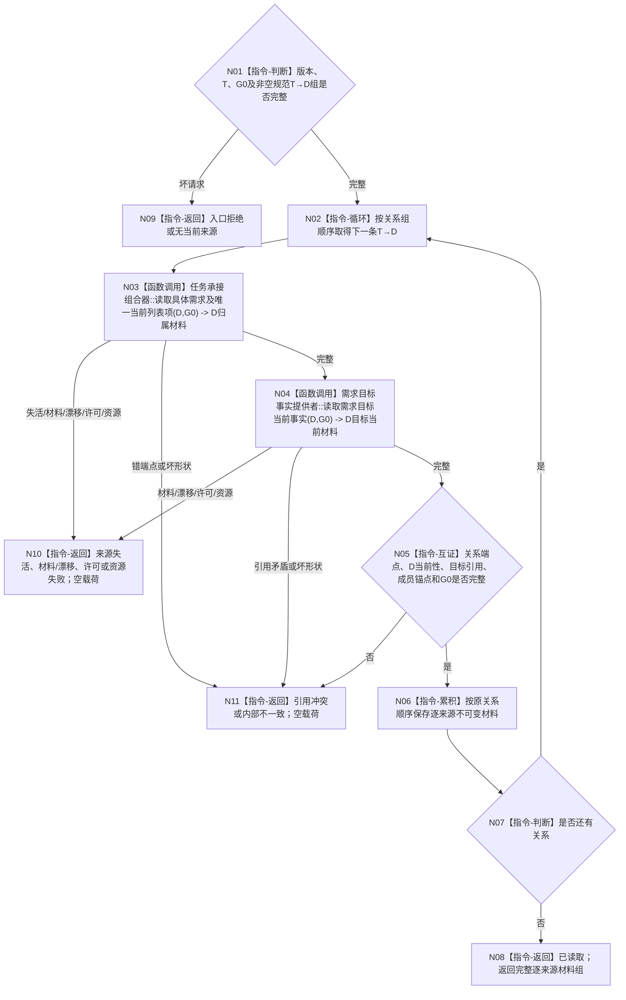

# BIZ-L4-004-02-02-11 逐项读取任务来源需求当前目标材料目标函数流程图 v0.1

更新时间：2026-08-27

## 依据

```text
0050、3100、3200、4250 v0.6、4260 v0.9、5090、5200 v0.9
BIZ-L3-004-01-01 v0.3、BIZ-L3-004-02-02 v0.2
BIZ-L4-004-01-01-01 v0.2、BIZ-L4-004-01-01-02 v0.2
```

## 身份与边界

正式目标函数设计图。函数消费 BIZ-L4-004-02-02-10 已完整返回的非空规范 `T→D` 关系组，对每个关系端点的具体需求在同一 `G0` 恰一次读取当前需求、目标合同定义和目标宿主当前事实，保留逐关系材料。它不合并需求身份、不按列表成员扩容，也不在本叶裁决新D与全部来源是否同义。

## 函数合同

```text
根函数：任务来源目标事实提供者::逐项读取任务来源需求当前目标材料
归属模块 / 文件 / 层级：任务来源目标事实提供者 / 海中鱼巣/领域/提供者.任务来源目标事实.ixx / BIZ-L4
现有或待新增：待新增；旧候选任务批量provider已退出当前父图
完整签名：任务来源需求目标材料读取结果 任务来源目标事实提供者::逐项读取任务来源需求当前目标材料(const 任务来源需求目标材料读取请求& 请求) const noexcept
参数：请求只读借用；含合同/规则版本、T、非零G0和完整规范T→D关系组；不得只传需求身份组或列表项
返回结果：已读取、入口拒绝、无当前来源、来源失活、材料不足、当前性/版本漂移、许可拒绝、资源失败、引用冲突或内部不一致；成功逐关系保留需求、成员关系、目标定义、宿主当前事实和G0
父图：BIZ-L3-004-02-02 v0.2
```

## 流程图



## 节点合同

| 节点 | 类型 | 输入 | 输出 | 事实读写 | 验证 |
| --- | --- | --- | --- | --- | --- |
| N02 | 本函数内循环 | 规范T→D组 | 当前关系 | 无新增读写 | 每项恰处理一次，保持原规范顺序 |
| N03 | 函数调用 | 关系端点D、G0 | D、成员关系与L | 只读需求核心、身份来源和列表成员事实 | D当前、成员关系唯一、L端点完整 |
| N04 | 函数调用 | 同一D、G0 | 目标定义与宿主当前事实 | 只读目标合同、特征定义、比较注册、场景、存在与当前特征事实 | 全部截止等于G0 |
| N05—N08 | 互证 / 累积 / 返回 | 逐来源完整材料 | 全组或具名非成功 | 无写入 | 关系数、材料数和身份顺序完全守恒 |

## 关键边界

- 每条正式关系都必须得到一份材料；缺一项、额外项、重复项或跨截止都不能返回部分成功。
- 相同D不应在规范关系组中重复；若出现重复关系或同D多关系，返回内部不一致而不是去重吞掉证据。
- 目标同义裁决由父级对新D和本组逐项执行；本叶只提供完整事实，不选择“第一项代表全部”。
