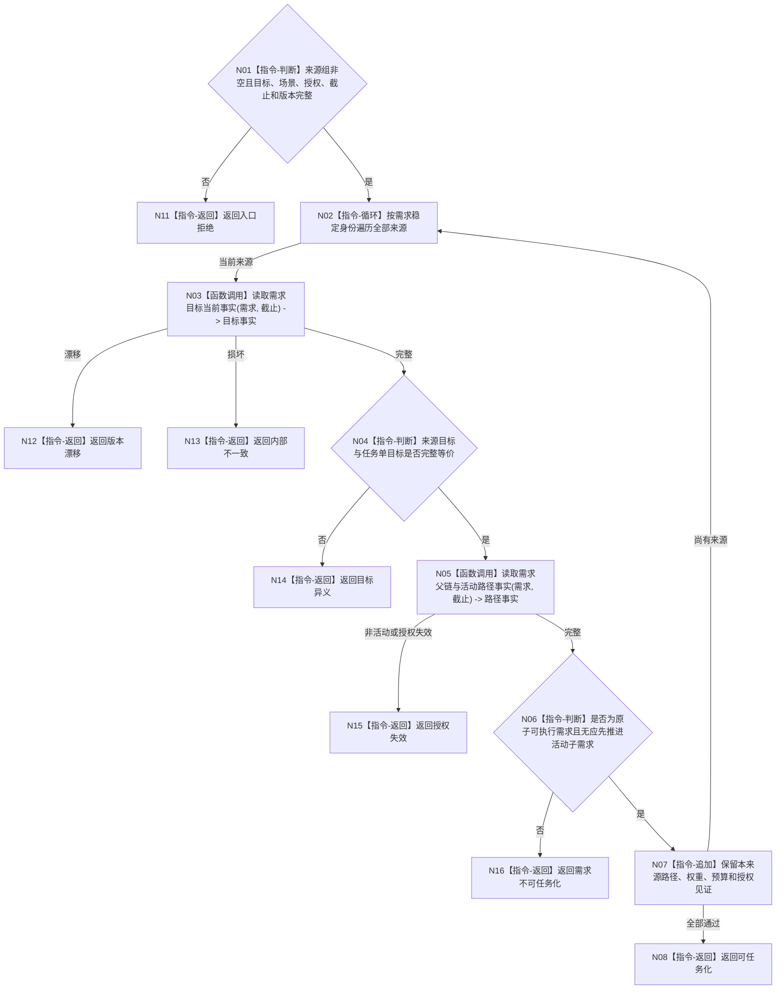

# BIZ-L4-004-02-03-01 复核全部来源目标等价与任务化闸门目标函数流程图 v0.1

更新时间：2026-08-03

## 依据

```text
3100、3200、5090、5100、5110、5200；BIZ-L3-004-02-03
```

## 身份与边界

正式目标函数设计图。联合复核全部来源需求的单目标等价、活动授权和任务化闸门；安全执行权限为零不阻止任务化。

## 函数合同

```text
根函数：任务业务服务::复核全部来源目标等价与任务化闸门
归属模块 / 文件 / 层级：任务领域 / 海中鱼巣/领域/服务.任务.ixx / L4
现有或待新增：待新增；组合需求目标、活动路径和授权读取
完整签名：任务化闸门复核结果 任务业务服务::复核全部来源目标等价与任务化闸门(const 任务化闸门复核请求& 请求) const
参数：请求为只读借用；含非空来源需求组、任务单目标、运行场景、授权、事实截止、需求树/任务规则版本和运行代次
返回结果：不可变值式结果；含可任务化、需求不可任务化、目标异义、授权失效、版本漂移或内部不一致，并回显全部来源、路径和授权见证
被调函数流程图：目标读取复用BIZ-L3-004-01-01；父路径/活动读取复用BIZ-L3-002-04-02；任务化角色裁决为本函数内指令
父图：BIZ-L3-004-02-03
```

## 流程图



## 节点合同

| 节点 | 类型 | 参数 / 输入绑定 | 结果 / 输出绑定 | 事实读写 | 后继条件 | 验证 |
| --- | --- | --- | --- | --- | --- | --- |
| N02 | 指令-循环 | 稳定来源组 | 当前来源 | 无写入 | 每项一次 | 同需求不重复 |
| N03/N05 | 函数调用 | 来源和截止 | 目标与路径事实 | 只读需求事实 | 同截止完整 | 保留每项来源分账 |
| N04/N06/N07 | 指令 | 目标与路径 | 闸门和见证 | 无写入 | 全部来源通过 | 不按名称/叶子判断任务化 |
| N08/N11—N16 | 指令-返回 | 闸门裁决 | 结构化结果 | 无写入 | 返回父图 | 零安全权限不作为不可任务化 |

## 关键边界

安全权限为零只阻止关联任务参加正常执行优先级竞争，不删除需求，也不阻止任务化、筹办或材料接收。
