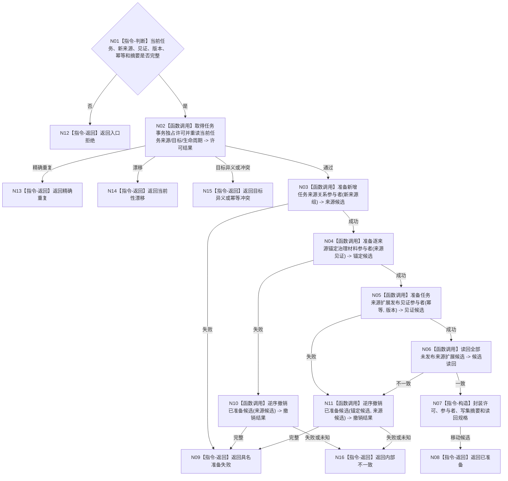

# BIZ-L4-004-02-03-02 准备扩展任务来源事务目标函数流程图 v0.1

更新时间：2026-08-03

## 依据

```text
3200、4010—4050、5090、5200；BIZ-L3-004-02-03
```

## 身份与边界

正式目标函数设计图。在既有当前任务上准备新增目标等价来源关系及来源锚定治理材料；不改变任务目标、治理存在或当前方法。

## 函数合同

```text
根函数：任务数据操作::准备扩展任务来源事务
归属模块 / 文件 / 层级：任务数据操作 / 海中鱼巣/领域/数据操作.任务.ixx / L4
现有或待新增：待新增；复用来源关系、来源锚定值和发布见证参与者
完整签名：任务来源扩展候选准备结果 任务数据操作::准备扩展任务来源事务(const 任务来源扩展候选准备请求& 请求)
参数：请求为只读借用；含当前任务完整投影、新来源需求组、逐来源路径/授权/权重/预算见证、期望版本、幂等身份和语义摘要
返回结果：移动结果；含已准备、精确重复、当前性漂移、目标异义、幂等冲突、资源失败或内部不一致；成功时唯一携带目标等价任务事务候选
被调函数流程图：事务许可、参与者准备、未发布读回与逆序撤销在L5展开
父图：BIZ-L3-004-02-03
```

## 流程图



## 节点合同

| 节点 | 类型 | 参数 / 输入绑定 | 结果 / 输出绑定 | 事实读写 | 后继条件 | 验证 |
| --- | --- | --- | --- | --- | --- | --- |
| N02 | 函数调用 | 当前任务与期望版本 | 独占许可 | 无已发布变化 | 最终复核通过 | 同任务并发隔离 |
| N03—N06 | 函数调用 | 新来源写集 | 不可见候选与读回 | 仅未发布候选 | 全部一致 | 不改任务目标/治理存在/方法 |
| N07/N08 | 构造 / 返回 | 许可和候选 | 唯一移动事务候选 | 无发布 | 所有权移交 | 不泄漏参与者控制权 |
| N09—N16 | 撤销 / 返回 | 部分候选 | 结构化非成功 | 清除候选 | 完整撤销才普通返回 | 撤销未知转内部不一致 |

## 关键边界

目标等价来源扩展保留每项需求的路径、权重、预算和授权；不得压成一条无来源汇总或重置既有任务状态。

