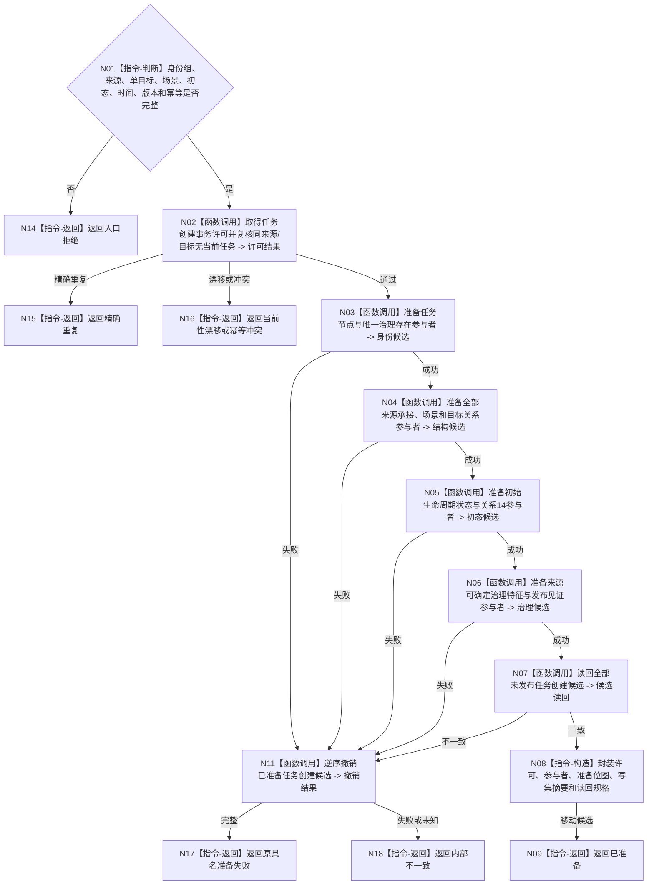

# BIZ-L4-004-02-03-03 准备任务治理存在承接初态事务目标函数流程图 v0.1

更新时间：2026-08-03

## 依据

```text
3200、4010—4050、5090、5200、5210；BIZ-L3-004-02-03
```

## 身份与边界

正式目标函数设计图。为新单目标任务准备任务节点、唯一运行态治理存在、全部来源承接、场景、目标、初始生命周期和可确定治理特征的统一候选。

## 函数合同

```text
根函数：任务数据操作::准备任务治理存在承接初态事务
归属模块 / 文件 / 层级：任务数据操作 / 海中鱼巣/领域/数据操作.任务.ixx / L4
现有或待新增：待新增；复用任务节点、治理存在、关系、状态和值参与者
完整签名：任务创建候选准备结果 任务数据操作::准备任务治理存在承接初态事务(const 任务创建候选准备请求& 请求)
参数：请求为只读借用；含任务/治理存在/初态稳定身份、全部来源、单目标、场景、授权、来源见证、发生时间、期望版本、幂等身份和语义摘要
返回结果：移动结果；含已准备、精确重复、当前性漂移、目标异义、幂等冲突、资源失败或内部不一致；成功时唯一携带目标等价任务事务候选
被调函数流程图：六类参与者准备、未发布读回与逆序撤销在L5展开
父图：BIZ-L3-004-02-03
```

## 流程图



## 节点合同

| 节点 | 类型 | 参数 / 输入绑定 | 结果 / 输出绑定 | 事实读写 | 后继条件 | 验证 |
| --- | --- | --- | --- | --- | --- | --- |
| N02 | 函数调用 | 来源、目标、版本和幂等 | 创建许可 | 无已发布变化 | 无当前等义任务 | 并发同义创建只准一个候选 |
| N03—N07 | 函数调用 | 完整任务结构 | 六类候选和读回 | 仅未发布候选 | 全部一致 | 每任务恰一治理存在、关系14唯一当前 |
| N08/N09 | 构造 / 返回 | 许可与候选 | 唯一移动事务候选 | 无发布 | 所有权移交 | 未选择方法、不建执行冻结 |
| N11/N14—N18 | 撤销 / 返回 | 部分候选或非成功 | 结构化结果 | 清除候选 | 完整撤销 | 半结构不得泄漏 |

## 关键边界

初始化只形成结构锚点、初始生命周期和来源可确定治理特征；当前方法、方法开放特征、安全组和当前安全权限不得在此预造。
