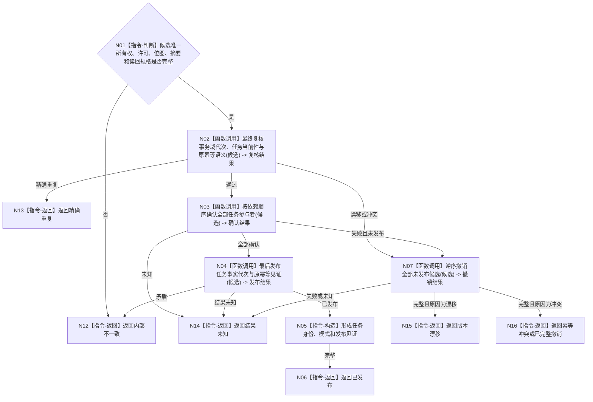

# BIZ-L4-004-02-03-04 确认并发布目标等价任务事务目标函数流程图 v0.1

更新时间：2026-08-03

## 依据

```text
0050、3200、4010—4050、5090、5200、5210；BIZ-L3-004-02-03
```

## 身份与边界

正式目标函数设计图。消费创建或来源扩展的唯一移动事务候选，确认全部参与者后最后发布一个任务事实代次；不筹办、不派发。

## 函数合同

```text
根函数：任务数据操作::确认并发布目标等价任务事务
归属模块 / 文件 / 层级：任务数据操作 / 海中鱼巣/领域/数据操作.任务.ixx / L4
现有或待新增：待新增；统一消费两类目标等价任务事务候选
完整签名：目标等价任务确认发布结果 任务数据操作::确认并发布目标等价任务事务(目标等价任务事务候选&& 候选)
参数：候选为唯一移动所有权；含事务许可、参与者组、准备位图、完整语义摘要、预期代次、幂等身份和读回规格
返回结果：不可变值式结果；含已发布、精确重复、版本漂移、幂等冲突、已完整撤销、结果未知或内部不一致，以及任务身份和发布见证
被调函数流程图：参与者确认、逆序撤销和最后发布见证在L5展开
父图：BIZ-L3-004-02-03
```

## 流程图



## 节点合同

| 节点 | 类型 | 参数 / 输入绑定 | 结果 / 输出绑定 | 事实读写 | 后继条件 | 验证 |
| --- | --- | --- | --- | --- | --- | --- |
| N02 | 函数调用 | 候选和当前事实 | 最终复核 | 无已发布变化 | 同代次同语义 | 提交前最后一次并发复核 |
| N03/N04 | 函数调用 | 全部参与者 | 确认和发布见证 | 最后原子切换任务事实代次 | 全确认后发布 | 创建/扩展两模式一致门禁 |
| N07 | 函数调用 | 未发布候选 | 撤销结果 | 清除候选 | 完整才普通返回 | 已发布后禁止撤销 |
| N05/N06/N12—N16 | 构造 / 返回 | 发布裁决 | 结构化结果 | 无额外写入 | 返回父图 | 结果未知禁止自行重放 |

## 关键边界

确认发布只建立或扩展任务事实，不证明筹办完成、方法已选、工作包已排队或任务目标已达成。

