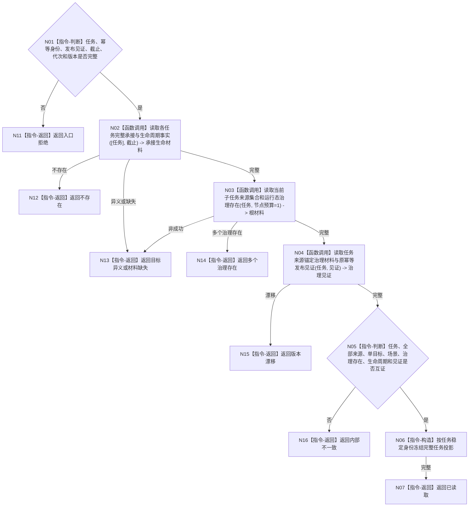

# BIZ-L4-004-02-03-05 完整读回任务承接治理存在初态与全部来源目标函数流程图 v0.1

更新时间：2026-08-03

## 依据

```text
3200、5090、5200、5210；BIZ-L3-004-02-03；BIZ-L4-004-02-02-02—03
```

## 身份与边界

正式目标函数设计图。按精确发布见证独立读回新建或扩展后的任务、全部来源、单目标、场景、唯一治理存在、生命周期和来源锚定治理材料。

## 函数合同

```text
根函数：任务业务服务::完整读回任务承接治理存在初态与全部来源
归属模块 / 文件 / 层级：任务领域 / 海中鱼巣/领域/服务.任务.ixx / L4
现有或待新增：待新增；组合已冻结任务完整读取入口
完整签名：目标等价任务完整读回结果 任务业务服务::完整读回任务承接治理存在初态与全部来源(const 目标等价任务完整读回请求& 请求) const
参数：请求为只读借用；含任务身份、原幂等身份、发布见证、事实截止、期望任务版本、运行代次和规则版本
返回结果：不可变值式结果；含已读取、不存在、材料缺失、目标异义、多个治理存在、版本漂移或内部不一致，以及完整任务投影
被调函数流程图：复用BIZ-L4-004-02-02-02读取完整承接/生命周期；复用BIZ-L4-004-02-02-03读取根节点来源集合和唯一治理存在；发布见证读取在L5展开
父图：BIZ-L3-004-02-03
```

## 流程图



## 节点合同

| 节点 | 类型 | 参数 / 输入绑定 | 结果 / 输出绑定 | 事实读写 | 后继条件 | 验证 |
| --- | --- | --- | --- | --- | --- | --- |
| N02/N03 | 函数调用 | 任务和截止 | 承接、生命周期、来源、治理存在 | 只读任务事实 | 同截止完整 | 节点预算1禁止隐式展开子树 |
| N04 | 函数调用 | 任务和发布见证 | 治理材料与见证 | 只读已发布事实 | 见证匹配 | 不用提交临时对象补齐 |
| N05—N07 | 指令 | 全量材料 | 完整任务投影 | 无写入 | 逐项互证 | 全来源分账保留 |
| N11—N16 | 指令-返回 | 非成功分类 | 结构化结果 | 无写入 | 返回父图 | 半结构是内部不一致 |

## 关键边界

独立读回完成只证明任务结构已发布；筹办占用、方法选择、执行冻结和结果事实均应不存在或保持未形成状态。
