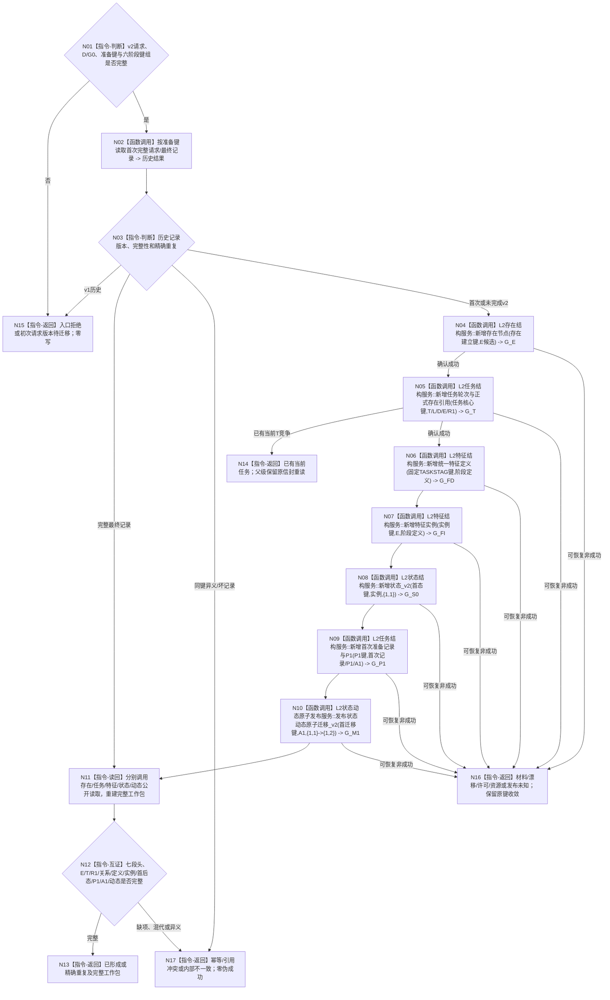

# BIZ-L4-004-02-03-06 形成唯一任务与初次筹办工作包目标函数流程图 v0.1

更新时间：2026-08-27

## 依据与替代

```text
0050、3200、4260 v0.9、5090、5200 v0.9
SELF-GOVERNANCE-CLOSURE-L4-INTEGRATED v0.6 有效设计/计划中的任务首态迁移边界
BIZ-L3-004-02-03 v0.2
```

本图只冻结新任务分支。它替代旧任务创建候选、task-owner私有治理存在和跨owner统一事务叶；既有任务新增来源关系由 BIZ-L4-004-02-03-07 单独负责。

## 函数合同

```text
根函数：需求初次筹办准备提供者::形成唯一任务与初次筹办工作包
归属模块 / 文件 / 层级：需求初次筹办准备 / 海中鱼巣/领域/内部治理/服务.需求初次筹办准备.ixx / BIZ-L4
现有或待新增：HEAD存在v1旧融合实现；目标v2六阶段链未实现
完整签名：需求初次筹办准备结果 需求初次筹办准备提供者::形成唯一任务与初次筹办工作包(需求初次筹办准备请求 请求) noexcept
参数：合同版本2、D、G0、运行代次、准备幂等身份、存在建立/任务核心建立/阶段特征实例建立/首态建立/P1建立/首迁移六阶段幂等身份；准备键=P1键，六键非零且两两不同
返回结果：已形成、精确重复、已有当前任务、初次请求版本待迁移、发布未知、入口拒绝、材料不足、当前性/版本漂移、许可拒绝、资源失败、幂等/引用冲突或内部不一致；成功携带七段结果头及完整独立读回工作包
父图：BIZ-L3-004-02-03 v0.2
```

## 流程图



## 分阶段合同

| 阶段 | 唯一键 | 事实读写 | 未知收敛 |
| --- | --- | --- | --- |
| E | 存在建立键 | 经存在领域服务原子发布正式E并回读 | 原键、原请求、E公开读回 |
| T核心 | 任务核心键 | 经任务领域服务原子发布T/T→L/T→D/T→E/R1 | 原键及task历史读回 |
| 阶段定义 | 固定TASKSTAG | 经特征定义领域服务幂等发布全局定义并回读 | 固定键读回；不占六键 |
| E实例 | 阶段特征实例键 | 经特征领域服务发布E唯一实例并回读 | 原键读回 |
| 首态 | 首态键 | 经状态领域服务发布无动态首态并回读 | 原键读回 |
| P1/A1 | P1键且等于准备键 | 经任务领域服务同次发布首次记录/P1/A1并回读 | 原键读回 |
| 首迁移 | 首迁移键 | 经状态/动态领域provider原子发布后态和第一动态并回读 | 原键读回 |

## 关键边界

- 六键由原业务请求一次分配，禁止从时间、运行代次、D/T、哈希、算术或前段结果派生。
- 已确认前段事实不跨owner回滚；发布未知不得换键、越段或改走既有任务分支。
- `L2任务虚拟存在身份`只包装正式E稳定编码；没有T→E和E身份来源读回不能成功。
- 当前发布源码中的 v1 旧实现仍创建task-owner私有虚拟存在并只用一枚任务键，因此不是本图实现证据。
