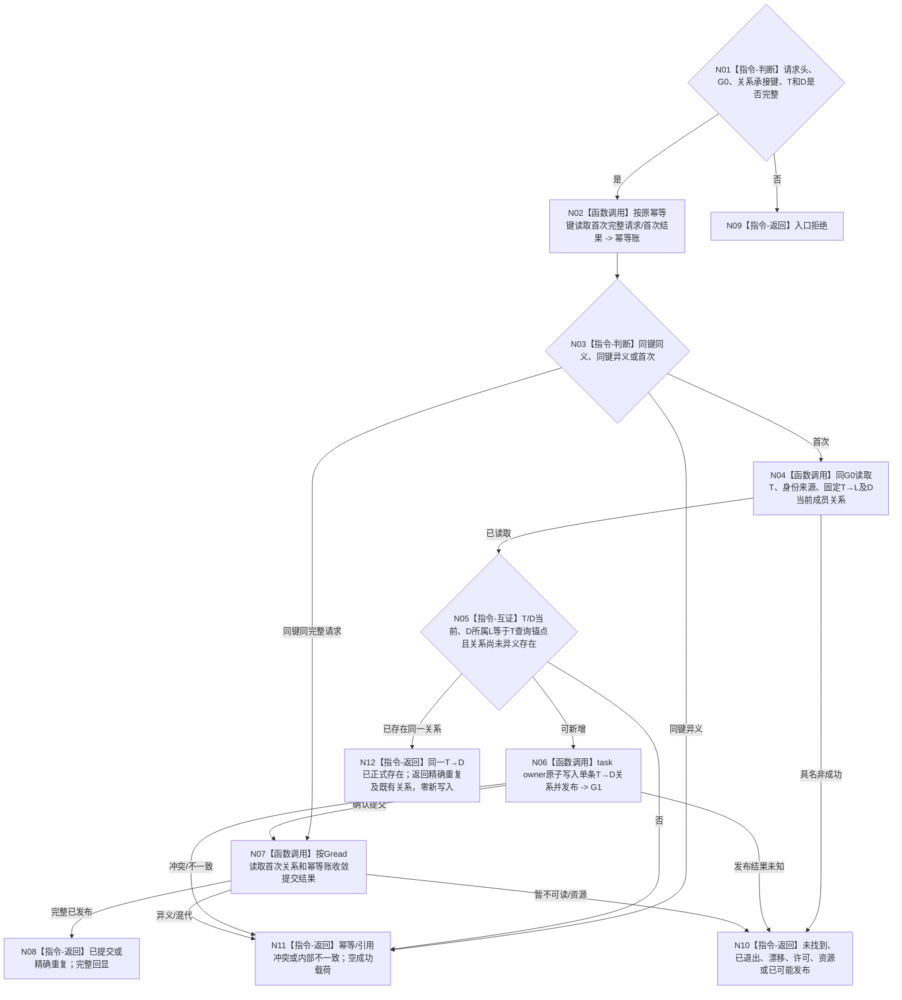

# BIZ-L4-004-02-03-07 承接具体来源需求目标函数流程图 v0.1

更新时间：2026-08-27

## 依据

```text
0050、3200、4250 v0.6、4260 v0.9、5090、5200 v0.9
BIZ-L3-004-02-03 v0.2
```

## 身份与边界

正式目标函数设计图。函数只负责在一个已经存在且当前的任务 `T` 上，以独立来源关系承接幂等身份新增或精确重复一条 `T→D`。它不建立任务、正式存在、R1、首态、P1/A1、动态，不自动承接 `L` 的其它成员。

## 函数合同

```text
根函数：L2任务结构服务::承接具体来源需求
归属模块 / 文件 / 层级：L2任务结构服务 / 海中鱼巣/领域/服务.L2任务结构.ixx / BIZ-L4
现有或待新增：待新增；发布源码无公开请求、结果和生产实现
完整签名：L2承接具体来源需求结果 L2任务结构服务::承接具体来源需求(L2承接具体来源需求请求 请求) noexcept
参数：共同L2结构请求头(G0)、独立L2结构幂等身份、任务T、具体来源需求D；D必须当前属于T固定查询锚点L且目标业务互证已由父级完成
返回结果：已提交、精确重复、入口拒绝、未找到、已退出、引用冲突、幂等冲突、事实代次漂移、许可拒绝、资源失败、内部不一致或已可能发布；成功回显首次完整请求、首次变更代次和关系事实
父图：BIZ-L3-004-02-03 v0.2
```

## 流程图



## 幂等与副作用合同

| 条件 | 结果 | 结构变化 |
| --- | --- | --- |
| 首次键、合法T/D/L | 已提交 | 恰一条T→D及幂等账 |
| 同键、完整请求逐字段相等 | 精确重复 | 零新变化，返回首次关系/G1 |
| 同键任一字段不同 | 幂等冲突 | 零变化 |
| 同一T/D关系已由其它合法键形成 | 精确重复，返回既有关系及其权威创建截止 | 不建立第二关系或第二来源语义 |
| G0漂移、许可/资源失败 | 结构化非成功 | 未提交时零变化；未知时只按原键收敛 |

## 节点合同

| 节点 | 类型 | 输入 | 输出 | 事实读写 | 验证 |
| --- | --- | --- | --- | --- | --- |
| N02/N03 | 函数调用 / 判断 | 关系承接键、完整请求 | 首次账或首次候选 | 只读task owner幂等账 | 同键完整请求逐字段相等才精确重复 |
| N04/N05 | 函数调用 / 互证 | T、D、G0 | 正式T/L和D成员材料 | 只读任务、身份来源、T→L及需求成员关系 | T/D当前、查询锚点一致 |
| N06 | 函数调用 | 合法T/D及原键 | T→D、首次账、G1 | task owner原子发布一条T→D关系和幂等账 | 无任务/E/R1/状态副作用 |
| N07/N08 | 函数调用 / 返回 | 原键、原请求、Gread | 已提交或精确重复 | 只读首次账和关系事实 | 首次请求、关系端点和G1完整 |

## 关键边界

- 父级目标同义裁决不是DATA写入口的第二目标权威；本函数只做正式结构和引用校验。
- 不消费新任务准备键或六阶段键，不重建E/R1/首态链。
- 发布未知只允许按原关系键、原请求和首次账读回，禁止换键重试。
