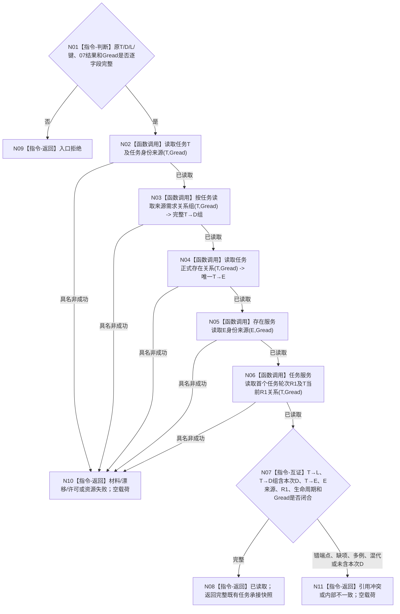

# BIZ-L4-004-02-03-08 完整读回既有任务新增来源承接目标函数流程图 v0.1

更新时间：2026-08-27

## 依据

```text
0050、3200、4260 v0.9、5090、5200 v0.9
BIZ-L3-004-02-03 v0.2
BIZ-L4-004-02-02-10 v0.1、BIZ-L4-004-02-03-07 v0.1
```

## 身份与边界

正式目标函数设计图。函数只服务“既有任务新增来源”分支：以关系提交结果确定的正式读回截止 `Gread`，独立读取 `T`、任务身份来源、固定 `T→L`、完整当前 `T→D` 组、唯一正式 `T→E`、E身份来源和首个任务轮次 `R1`，并证明本次D关系位于完整组中。它不读取或重建首态、P1/A1和第一动态。

## 函数合同

```text
根函数：任务承接组合器::完整读回既有任务新增来源承接
归属模块 / 文件 / 层级：任务承接组合 / 海中鱼巣/领域/组合.任务承接.ixx / BIZ-L4
现有或待新增：待新增；发布源码只有分散的旧任务/虚拟存在读取，缺正式T→D/T→E/R1联合读回
完整签名：既有任务来源承接完整读回结果 任务承接组合器::完整读回既有任务新增来源承接(const 既有任务来源承接完整读回请求& 请求) const noexcept
参数：原T/D/L、来源关系承接键、BIZ-L4-004-02-03-07完整结果和Gread；首次提交取变更G1，精确重复取请求当前守卫截止，不得退回首次关系旧G1冒充当前完整组
返回结果：已读取、入口拒绝、材料不足、当前性/版本漂移、许可拒绝、资源失败、引用冲突或内部不一致；成功携带完整任务承接快照及Gread
父图：BIZ-L3-004-02-03 v0.2
```

## 流程图



## 成功互证矩阵

| 材料 | 必须证明 |
| --- | --- |
| T与身份来源 | 正式task owner、当前生命周期、查询锚点=L |
| T→D组 | 规范有序、非空、包含恰一本次T→D，全部端点当前 |
| T→E与E来源 | 恰一正式关系；E是正式存在且兼容投影仅等值包装E稳定编码 |
| R1 | 恰一首轮身份，R1→T与T→当前R1互证 |
| 截止 | 全部读取成功形状和事实截止均为Gread，无当前/历史拼接 |

## 节点合同

| 节点 | 类型 | 输入 | 输出 | 事实读写 | 验证 |
| --- | --- | --- | --- | --- | --- |
| N02 | 函数调用 | T、Gread | T与身份来源 | 只经任务领域服务读取任务核心与任务身份来源 | task owner、生命周期、T→L和截止完整 |
| N03 | 函数调用 | T、Gread | 完整当前T→D组 | 只经任务领域服务读取任务来源需求关系 | 规范有序且含本次D |
| N04/N05 | 函数调用 | T/E、Gread | 正式T→E及E身份来源 | 只经任务/存在领域服务读取正式存在关系和身份来源 | 恰一T→E，E正式且当前 |
| N06 | 函数调用 | T、Gread | R1及当前关系 | 只经任务领域服务读取任务轮次事实 | R1→T、T→当前R1和序号1互证 |
| N07/N08 | 互证 / 返回 | 全部读回 | 完整快照或空载荷非成功 | 无写入 | 所有截止均为Gread，零混拼 |

## 关键边界

- 精确重复时首次关系G1只证明该关系首次形成；完整当前来源组必须在请求当前守卫截止读回。
- 发布返回、旧任务虚拟存在字段、缓存或日志均不能替代联合读回。
- 本叶不证明新任务六阶段首态链；新任务分支由 BIZ-L4-004-02-03-06 自己完整读回。
