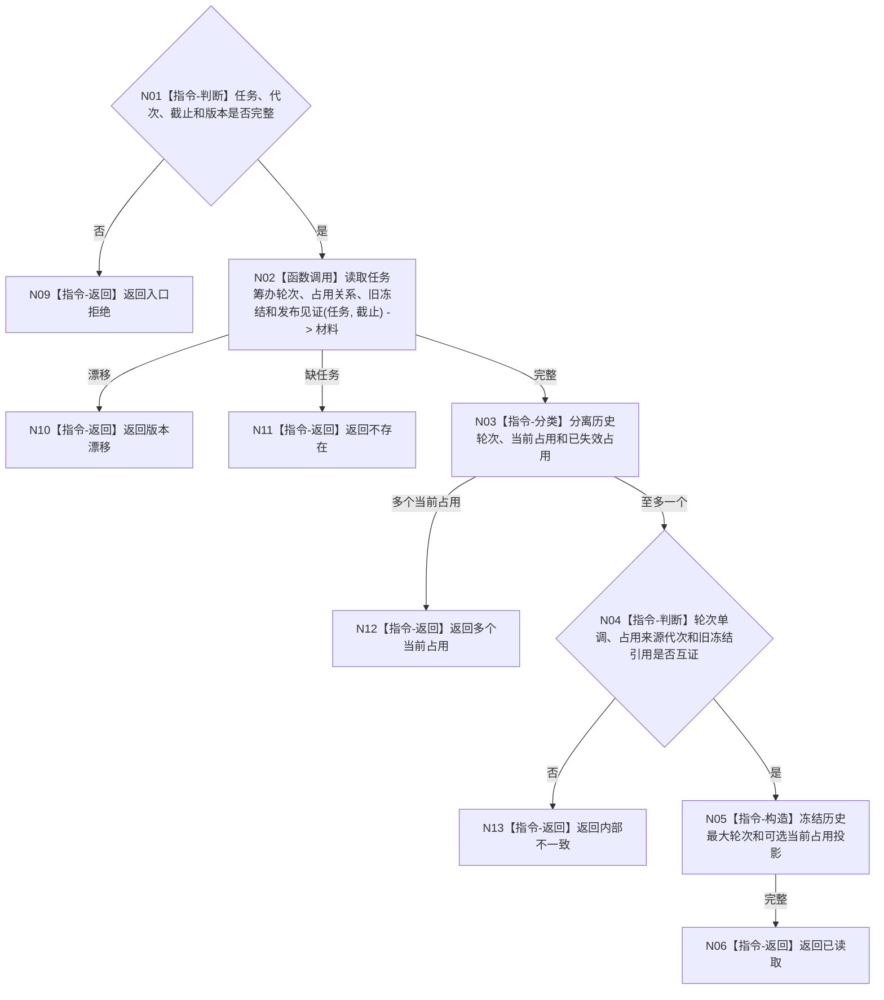

# BIZ-L4-004-03-01-01 读取任务当前筹办占用与历史目标函数流程图 v0.1

更新时间：2026-08-03

## 依据

```text
3200、5210、5230；BIZ-L3-004-03-01
```

## 身份与边界

正式目标函数设计图。只读任务全部筹办轮次、当前占用、来源运行代次和旧冻结当前性；不按墙钟、进程号或线程号失效占用。

## 函数合同

```text
根函数：任务筹办数据操作::读取任务当前筹办占用与历史
归属模块 / 文件 / 层级：任务筹办数据操作 / 海中鱼巣/领域/数据操作.任务筹办.ixx / L4
现有或待新增：待新增；组合筹办治理值、当前关系和发布见证读取
完整签名：任务筹办占用历史读取结果 任务筹办数据操作::读取任务当前筹办占用与历史(const 任务筹办占用历史读取请求& 请求) const
参数：请求为只读借用；含任务、运行代次、事实截止、期望任务/占用版本和筹办规则版本
返回结果：不可变值式结果；含已读取、不存在、多个当前占用、版本漂移或内部不一致，以及历史最大轮次、可选当前占用、来源代次、旧冻结和见证
被调函数流程图：筹办治理值与当前关系专用读取在L5展开
父图：BIZ-L3-004-03-01
```

## 流程图



## 节点合同

| 节点 | 类型 | 参数 / 输入绑定 | 结果 / 输出绑定 | 事实读写 | 后继条件 | 验证 |
| --- | --- | --- | --- | --- | --- | --- |
| N02 | 函数调用 | 任务和截止 | 筹办材料 | 只读任务事实 | 同截止完整 | 不读取裸线程身份 |
| N03—N05 | 指令 | 筹办材料 | 唯一当前投影 | 无写入 | 轮次/代次/冻结互证 | 历史不覆盖 |
| N06/N09—N13 | 指令-返回 | 读取裁决 | 结构化结果 | 无写入 | 返回父图 | 多占用为内部不一致 |

## 关键边界

旧代次当前占用只能报告待核验；本函数无权根据超时或重启事实删除、继承或替换它。

