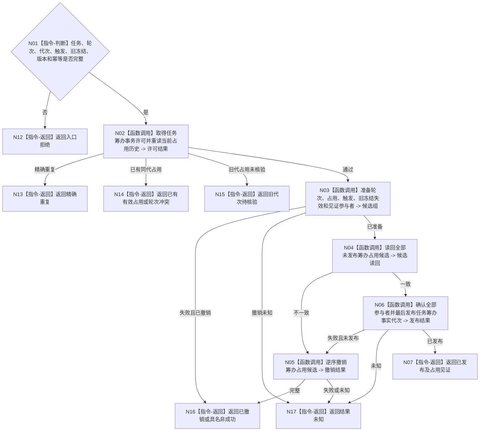

# BIZ-L4-004-03-01-02 发布任务筹办占用事务目标函数流程图 v0.1

更新时间：2026-08-03

## 依据

```text
3200、4010—4050、5210、5230；BIZ-L3-004-03-01
```

## 身份与边界

正式目标函数设计图。在任务稳定身份隔离域内原子发布新筹办轮次、唯一占用、触发来源和旧冻结失效；不读取方法候选。

## 函数合同

```text
根函数：任务筹办数据操作::发布任务筹办占用事务
归属模块 / 文件 / 层级：任务筹办数据操作 / 海中鱼巣/领域/数据操作.任务筹办.ixx / L4
现有或待新增：待新增；复用治理值、关系、状态当前性和见证参与者
完整签名：任务筹办占用发布结果 任务筹办数据操作::发布任务筹办占用事务(const 任务筹办占用发布请求& 请求)
参数：请求为只读借用；含任务、后继轮次、运行代次、触发事实、旧冻结失效规格、发生时间、期望版本、幂等身份和语义摘要
返回结果：不可变值式结果；含已发布、精确重复、已有有效占用、旧代次待核验、轮次冲突、版本漂移、已撤销、结果未知或内部不一致，以及占用身份和发布见证
被调函数流程图：许可、参与者准备、未发布读回、确认、撤销和最后发布在L5展开
父图：BIZ-L3-004-03-01
```

## 流程图



## 节点合同

| 节点 | 类型 | 参数 / 输入绑定 | 结果 / 输出绑定 | 事实读写 | 后继条件 | 验证 |
| --- | --- | --- | --- | --- | --- | --- |
| N02 | 函数调用 | 任务、轮次和版本 | 独占许可 | 无已发布变化 | 无合法当前占用 | 同任务串行、不同任务可并行 |
| N03/N04 | 函数调用 | 完整写集 | 不可见候选与读回 | 仅未发布候选 | 全部等值 | 旧冻结失效同写集 |
| N05/N06 | 函数调用 | 候选组 | 撤销或发布 | 最后切换任务筹办事实代次 | 全确认后发布 | 故障注入覆盖参与者 |
| N07/N12—N17 | 指令-返回 | 发布裁决 | 结构化结果 | 无额外写入 | 返回父图 | 未知禁止盲重试 |

## 关键边界

占用身份是任务治理事实，不是线程租约；发布占用不证明筹办读取、方法召回或冻结已经开始。

