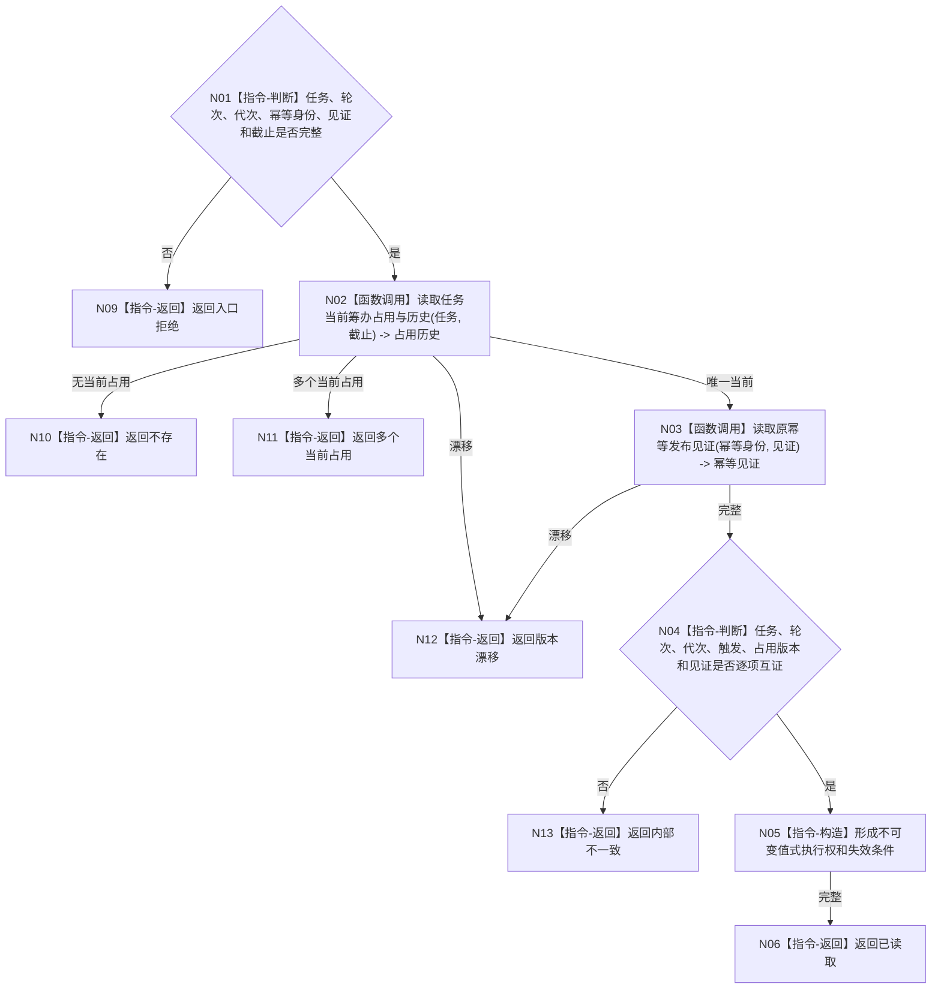

# BIZ-L4-004-03-01-03 读回唯一当前占用与执行权目标函数流程图 v0.1

更新时间：2026-08-03

## 依据

```text
3200、5210、5230；BIZ-L3-004-03-01；BIZ-L4-004-03-01-01
```

## 身份与边界

正式目标函数设计图。绑定原幂等身份和发布见证读回任务唯一当前筹办占用及值式执行权；不返回锁、线程标识或可变内部对象。

## 函数合同

```text
根函数：任务筹办数据操作::读回唯一当前占用与执行权
归属模块 / 文件 / 层级：任务筹办数据操作 / 海中鱼巣/领域/数据操作.任务筹办.ixx / L4
现有或待新增：待新增；复用筹办占用历史读取并增加发布见证互证
完整签名：任务筹办执行权读回结果 任务筹办数据操作::读回唯一当前占用与执行权(const 任务筹办执行权读回请求& 请求) const
参数：请求为只读借用；含任务、期望轮次、运行代次、原幂等身份、发布见证、事实截止和规则版本
返回结果：不可变值式结果；含已读取、不存在、多个当前占用、版本漂移或内部不一致，以及执行权身份、占用版本、触发事实和失效条件
被调函数流程图：复用BIZ-L4-004-03-01-01；原幂等发布见证读取在L5展开
父图：BIZ-L3-004-03-01
```

## 流程图



## 节点合同

| 节点 | 类型 | 参数 / 输入绑定 | 结果 / 输出绑定 | 事实读写 | 后继条件 | 验证 |
| --- | --- | --- | --- | --- | --- | --- |
| N02/N03 | 函数调用 | 任务、截止和见证 | 占用历史与幂等见证 | 只读任务事实 | 同一发布见证 | 不读锁/线程号 |
| N04—N06 | 指令 | 两类材料 | 值式执行权 | 无写入 | 逐项互证 | 调用方只能携带不可变身份 |
| N09—N13 | 指令-返回 | 非成功分类 | 结构化结果 | 无写入 | 返回父图 | 缺失与多占用分离 |

## 关键边界

执行权只对给定任务、轮次、运行代次和占用版本有效；任何绑定事实变化均使其失效，不能在调用方就地续期。
