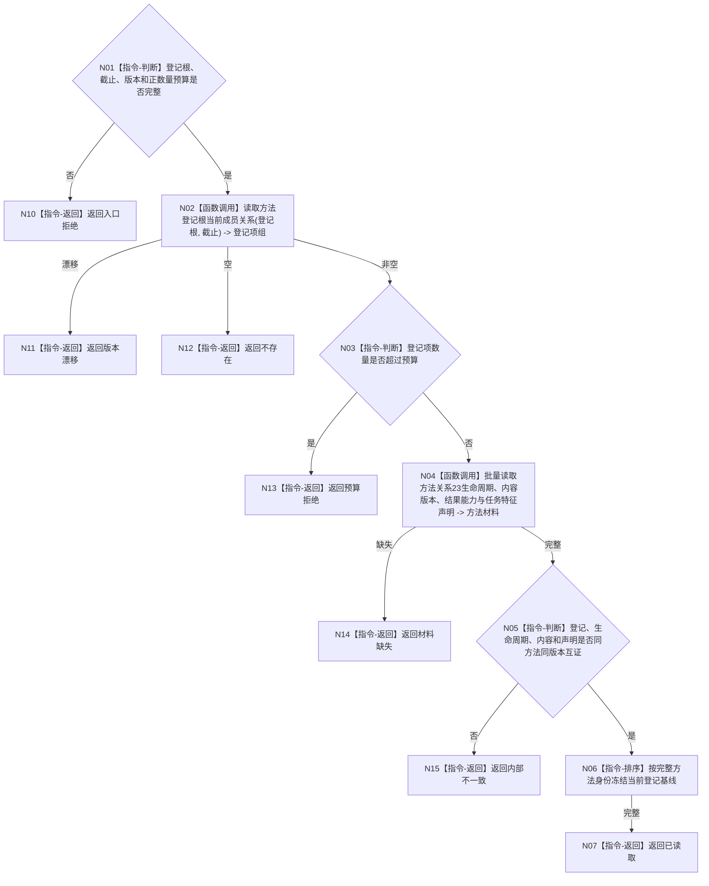

# BIZ-L4-004-03-02-01 读取筹办方法登记基线目标函数流程图 v0.1

更新时间：2026-08-03

## 依据

```text
3300、5230、5250、5300；BIZ-L3-004-03-02
```

## 身份与边界

正式目标函数设计图。以当前方法登记根和固定事实截止读取可参与召回的方法登记、生命周期、内容版本、结果能力与任务特征声明基线；不使用结果索引裁决权威事实。

## 函数合同

```text
根函数：方法筹办事实提供者::读取筹办方法登记基线
归属模块 / 文件 / 层级：方法筹办事实提供者 / 海中鱼巣/领域/提供者.方法筹办事实.ixx / L4
现有或待新增：待新增；组合方法登记、关系23生命周期、内容和声明读取
完整签名：筹办方法登记基线读取结果 方法筹办事实提供者::读取筹办方法登记基线(const 筹办方法登记基线读取请求& 请求) const
参数：请求为只读借用；含方法登记根、事实截止、方法登记/生命周期/内容规则版本和数量预算
返回结果：不可变值式结果；含已读取、不存在、预算拒绝、材料缺失、版本漂移或内部不一致，以及稳定有序的当前方法登记基线
被调函数流程图：方法登记项、关系23和内容规格专用读取在L5展开
父图：BIZ-L3-004-03-02
```

## 流程图



## 节点合同

| 节点 | 类型 | 参数 / 输入绑定 | 结果 / 输出绑定 | 事实读写 | 后继条件 | 验证 |
| --- | --- | --- | --- | --- | --- | --- |
| N02/N04 | 函数调用 | 登记根和截止 | 登记与方法材料 | 只读方法事实 | 同截止完整 | 索引不参与权威裁决 |
| N03/N05/N06 | 指令 | 方法材料和预算 | 有界稳定基线 | 无写入 | 互证且预算内 | 不静默截断 |
| N07/N10—N15 | 指令-返回 | 读取裁决 | 结构化结果 | 无写入 | 返回父图 | 空、缺失、预算分离 |

## 关键边界

登记基线只说明当前可被召回的方法事实全集；它不选择方法，不证明条件满足，也不建立本轮候选实例。
