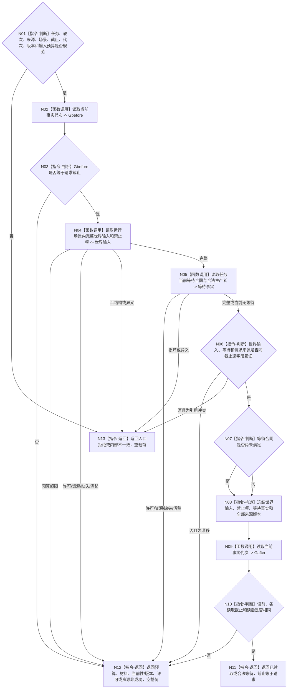

# BIZ-L4-004-03-02-02 读取筹办运行输入与等待目标函数流程图 v0.2

更新时间：2026-08-27

## 依据与替代

```text
3200、5210、5230；BIZ-L3-004-03-02 v0.2
```

本图替代 v0.1“读取筹办运行输入等待与权限”。6150/6170调度资格只在执行冻结完成后、真实派发前形成，不是任务筹办输入；旧图在筹办阶段读取生存控制和逐来源调度权限，已退出。

## 身份与边界

正式目标函数设计图。本函数只按任务筹办上下文读取当前世界输入、禁止项和合法等待合同，并冻结同一事实截止的值式材料。它不读取生存控制、根调度配额、6150来源倍率或任务普通派发选择，也不以调度零值阻止筹办。

## 函数合同

```text
根函数：任务筹办运行事实提供者::读取筹办运行输入与等待
归属模块 / 文件 / 目标分解深度：任务筹办运行事实提供者 / 海中鱼巣/领域/提供者.任务筹办运行事实.ixx / BIZ-L4
现有或待新增：待新增；组合世界输入和任务等待合同正式读取
完整签名：筹办运行事实读取结果 任务筹办运行事实提供者::读取筹办运行输入与等待(const 筹办运行事实读取请求& 请求) const noexcept
参数：请求只读借用；含任务、筹办轮次、本轮实际来源需求、运行场景、非零事实截止、运行代次、世界/等待规则版本和输入总预算
返回结果：已读取、合法等待、预算拒绝、材料不足、当前性漂移、版本漂移、入口拒绝、许可拒绝、资源失败或内部不一致；完整形状含世界输入、禁止项、等待事实、生产者和截止
被调函数流程图：世界结构完整读取复用正式世界/场景读取能力；等待合同专用读取在L5展开
父图：BIZ-L3-004-03-02 v0.2
```

## 流程图



## 节点合同

| 节点 | 类型 | 输入绑定 | 输出绑定 | 事实读写 | 验证 |
| --- | --- | --- | --- | --- | --- |
| N04 | 正式读取 | 场景、输入预算、截止 | 世界输入和禁止项 | 只读世界/场景owner | 0/N输入、预算拒绝、禁止项完整 |
| N05—N08 | 正式读取 / 互证 / 构造 | T、筹办轮次、来源组、截止 | 等待或完整筹办运行材料 | 只读task/等待owner | 无等待、等待未满足、生产者缺失、来源错配 |
| N02/N09/N10 | 读取 / 守卫 | 请求截止 | 同截止证明 | 只读当前事实代次 | 读前/读后漂移 |

## 关键边界

- 筹办可以在普通派发关闭或调度资格为零时继续维护方法候选、等待合同和事实；不得读取003-03结果作为筹办前置。
- 输入预算超限必须结构化返回，不能截断世界输入后宣称完整。
- 只读组合器不得用缓存、SQL、日志、线程状态或旧执行冻结补齐世界输入和等待事实。
