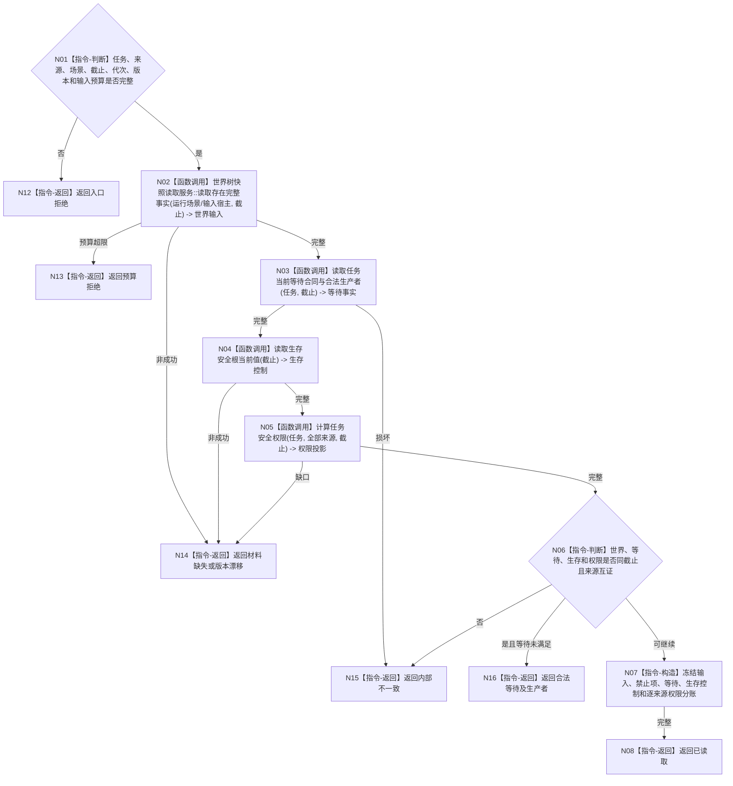

# BIZ-L4-004-03-02-02 读取筹办运行输入等待与权限目标函数流程图 v0.1

更新时间：2026-08-03

## 依据

```text
3200、5210、5230、6150、6170；BIZ-L3-004-03-02
```

## 身份与边界

正式目标函数设计图。按任务运行上下文读取当前世界输入、禁止项、等待合同、生存控制和逐来源安全权限投影；各机器量保持分账。

## 函数合同

```text
根函数：任务筹办运行事实提供者::读取筹办运行输入等待与权限
归属模块 / 文件 / 层级：任务筹办运行事实提供者 / 海中鱼巣/领域/提供者.任务筹办运行事实.ixx / L4
现有或待新增：待新增；组合世界快照、任务等待、6170生存控制和6150权限服务
完整签名：筹办运行事实读取结果 任务筹办运行事实提供者::读取筹办运行输入等待与权限(const 筹办运行事实读取请求& 请求) const
参数：请求为只读借用；含任务、全部来源需求、运行场景、事实截止、运行代次、世界/等待/权限/生存规则版本和输入预算
返回结果：不可变值式结果；含已读取、合法等待、预算拒绝、材料缺失、版本漂移或内部不一致，以及世界输入、禁止项、等待、服务/安全控制和逐来源权限分账快照
被调函数流程图：世界树完整事实读取复用4200；生存安全根复用BIZ-L4-002-05-01-01；逐任务安全权限复用BIZ-L3-003-03-03；等待合同专用读取在L5展开
父图：BIZ-L3-004-03-02
```

## 流程图



## 节点合同

| 节点 | 类型 | 参数 / 输入绑定 | 结果 / 输出绑定 | 事实读写 | 后继条件 | 验证 |
| --- | --- | --- | --- | --- | --- | --- |
| N02—N05 | 函数调用 | 任务上下文和截止 | 四组运行事实 | 只读正式事实 | 同截止完整 | 无SQL/缓存/线程状态补齐 |
| N06/N07 | 指令 | 四组事实 | 分账快照或等待 | 无写入 | 来源互证 | 权重、预算、基础优先级、安全权限不合并 |
| N08/N12—N16 | 指令-返回 | 读取裁决 | 结构化结果 | 无写入 | 返回父图 | 零权限合法保留 |

## 关键边界

权限为零不删除任务或等待材料，只禁止正常执行优先级竞争；输入预算超限必须具名拒绝，不能截断后宣称快照完整。

