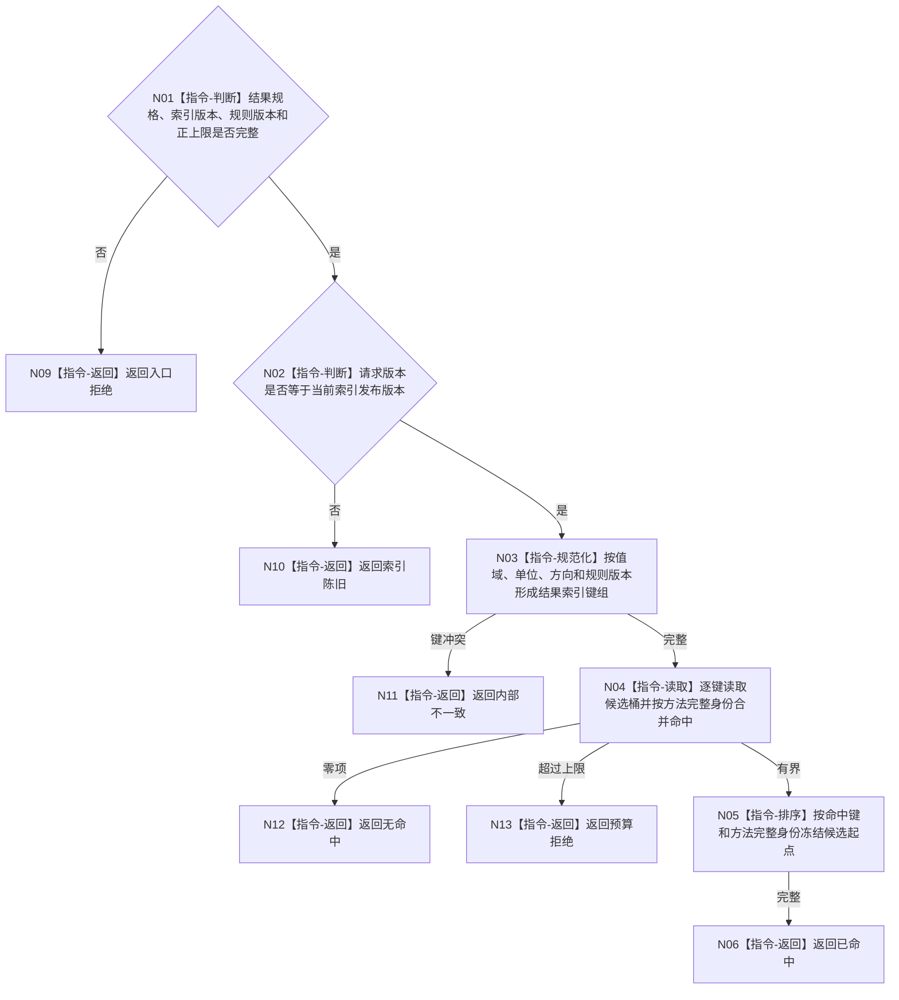

# BIZ-L4-004-03-04-01 按结果规格查询方法结果索引目标函数流程图 v0.1

更新时间：2026-08-03

## 依据

```text
3300、4060、5250、5300；BIZ-L3-004-03-04
```

## 身份与边界

正式目标函数设计图。以强类型结果规格和精确索引版本查询非权威方法候选身份；不读取或裁决方法当前性。

## 函数合同

```text
根函数：方法结果索引::按结果规格查询
归属模块 / 文件 / 层级：方法结果索引 / 海中鱼巣/核心/索引.方法结果.ixx / L4
现有或待新增：适配扩展；复用可重建索引稳定有序读取
完整签名：方法结果索引查询结果 方法结果索引::按结果规格查询(const 方法结果索引查询请求& 请求) const
参数：请求为只读借用；含非空结果规格组、索引发布版本、比较规则版本和候选数量上限
返回结果：不可变值式结果；含已命中、无命中、索引陈旧、预算拒绝或内部不一致，以及稳定候选方法身份和命中键
被调函数流程图：无非平凡项目函数；索引键规范化和有界合并为本函数内指令
父图：BIZ-L3-004-03-04
```

## 流程图



## 节点合同

| 节点 | 类型 | 参数 / 输入绑定 | 结果 / 输出绑定 | 事实读写 | 后继条件 | 验证 |
| --- | --- | --- | --- | --- | --- | --- |
| N02—N05 | 本函数内指令 | 结果规格与索引版本 | 有界候选起点 | 只读非权威索引 | 版本一致 | 不按名称或函数地址命中 |
| N06/N09—N13 | 指令-返回 | 查询裁决 | 结构化结果 | 无写入 | 返回父图 | 陈旧、空、预算分离 |

## 关键边界

索引命中只能触发权威方法事实回读；索引内容、缓存键和候选顺序均不能证明方法存在、当前或可执行。

