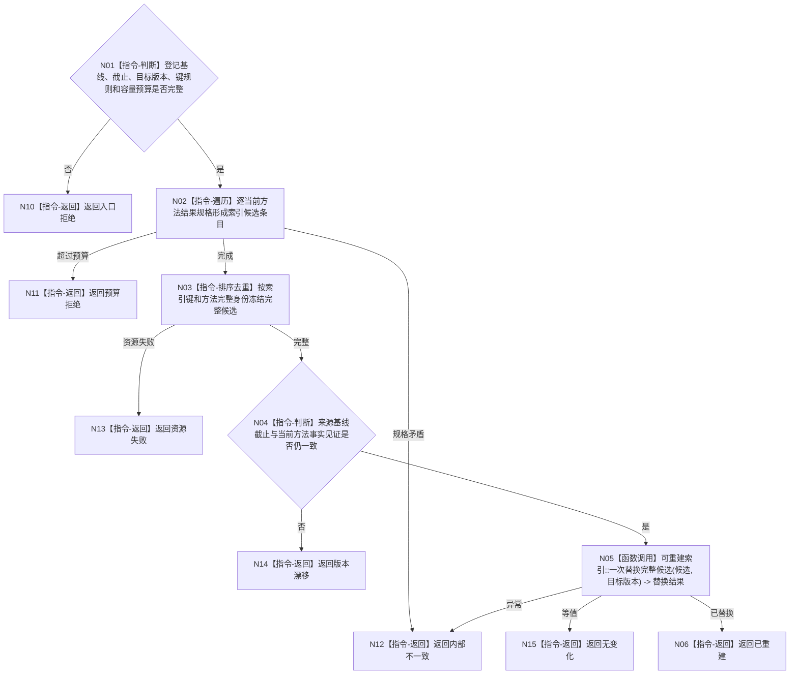

# BIZ-L4-004-03-04-02 从已发布方法登记事实重建结果索引目标函数流程图 v0.1

更新时间：2026-08-03

## 依据

```text
3300、4060、5250、5300；BIZ-L3-004-03-04；BIZ-L4-004-03-02-01
```

## 身份与边界

正式目标函数设计图。从冻结的已发布方法登记基线构造完整新索引并一次替换；不改变任何方法事实。

## 函数合同

```text
根函数：方法结果索引::从已发布方法登记事实重建
归属模块 / 文件 / 层级：方法结果索引 / 海中鱼巣/核心/索引.方法结果.ixx / L4
现有或待新增：适配扩展；复用4060候选构造和一次替换
完整签名：方法结果索引重建结果 方法结果索引::从已发布方法登记事实重建(const 方法结果索引重建请求& 请求)
参数：请求为只读借用；含完整方法登记基线、来源事实截止、目标索引发布版本、键规则版本和容量预算
返回结果：不可变值式结果；含已重建、无变化、预算拒绝、版本漂移、资源失败或内部不一致，以及新索引版本和条目统计
被调函数流程图：复用BIZ-L4-004-03-02-01取得登记基线；候选构造和一次替换为4060通用能力
父图：BIZ-L3-004-03-04
```

## 流程图



## 节点合同

| 节点 | 类型 | 参数 / 输入绑定 | 结果 / 输出绑定 | 事实读写 | 后继条件 | 验证 |
| --- | --- | --- | --- | --- | --- | --- |
| N02—N04 | 指令 | 完整登记基线 | 完整索引候选 | 无权威写入 | 来源仍当前 | 不增量补旧索引 |
| N05 | 函数调用 | 完整候选和版本 | 一次替换结果 | 仅非权威索引 | 候选完整 | 失败保留旧索引 |
| N06/N10—N15 | 指令-返回 | 重建裁决 | 结构化结果 | 无方法事实写入 | 返回父图 | 无变化不写假更新 |

## 关键边界

索引可随时清空重建；重建成功只证明候选加速结构已刷新，不证明任何方法已被选择或满足任务条件。

