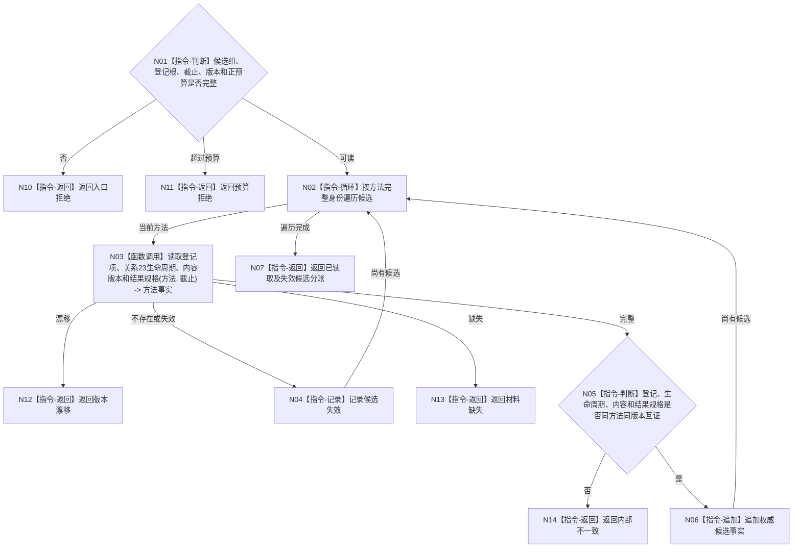

# BIZ-L4-004-03-04-03 回读候选方法登记生命周期内容与结果规格目标函数流程图 v0.1

更新时间：2026-08-03

## 依据

```text
3300、5250、5300；BIZ-L3-004-03-04
```

## 身份与边界

正式目标函数设计图。对索引候选逐项回读权威登记、关系23生命周期、内容版本和结果规格，形成可供父函数复判的候选事实。

## 函数合同

```text
根函数：方法召回事实提供者::回读候选方法登记生命周期内容与结果规格
归属模块 / 文件 / 层级：方法召回事实提供者 / 海中鱼巣/领域/提供者.方法召回事实.ixx / L4
现有或待新增：待新增；组合方法领域具名读取
完整签名：方法召回候选事实读取结果 方法召回事实提供者::回读候选方法登记生命周期内容与结果规格(const 方法召回候选事实读取请求& 请求) const
参数：请求为只读借用；含候选方法身份组、方法登记根、事实截止、登记/生命周期/内容/结果规格版本和数量预算
返回结果：不可变值式结果；含已读取、材料缺失、候选失效、预算拒绝、版本漂移或内部不一致，以及逐方法权威候选事实
被调函数流程图：方法登记、关系23、内容和结果规格专用读取在L5展开
父图：BIZ-L3-004-03-04
```

## 流程图



## 节点合同

| 节点 | 类型 | 参数 / 输入绑定 | 结果 / 输出绑定 | 事实读写 | 后继条件 | 验证 |
| --- | --- | --- | --- | --- | --- | --- |
| N02 | 指令-循环 | 稳定候选组 | 当前方法 | 无写入 | 每项一次 | 不持锁跨读取 |
| N03 | 函数调用 | 方法和截止 | 权威方法事实 | 只读方法领域 | 同截止完整 | 索引材料不补字段 |
| N04—N07 | 指令 | 方法事实 | 有效/失效分账 | 无写入 | 全候选完成 | 失效候选可正常排除 |
| N10—N14 | 指令-返回 | 非成功 | 结构化结果 | 无写入 | 返回父图 | 缺失与失效分离 |

## 关键边界

只有权威回读后仍当前且结果规格命中目标的方法才可保留；方法名称、固定编号和索引命中不得替代本读回。
