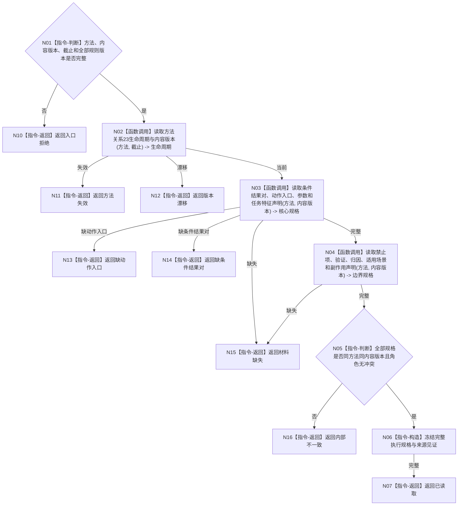

# BIZ-L4-004-03-05-01 读取方法完整执行规格目标函数流程图 v0.1

更新时间：2026-08-03

## 依据

```text
3300、4190、5230、5250、5300；BIZ-L3-004-03-05
```

## 身份与边界

正式目标函数设计图。按方法身份和内容版本完整读取生命周期、条件结果对、真实动作入口、参数、任务特征、禁止项、验证、归因和适用场景。

## 函数合同

```text
根函数：方法事实服务::读取方法完整执行规格
归属模块 / 文件 / 层级：方法领域 / 海中鱼巣/领域/服务.方法事实.ixx / L4
现有或待新增：待新增；组合方法领域专用读取
完整签名：方法完整执行规格读取结果 方法事实服务::读取方法完整执行规格(const 方法完整执行规格读取请求& 请求) const
参数：请求为只读借用；含方法身份、期望内容版本、事实截止、生命周期/条件结果/动作入口/参数/验证规则版本
返回结果：不可变值式结果；含已读取、方法失效、缺动作入口、缺条件结果对、材料缺失、版本漂移或内部不一致，以及完整执行规格
被调函数流程图：生命周期、内容、条件结果对、动作入口和声明专用读取在L5展开
父图：BIZ-L3-004-03-05
```

## 流程图



## 节点合同

| 节点 | 类型 | 参数 / 输入绑定 | 结果 / 输出绑定 | 事实读写 | 后继条件 | 验证 |
| --- | --- | --- | --- | --- | --- | --- |
| N02—N04 | 函数调用 | 方法、内容版本、截止 | 生命周期、核心和边界规格 | 只读方法事实 | 同版本完整 | 真实动作入口不可缺 |
| N05—N07 | 指令 | 全部规格 | 不可变完整规格 | 无写入 | 角色无冲突 | 不用默认参数补齐 |
| N10—N16 | 指令-返回 | 具名缺口 | 结构化结果 | 无写入 | 返回父图 | 方法失效与结构损坏分离 |

## 关键边界

执行规格缺口必须在筹办期暴露；不得把通用写入原语、函数地址或名称相似项替代正式动作入口。
